李宏毅机器学习2023笔记


# 开场：ChatGPT原理剖析

> ChatGPT（可能）是怎么炼成的？


常见误解：

* ChatGPT的回答是罐头信息？ No，并不是从人写的笑话库里随便摘一条出来，而是实时生成的
* ChatGPT的答案是网络搜寻的结果？ No，（它会瞎编Haha）不能保证正确性，只训练到2021年的数据集


ChatGPT真正做的事情 - **文字接龙**（语言模型）

函数 f 输入一句话， 输出每个字的几率分布

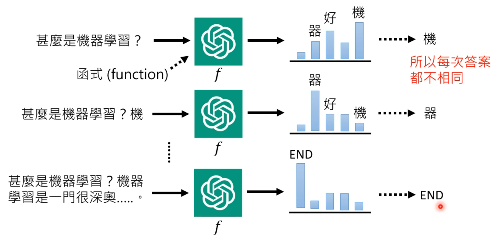

这个function可能非常复杂，可能有1700亿（GPT3）以上的参数


## ChatGPT是如何训练的

关键技术：预训练 **Pre-train**

又叫自监督学习（Self-supervised Learning） / 基石模型（Foundation Model）

GPT的名字：

* G：Generative
* P：Pre-trained
* T：Transformer


一般机器是怎么学习的？ 以英文翻译中文为例子：

| 英文              | 中文     |
| ----------------- | -------- |
| I eat an apple    | 我吃苹果 |
| You eat an orange | 你吃桔子 |

机器收集大量中英文成对的例句，然后自己寻找函数式 f ，这个叫**监督学习**

这个 f ，比如输入 “ I ”， 输出就是 “ 我 ”

而人为喂给GPT的数据集总是有限的，但网络上的每一段文字都可以教机器做文字接龙，机器可以自己去网络上找数据，换句话说所有训练数据都可以无痛生成：

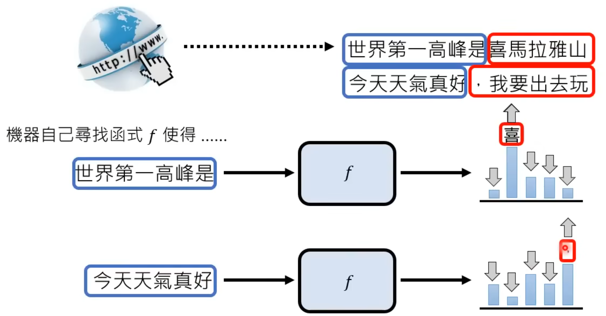

ChatGPT的前身：GPT就是单纯的从网络上学习做文字接龙这件事情

而ChatGPT就是在GPT的基础上，通过人手动训练，提高GPT的回答正确率

在人为训练前的GPT，自己在网络上学习的过程，成为**预训练**，也叫做**自监督学习**

继续学习（人为训练）的过程，叫做**微调**，也叫做**监督学习**（辛苦）

再继续学习，人不直接给机器答案，而是告诉它这个答案好还是不好，叫做**强化学习**（更省力，且更适用于人类自己都知道答案的时候）


## 预训练有什么帮助

简单的说，提高自我学习能力，只需简单的微调就可以达到良好的效果

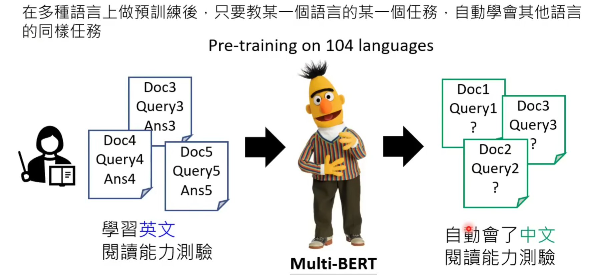

下图是对机器经过不同训练，阅读中文材料能力的测试

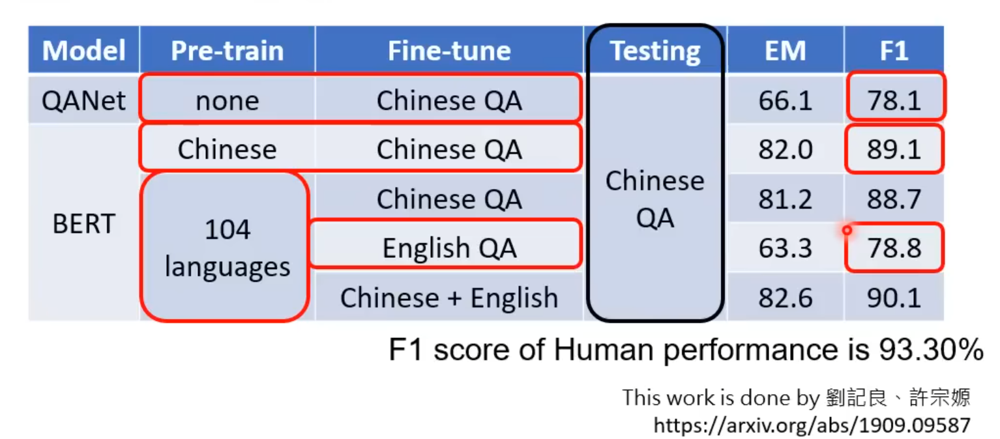


## ChatGPT带来的研究问题

> 如何精准提出需求

直接跟ChatGPT聊天，可能它只会简单回复一句，并不像是一个“聊天”机器人

跟ChatGPT聊天前，先给它提出需求，对它进行催眠，学术界叫做**Prompting**

比如说：

```
请想象你是我的朋友，我会对你抱怨，希望你可以用中文提供安慰，并试图跟我聊聊，在对话过程中展现出同理心，现在我们开始：
我今天工作很累！
```

中文“催眠”方式：

[ChatGPT中文调教指南](https://github.com/PlexPt/awesome-chatgpt-prompts-zh)

[ChatGPT詠唱案例懶人包-超過40個現實世界的應用範例 (持續更新) (rayskyinvest.com)](https://www.rayskyinvest.com/96682/chatgpt-examples))

[我用 ChatGPT 寫了一個 ChatGPT 指令大全網站｜ExplainThis](https://www.explainthis.io/zh-hant/ai/website)


> 如何更正错误

比如ChatGPT的训练集只到2021年，如果问他**最近一次**世界杯冠军，他会回答你是2018年的法国队

如果答错了，有没有办法修正呢？ 

* 人类老师来更新它的答案？可能会导致更多的错误。
  * 比如告诉它最近一次世界杯冠军是阿根廷，那么它可能只要看到世界杯关将军就回答阿根廷
* 所以如何正确的更正错误是一个新的研究主题，叫做**Neural Editing**


> 侦测AI生成的物件

怎么判断是否是AI生成的东西？


> 隐私与机密问题

虽然明面上ChatGPT不会回答隐私性问题，但是有一些绕着弯的方式问，同样也能问出来答案（即使不知道对错）

这也是一个新的研究主题，叫做**Machine Unlearning**，即机器反学习，让它忘记自己学过的东西


## ChatGPT是如何练成的

ChatGPT官方除了Blog以外并没有给相关论文，但是ChatGPT还有一个衍生兄弟，**InstructGPT**，有相关论文，两者的训练步骤基本类似，所以一下对ChatGPT训练步骤的猜测来自InstructGPT

* [ChatGPT的官网Blog](https://openai.com/blog/chatgpt/)

* [InstructGPT论文](https://arxiv.org/abs/2203.02155)


ChatGPT学习的四个阶段

* 学习文字接龙
* 人类老师引导文字接龙的方向
* 模仿人类老师的喜好
* 用增强学习向模拟老师学习


> 学习文字接龙，人类老师引导文字接龙的方向

见前文叙述


> 模仿人类老师的喜好

一个问题可能有许多可以生成的答案，由人类老师标注哪些答案是好的，哪些答案是差的

接着GPT模仿人类老师评分的标准，给所有可能答案评分

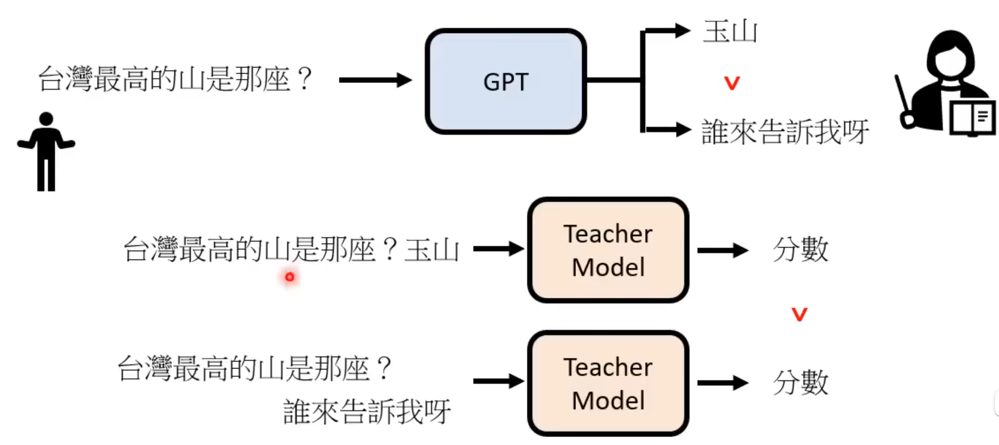

> 用增强学习向模拟老师学习

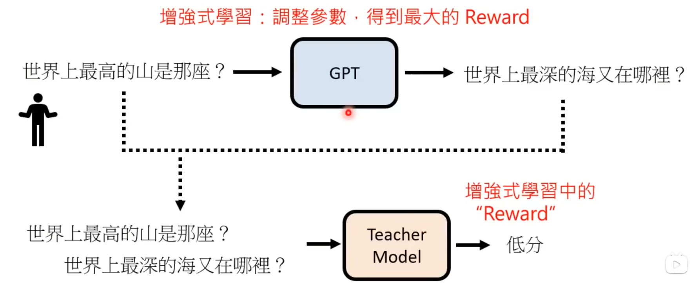


# Regression

一般用于预测，训练出一个函数，给定输入，输出预测值

**Linear model**：只要是长这个样子的，都是线性模型
$$
y = b + \sum{w_i x_i}
$$
知识点略

目的是要找到使得损失函数最小的参数

以一元线性回归为例子，这里的Loss Function指的是每个样本的损失sum起来了，在其他教材中也有定义Loss Function指单个样本的损失
$$
L(w,b) = \sum_{n=1}^{N}{(\hat{y}-(b+w*x^n))} \\
w^*, b^* = arg\min_{w,b}L(w,b)
$$


这里说一下梯度下降 **Gradient Descent** ，不只是线性回归，只要L是可微的，Gradient Descent都可以处理


## Gradient Descent

假设损失函数 $L(w)$ 只有一个参数w
$$
w^* = arg \min_w L(w)
$$
怎么做呢？ 第一个方法，可以穷举所有从无限小到无限大的 w ，总能找到一个 w

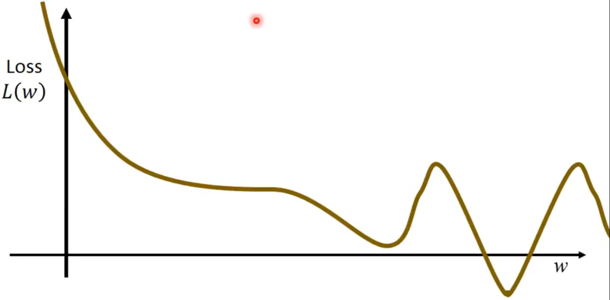

但是这样做是没有效率的，所以有了Gradient Descent

>  **Gradient Descent**：

* 先随机选取一个初始的点 $w^0$
* 计算在$w = w_0$这个位置，参数$w^0$ 对 Loss Function的微分 $\frac{dL}{dw} | w = w^0$
  * 可以理解成切线斜率
  * 比如下图中的切线斜率（微分值）是负数，则左边 loss 高，右边 loss 低，所以应该增加  w 的值，反之减少 w 的值

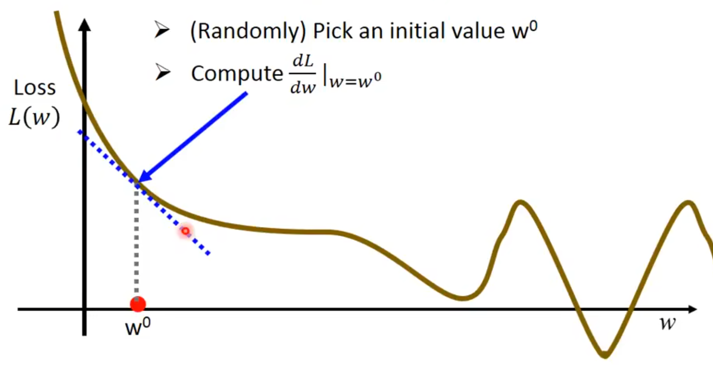

以增加为例，应该增加多少呢？ 取决于两个值，当前微分值 $\frac{dL}{dw}$ 和 学习率 $\eta$
$$
w^1 \leftarrow w^0 - \eta \frac{dL}{dw}|{}_{w=w^0}
$$
反复不断执行下去

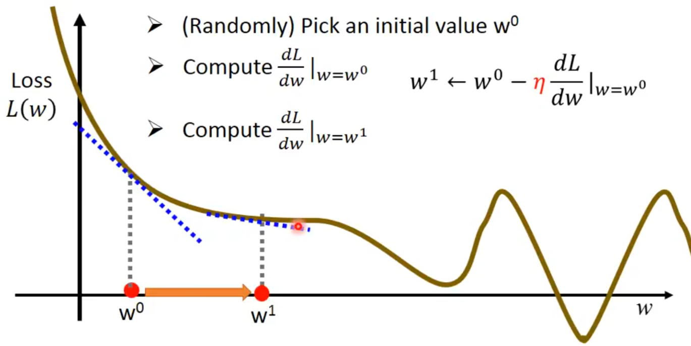

最后会到一个局部最优解（**Local optimal**），就是当微分为0的时候的解

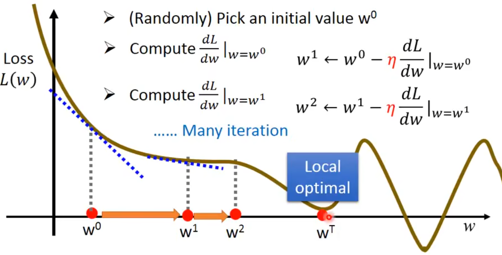

幸运的是，**在Linear Regression中不存在局部最优解**，只有唯一解


推广到两个参数 
$$
w^*, b^* = arg\min_{w,b}L(w,b)
$$

* 随机选取两个初始值$w^0, b^0$
* 分别计算对w和对b的偏微分 

$$
\frac{\partial L}{\partial w} |{}_{w=w^0, b= b^0}, \frac{\partial L}{\partial b}|{}_{w=w^0,b=b^0}
$$

* 分别更新$w^0,b^0$

$$
w^1 \leftarrow w^0 - \eta \frac{\partial L}{\partial w}|{}_{w=w^0, b=b^0} \\
b^1 \leftarrow b^0 - \eta \frac{\partial L}{\partial b}|{}_{w=w^0, b=b^0}
$$

* 重复以上步骤


> Gradient是什么？ 梯度$\nabla$

$$
\nabla L = \begin{bmatrix} 
\frac{\partial L}{\partial w} \\ 
\frac{\partial L}{\partial b} \end{bmatrix}_{gradient}
$$

梯度下降存在的问题，可能有局部最优解

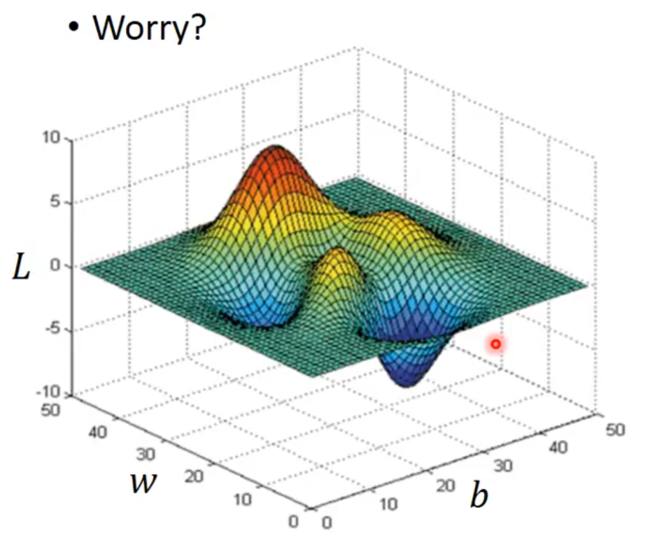


## Overfitting

如何解决过拟合


### regularization

> 正则化

假设目标函数和loss函数为
$$
y=b+\sum{w_i x_i} \\
L = \sum_{n}(\hat{y}^n - (b+\sum{w_i x_i}))^2 + \lambda \sum(w_i)^2
$$
加入了一个正则项，这个 $\lambda$ 是手动设置的
$$
\lambda \sum(w_i)^2
$$


从 $L$ 的式子上来看，参数的值越接近 0 ， $L$ 越小， 为什么呢？

* 参数w越小，输入的变化对输出的变化就没那么敏感，函数比较**平滑**

* $\lambda$ 越大，正则项对损失的影响就越大，目标函数就越平滑

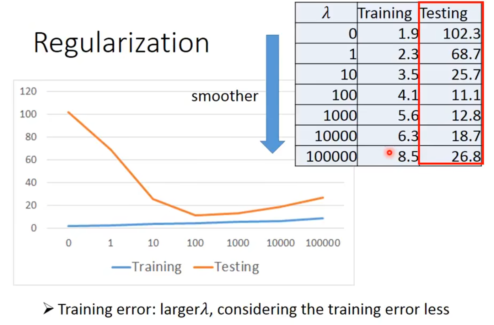


# Classification

$$
x \rightarrow Function \rightarrow Class\quad n
$$


## 贝叶斯分类

只需要知道样本的类别先验概率，类条件概率和样本与类的分布就可以知道样本的后验概率（贝叶斯分类器）


如何找出样本的分布？

假设样本的分布符合高斯分布

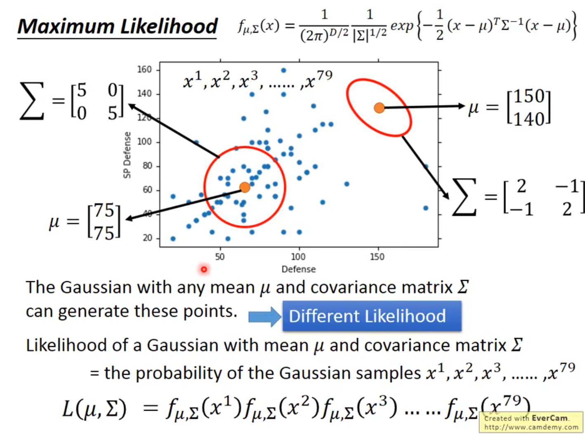


然后就可以用贝叶斯公式做后验概率了


> 为什么用高斯分布？
>
> You can always use the distribution you like 


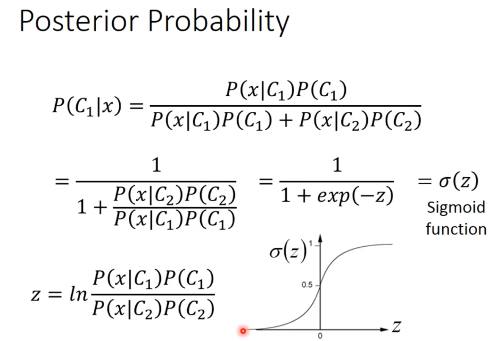
$$
z = \sigma(wx+b)
$$


## Logistic Regression

我们要找到后验概率 $P_{w,b}(C_1|x)$

如果P>=0.5，输出$C_1$ 否则输出$C_2$
$$
P_{w,b}(C_1|x) = \sigma(z)\\
\sigma(z) = \frac{1}{1+exp(-z)} \\
z = W*x + b = \sum_{i}w_i x_i + b
$$
所以最终function为
$$
f_{w,b} = P_{w,b}(C_1|x)\\
f_{w.b}(x) = \sigma(\sum_{i}{w_i x_i + b})
$$


损失函数为交叉熵损失
$$
L(f) = \sum_{n}{CorssEntropy(f(x^n),\hat y^n)}\\
 CorssEntropy(f(x^n),\hat y^n)=-[\hat y^n \ln f(x^n) + (1-\hat y^n)\ln(1-f(x^n))]
$$


逻辑回归个线性回归两者更新参数的式子的区别

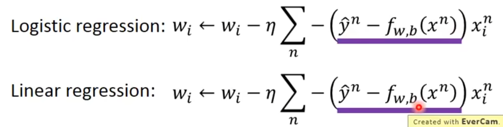

y和f实际取值是不一样的


> 为什么逻辑回归不用平方损失

使用平方损失，在距离目标很远的时候，偏微分的值趋于平坦且值较小，收敛特别慢，交叉熵损失在距离目标远的时候，收敛快


## Multi-class Classification

Softmax


# 卷积神经网络


在图像分类问题上，我们输入一张图片，输入所有类别的概率，并且使用交叉熵损失

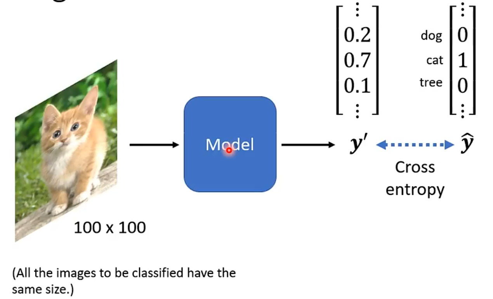


一个图片一般有三个chanel，而神经网络的输入一般是一个向量，所以将一个三维tensor拉直成一个向量

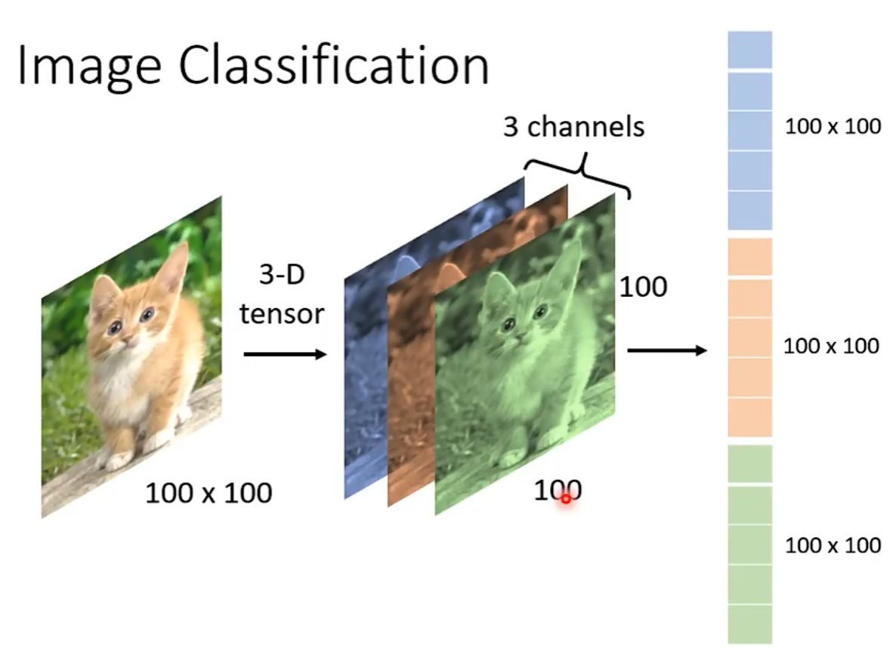

但是这样巨大的特征量放进神经网络会导致参数过多，容易过拟合

实际上做一个图像识别并不需要观察所有的特征（每一个像素），比如只需要观察猫耳朵，猫眼睛等等等就可以知道这是一只猫，这就是CNN的思想

将巨大的输入简化，每一次只输入一个小区域的特征

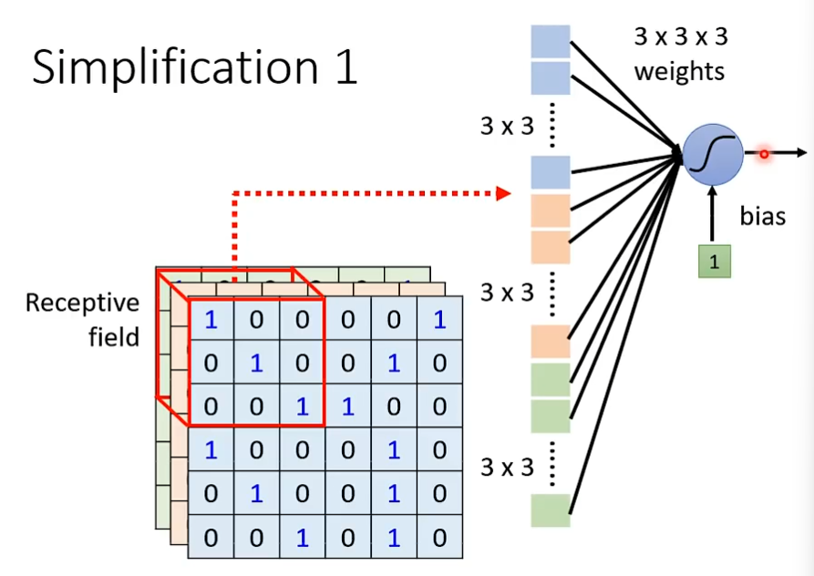


这样一个小区域的大小，就叫kernel size

