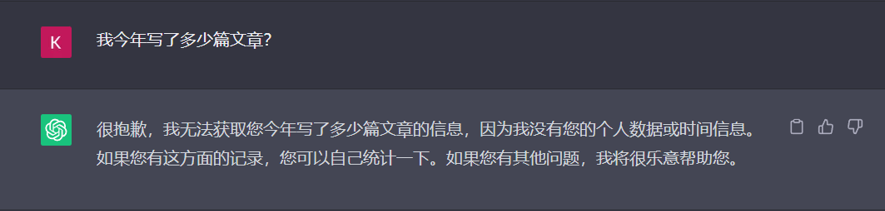
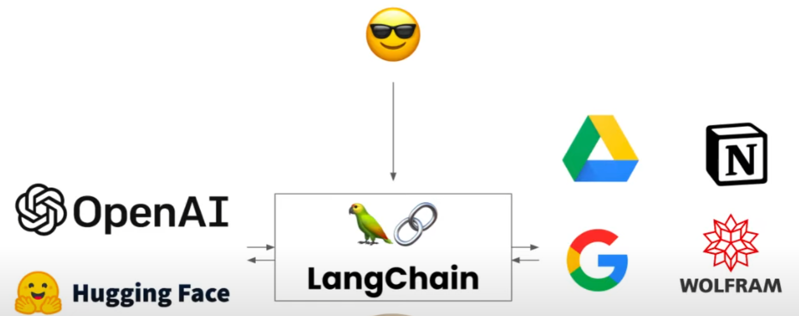
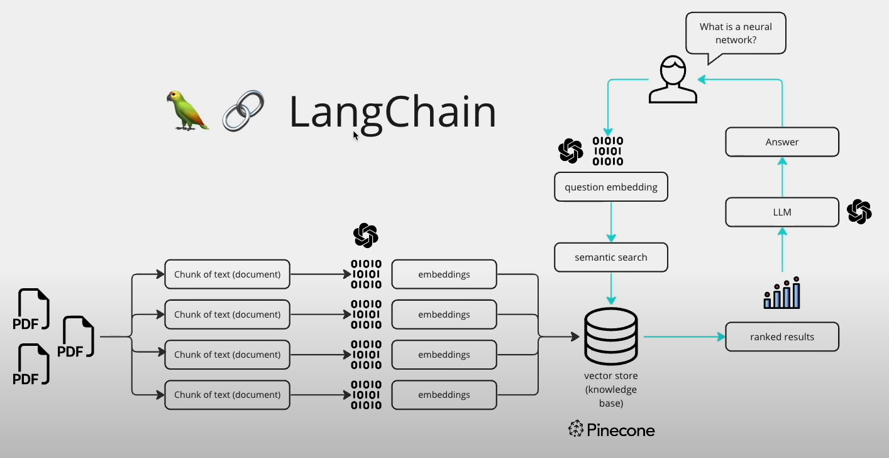
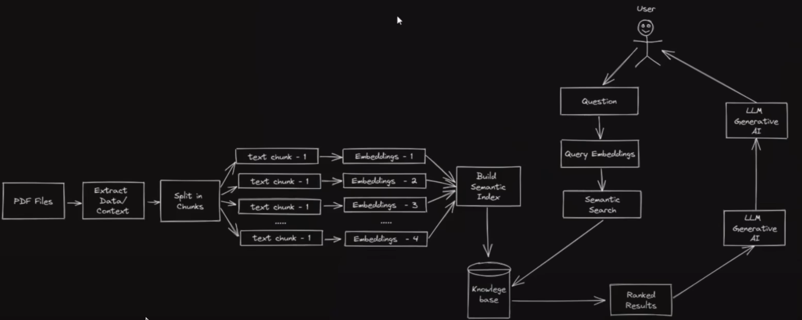
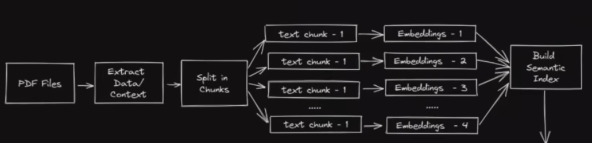
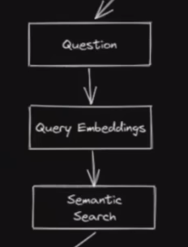
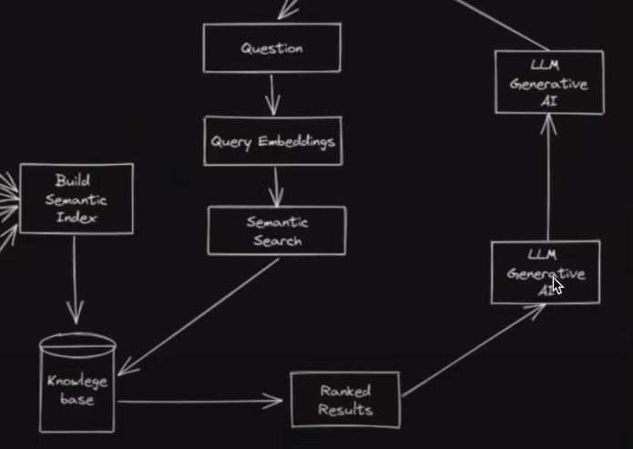

# reference

https://www.youtube.com/channel/UCyR2Ct3pDOeZSRyZH5hPO-Q
https://www.youtube.com/watch?v=TLf90ipMzfE
collab：

https://www.youtube.com/redirect?event=video_description&redir_token=QUFFLUhqbWpCTVZGN

# 引入

[What Is LangChain? - LangChain + ChatGPT Overview - YouTube](https://www.youtube.com/watch?v=_v_fgW2SkkQ&list=PLqZXAkvF1bPNQER9mLmDbntNfSpzdDIU5&index=1)

如果你问ChatGPT一个问题： 我今年写了多少篇文章？

它会告诉你不知道，因为他只是一个由截至2021年的数据集训练的模型，他并不知道2021年之后的数据以及你的本地数据库的数据。

当然调用ChatGPT这样的LLM模型不仅仅可以使用Browser版，也可以使用他的API在代码中使用

那Langchain可以干嘛？

Langchain可以连接任何一个人工智能模型，不管是OpenAI的还是Hugging Face的， 它也可以连接外部资源，比如你的Google云盘甚至一些其他软件，那么GPT就不会受限制于自己不会的知识，它只需要成为一个扩写或者整理者，将外部资源获取的信息翻译成人能理解的话

先说结论，Langchain可以帮助你标准化，模块化一个人工智能框架，可以自由替换框架的任意一个部分为自己喜欢的公司的服务

LangChain 提供了对几个主要模块的支持。

这些模块按照逐渐增加的复杂性排列如下：

- [模型（models）](https://www.langchain.asia/modules/models) : LangChain 支持的各种模型类型和模型集成。
- [提示（prompts）](https://www.langchain.asia/modules/prompts) : 包括提示管理、提示优化和提示序列化。
- [内存（memory）](https://www.langchain.asia/modules/memory) : 内存是在链/代理调用之间保持状态的概念。LangChain 提供了一个标准的内存接口、一组内存实现及使用内存的链/代理示例。
- [索引（indexes）](https://www.langchain.asia/modules/indexes) : 与您自己的文本数据结合使用时，语言模型往往更加强大——此模块涵盖了执行此操作的最佳实践。
- [链（chains）](https://www.langchain.asia/modules/chains) : 链不仅仅是单个 LLM 调用，还包括一系列调用（无论是调用 LLM 还是不同的实用工具）。LangChain 提供了一种标准的链接口、许多与其他工具的集成。LangChain 提供了用于常见应用程序的端到端的链调用。
- [代理（agents）](https://www.langchain.asia/modules/agents) : 代理涉及 LLM 做出行动决策、执行该行动、查看一个观察结果，并重复该过程直到完成。LangChain 提供了一个标准的代理接口，一系列可供选择的代理，以及端到端代理的示例。

从PDF-GPT的大致流程引入

# 几个问题

* 机器如何看懂PDF的内容？

把内容转化为向量表示（embedding）

举例：

​	你叫什么名字？ 与 你的名字叫什么？ 在向量表示中应该是一样（或是十分相似）的

* 怎么去问PDF中的内容？

  * 将问题也转化为向量

    

  * 去之前embedding好的PDF数据库中做搜索（相似性搜索）

> AI中的Embedding是一种将高维的数据（如文字、图片、音频等）映射到低维空间的技术，目的是为了捕捉数据的语义和上下文信息。Embedding可以用来表示单词、句子、段落甚至整个文档的含义，从而可以在自然语言处理中进行各种计算和应用。Embedding的常见方法有矩阵分解、神经网络和大型语言模型等。

 

到此并**没有与LLM相关的东西**，本质只是搜索而已

然后将问题和搜索到的结果一起传递给LLM，让大型语言模型根据所传递的内容生成结果（润色成人能看懂的东西）

相当于把本地（本地指的是并非从LLM中拿到数据，而是我们给LLM提供的数据）数据库（知识库）和问的问题当作 **Prompt** 传递给LLM， LLM并不需要理解事实，只是做一个扩写/缩写/整理。

# Langchain干了什么

上方的几个部分都是可替换的模块（比如：阅读PDF，分片，Embedding，Prompt等等），也是 langchain 的核心功能（模块化和标准化），只需要调用响应模块即可（跟调用python库一样）

模块化的好处：可以不依赖于某一个公司的服务，只需要**搭建一个模块化框架**。比如embedding，不想用OppenAI的服务，可以自由替换为Google的服务， LLM不想用GPT4或GPT3.5，可以自由替换为本地的LLM模型

