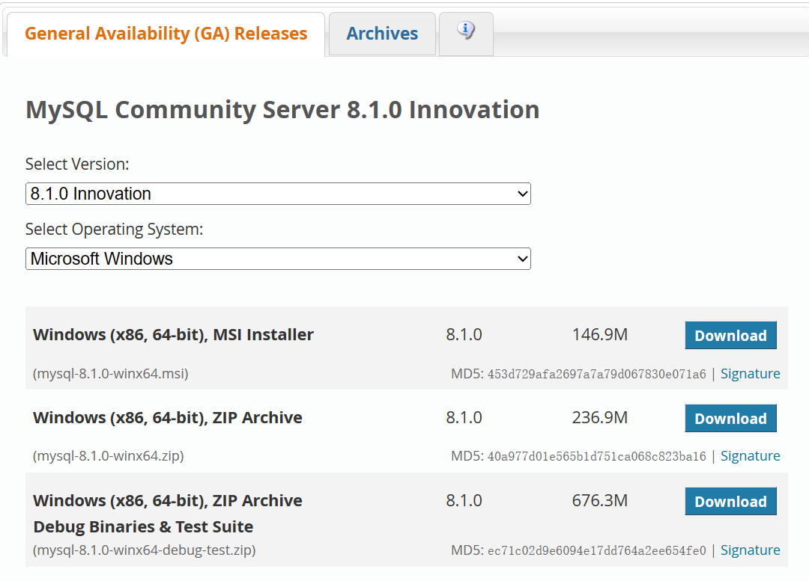

# 下载

> 当前版本：8.10.0
>
> [MySQL下载地址](https://dev.mysql.com/downloads/mysql/)
>
> 选择解压版（第二个）下载




# 解压

解压到自己的目录下


# 配置

## 配置环境变量

系统变量中新建`MYSQL_HOME`


在 `PATH` 中添加bin目录


## 打开命令行验证

命令行**以管理员身份运行**

```bash
mysql
```


输出如下，则配置成功


## 初始化MySQL

在打开的命令行（管理员）中输入：

```bash
mysqld --initialize-insecure
```

成功运行后会在安装目录下生成data文件夹，用于存放MySQL数据


## 注册MySQL服务

命令行（管理员）：

```bash
mysqld -install
```


成功后就可以在服务中找到mysql，**默认开机自动启动**


## 启动改为手动（可选）

为了加快开机速度，可以设置手动启动服务，不过以后使用前**记得手动开启MySQL**

右键我的电脑->管理->服务与应用程序->服务，找到mysql将启动类型改为手动


## 启动MySQL服务

命令行（管理员）：

```bash
net start mysql //启动服务
```

```bash
net stop mysql //停止服务
```

或者服务设置里面手动点击启动/关闭


## 修改MySQL默认账号密码

命令行（管理员）：

```bash
mysqladmin -u root password 123456
```

root：默认管理员权限（自带）  修改密码为自己喜欢的


# 登录MySQL

命令行输入

```bash
mysql -uroot -p123456
```


退出时输入 `exit`


> mysql连接指定服务器IP地址, 注意后面的P是大写！

```bash
mysql -u用户名 -p密码 [-h数据库服务器IP -P端口号]
```


# 卸载MySQL

命令行（管理员）

* 停止服务

```bash
net stop mysql
```

* remove mysql

```bash
mysqld -remove mysql
```

* 最后删除MySQL目录以及相关环境变量

卸载完成！
