# Flask 初识

Flask是一个基于Python的web开发框架，以“微”框架著称，本身不具备太多的功能，但是通过丰富的第三方插件，可以轻松应对现实开发中复杂的需求，并且有大量的企业在使用Flask构建自己的产品。国内比较出名的有比如豆瓣、果壳网，国外的有Reddit、Netflix等。


## 第一个Flask

会有三个文件（夹）分别存放静态文件，jinja2模板和app.py（入口程序）

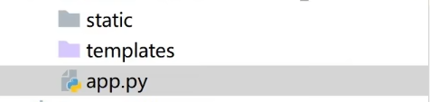

> app.py

```python
from flask import Flask

# 使用Flask类创建app对象
# __name__： 代表当前app.py这个模块
app = Flask(__name__)

# 路由
@app.route('/')
def hello_world():  # put application's code here
    return 'Hello World!'

if __name__ == '__main__':
    app.run()
```


## Flask配置

### debug

默认不开启debug模式（每次改变代码后需要重新启动代码才能在浏览器刷新有效）

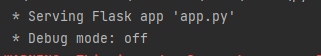


> 开启debug

* **方法一**：

在右上角Edit Configuration，开启FlASK_DEBUIG

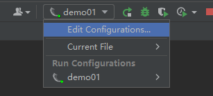

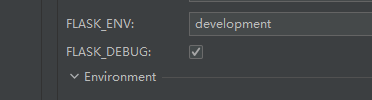

成功后:


* **方法二**：

```python
if __name__ == '__main__':
    app.run(debug=True)
```


### host

监听的主机名，默认是 `127.0.0.1`

如果在局域网里面，想让别人也访问项目，可以将host设置为 `0.0.0.0`，这样就可以通过别人访问自己的ip地址（比如192.168.xx.xx）访问到项目，也可以直接设置成自己的ip地址（0.0.0.0更方便）

[一文彻底明白127.0.0.1和0.0.0.0地址的区别是什么？ - 知乎 (zhihu.com)](https://zhuanlan.zhihu.com/p/439510282)

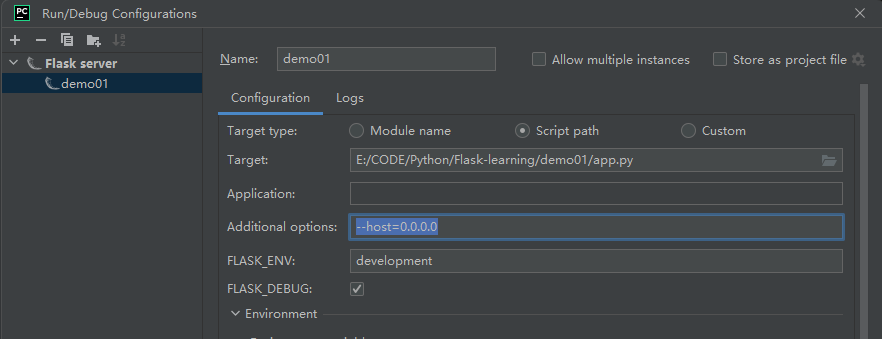

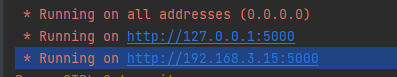


### port

修改port两种方式：

方式一：修改配置文件

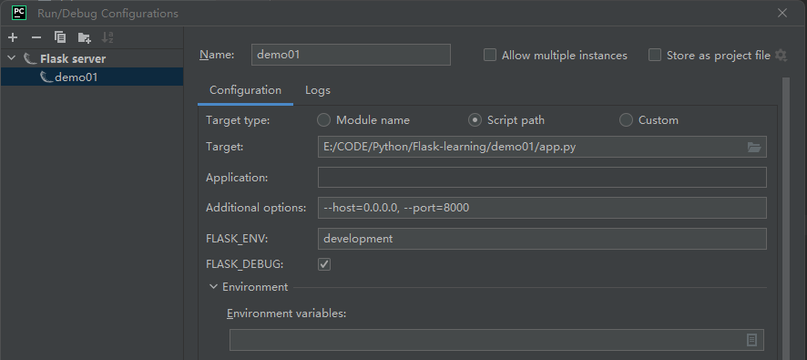


方式二：代码里配置

```python
if __name__ == '__main__':
    app.run(debug=True, port=8000)
```


### threaded

如果电脑打开浏览器比较慢，可以设置

```python
if __name__ == '__main__':
    app.run(debug=True, threaded=True)
```


## 项目拆分


# URL与视图

URL组成：协议 (http[80] / https[443]) / 域名(www.baidu.com) : 443 / path

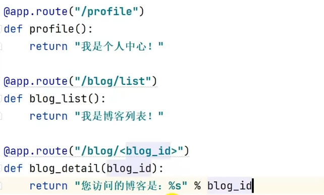


## 路由参数

前两种就是正常的路由

最后一种是带参数，用 <> 括起来

```python
@app.route("/paramPath/<paramId>")
def paramPath(paramId):
    return "id: %s" % paramId
```


甚至可以指定参数路由的类型

```python
@app.route("/paramPath/<int: paramId>")
def paramPath(paramId):
    return "id: %d" % paramId
```


> 注意，定义的参数可以不传，比如上方的例子，单独设置一个 "/paramPath" 路由当默认路由即可


## request

通过 `request` 获取参数（以get请求为例子）

如果访问 `/list?page=1`

```python
from flask import Flask, request
@app.route("/list")
def list():
    page = request.args.get("page", default=1, type=int) #default指没有传参时的默认值
    return "你获取的是第%d页" % page
```


# 模板渲染

## Jinja2模板渲染

flask包中的render_template，就会自动查找template文件夹下的html文件，进行渲染

```python
from flask import Flask, render_template
@app.route("/")
def index():
    return render_template("index.html")
```


> 给模板Html传递参数

```python
from flask import Flask, render_template
@app.route("/index/<param>")
def index(param):
    return render_template("index.html"， param1 = param)
```

然后在HTML中使用Flask的模板语法：用`{{}}`括起来

```html
<h1>
    你的参数是 {{param1}}
</h1>
```


## 过滤器filter

过滤器本质上是Python的函数，他会把被过滤的值当做第一个参数传给这个函数，函
数经过一些逻辑处理后，再返回新的值。在过滤器函数写好后，可以通过@app.template_filter
装饰器或者是app.add template_filter函数来把函数注册成Jinja2能用的过滤器。这里我们以
注册一个时间格式化的过滤器为例，来面说明下**自定义过滤器**的方法。·

```python
def datetime_format(value, format="%Y-%d-%m %H:%M"):
	return value.strftime (format)
app.add_template_filter(datetime_format,"dformat") # 后面这个是过滤器名字
```

模板中使用：

```html
<div>
    {{ mytime | dformat}}
</div>
```


## 模板控制语句

### if语句

```html
<body>
    
    <div>您已经满18岁</div>
    
    <div>您刚满18岁 </div>
    
    <div>您未满18岁 </div>
       <!--必须要有endif！！-->
</body>
```


### for循环语句

> 注意：Jinja2中的for循环没有break语句，只能一次遍历完所有

```python
@app.route("/books")
def books():
    books = [
        {
            "name" = "三国演义",
            "author" = "罗贯中"
        },
        {
            "name" =  "水浒传",
            "author" = "施耐庵"
        }
    ]
    return render_template("books.html", books=books)
```


```html
<body>
    
    {{book.name}}
    
</body>
```


## 模板继承

父模板的HTML文件写好后，如何继承父模板：

在需要继承的地方：

```html

```

可以通过**block语法**，在子文件中添加新东西并渲染回父模板


> 举例：

父模板：

```html
<!DOCTYPE html>
<html lang="en">
<head>
    <meta charset="UTF-8">
    <title></title>
</head>
<body>
这是父模板

</body>
</html>
```


继承并使用：

```html



    childTitle


 
    <h1>子模版内容</h1>

```


```python
@app.route('/child')
def child():
    return render_template("child.html")
```


> 效果：

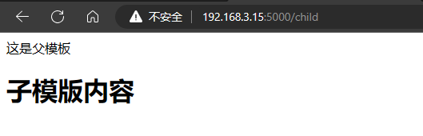


# url_for

语法：

```python
url_for('蓝图名称.视图函数名称')

url_for('视图函数名称')
```


使用 url for 语法

在HTML中加载静态文件时（静态文件放在static目录下）：

```html

```


如果图片在子文件夹中

```html

```


# Flask提交数据表单到模板

使用：

```python
from flask import Flask, render_template, request
# 引入底层框架的ResponseStream
from werkzeug.wrappers.response import ResponseStream
```

定义路由

```python
@app.route('/form/student')
def student():
    return render_template('form/student.html')

@app.route('/form/result', methods=['POST', 'GET'])
def result():
    if request.method=='POST':
        rst = request.form  # 直接拿到form
        return render_template('form/result.html', result=rst) # 前面是html，后面是参数名=参数
```

 

student:

```html
<form action="/form/result" method="POST">
    <p>name <input type="text" name="Name"></p>
    <p>math <input type="text" name="Math"></p>
    <p>Chinese <input type="text" name="Chinese"></p>
    <p>chemistry <input type="text" name="Chemistry"></p>
    <p><input type="submit" value="submit" name="" id=""></p>
</form>
```


result:

```html
<table border="1">
    
    <tr>
        <th>{{ key }}</th>
        <td>{{ value }}</td>
    </tr>
    
</table>
```


> 表单

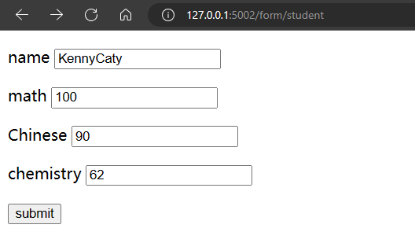

> 结果

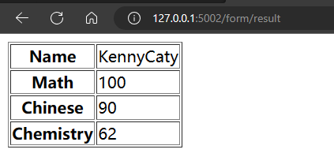


# flask重定向和错误

> 下面的例子：
>
> * 如果请求方式是POST，判断username是否等于admin，如果是则重定向到success（登陆成功），不是则抛出401（没有权限）
>
> * 如果请求方式是GET，直接重定向到index


使用

```python
from flask import Flask, render_template, request, url_for, redirect, abort
```


路由：

```python
@app.route('/')
def index():  # put application's code here
    return render_template('index.html')

@app.route('/login', methods=['POST', 'GET'])
def login():
    if request.method == 'POST':
        if request.form['username'] == 'admin' :
            return redirect(url_for('success'))    # 重定向到某一个 ‘路由函数’
        else:
            abort(401)
    elif request.method == 'GET':
        return redirect('/')                      # 重定向到某一个 ‘路由’

@app.route('/login/success')
def success():
    return "login success!"
```


index:

```html
<form action="/login" method="POST">
    <p><input type="text" name="username" id=""></p>
    <p><input type="submit" value="登录"></p>
</form>
```


# Request和Response

## Request

request对象的属性：

| 属性        | 功能                  |
| ----------- | --------------------- |
| url         | 完整请求地址          |
| base_url    | 去掉GET参数的URL      |
| host_url    | 只有主机和端口号的URL |
| path        | 路由中的路径          |
| method      | 请求方法              |
| remote_addr | 请求的客户端地址      |
| args        | GET请求参数           |
| form        | POST请求参数          |
| files       | 文件上传              |
| headers     | 请求头                |
| cookies     | 请求中的cookie        |


## Response


响应的几种方式：

1. 返回字符串

```python
@app.route('/')
def index():
    return "hello"
```


2. 模板渲染

这个就需要有html

```python
@app.route('/')
def index():
    return render_template('index.html' [,arg1=xx])
```


3. 返回 Json 数据（**前后端分离**）

> 直接返回字典

```python
@app.route('/')
def index():
    data = {'name':'张三', 'age': 18}
    return data
```

```json
{
	"age": 18,
    "name": "张三"
}
```


> 做一个序列化，将字典转成字符串

```python
@app.route('/')
def index():
    data = {'name':'张三', 'age': 18}
    return jsonify(data)
```


> 自定义Response对象

```python
html = render_template('index.html')
res = make_response(html)
# res = Response(html)
```


# cookie和session

使用：

```python
from flask import Flask, make_response, request, session
```


> Cookie
>
> flask中的 **make_response **是一个用于创建响应对象的函数，它可以接受不同格式的参数，比如字符串、元组、字典等，并将其转换为flask.Response类的实例。flask.Response类是flask用于表示HTTP响应的默认类，它有一些属性和方法，比如status_code, headers, data, set_cookie等，可以用来设置响应的状态码、头部、数据、cookie等信息

路由：

```python
@app.route('/set_cookies')
def set_cookie():
    resp = make_response('success') 
    resp.set_cookie('aaa_key', 'aaa_value', max_age=3600)  # 最长存活时间 3600s
    return resp

@app.route('/get_cookies')
def get_cookie():
    cookie_1 = request.cookies.get('aaa_key')
    return cookie_1

@app.route('/delete_cookies')
def delete_cookie():
    resp = make_response('del success')
    resp.delete_cookie('aaa_key')
    return resp
```


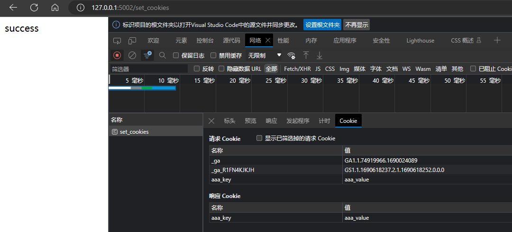

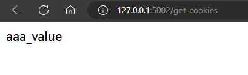

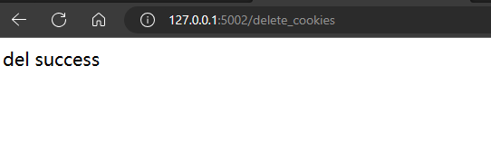

> Session

```python
app = Flask(__name__)
app.secret_key = "123456" 
# session 处理与 cookie有一点不同，需要先设置一个secret_key，来加密seession id，保存在客户端
# session存在服务器， session id存在客户端
```

路由：

```python
@app.route('/')
def index():  
    if 'username' in session:
        user = session['username'] # 如果session里面有username，则保存在user中
        return '登陆用户名 : ' + user + '<br>' + '<b><a href="/logout">点击注销</a></b>'
    return '您暂未登录， <br><a href="/login">点击登录</a>'


@app.route('/login', methods=['POST', 'GET'])
def login():
    if request.method == 'POST':
        session['username'] = request.form['username']
        return redirect(url_for('index'))    

    elif request.method == 'GET':
        return render_template('login.html') 


@app.route('/logout')
def logout():  
    session.pop('username', None)
    return redirect(url_for('index'))
```

login.html

```html
<form action="/login" method="POST">
    <p><input type="text" name="username" id=""></p>
    <p><input type="submit" value="登录"></p>
</form>
```


# 消息闪现flash

> flash会将消息放进request里面，让下一个request也可以获得，flash本质是对session的封装
>
> **flash和它的名字一样，是闪现，意思就是我们的消息只会显示一次，当我们再次刷新也面的时候，它就不存在了，而正是这点，它经常被用来显示一些提示消息，比如登陆之后，显示欢迎信息等**


使用flash

```python
from flask import Flask, flash, redirect, render_template, request, url_for
```

先定义一个app实例和secret_key

```python
app = Flask(__name__)
app.secret_key = "123456"
```


```python
@app.route('/')
def index():  
    return render_template('index2.html')


@app.route('/login', methods=['POST', 'GET'])
def login():
    errormsg = None
    if request.method == 'POST':
        if request.form['username'] != 'admin' or request.form['password'] != 'admin':
            errormsg = "Invalid username or password. Please try again!"
        else:
            flash('You were successfully logged in')
            return redirect(url_for('index'))

    return render_template('login.html', error = errormsg) 

```


index2.html

```html
<body>
    
        
            
                <p>{{ message }}</p>
            
        
    
    <h3>Welcome</h3>
    <a href="{{url_for('login')}}">login</a>
</body>
</html>
```


login.html 

```html
<form action="/login" method="POST">
    <table>
        <tr>
            <th>username</th>
            <td><input type="text" name="username" ></td>
        </tr>
        <tr>
            <th>password</th>
            <td><input type="password" name="password"></td>
        </tr>
        <tr>
            <td><input type="submit" value="submit" ></td>
        </tr>
    </table>
</form>

    <p><strong>Error:</strong>{{ error }}</p>

```


# 文件上传

可以使用 request.files['filename']  拿到form表单上传的文件

代码示例：

```python
from flask import Flask, render_template, request
from werkzeug.utils import secure_filename 
'''  secure_filename
可以自动将 My movie.mov 转化成 My_movie.mov
将文件名带“/”的 如 etc/passwd 转化为etc_passwd
就是为了文件名不发生异常
'''
import os


app = Flask(__name__)
app.config['UPLOAD_FOLDER'] = 'uploaddir/'

@app.route('/')
def upload_file():
    return render_template('upload10.html')

@app.route('/uploader', methods=['POST', 'GET'])
def uploader():
    if request.method == 'POST':
        f = request.files['file111']
        f.save(os.path.join(app.config['UPLOAD_FOLDER'], secure_filename(f.filename)))
        return 'file upload successfully'
    elif request.method == 'GET':
        return render_template('upload10.html')

if __name__ == "__main__":
    app.run(debug=True)
```


upload10.html

```html
<body>
    <form action="/uploader" method="POST" enctype="multipart/form-data">
        <input type="file" name="file111">
        <input type="submit" value="提交">
    </form>
</body>
```


# WTF表单

这是Flask自己的表单控件，就可以不使用HTML的表单控件了

需要使用 wtform 包

wtform 使用邮件验证器，需要安装email_validator 

`pip install email_validator`


示例：

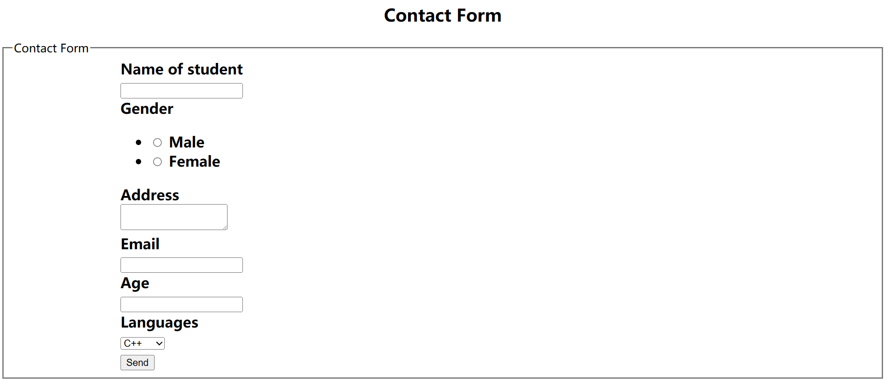


app.py

```python
from flask import Flask, render_template, request, flash
from form11 import ContactForm

app = Flask(__name__)
app.secret_key = "123456"

@app.route('/', methods = ['POST', 'GET'])
def contact():
    form1 = ContactForm()
    if request.method == 'POST':
        if form1.validate() == False:  # 检查
            flash("All fields are required.")
            return render_template('contact11.html', form = form1) # 将之前填的值也带过去
        else:
            return render_template('success11.html')
    elif request.method == 'GET':
        return render_template('contact11.html', form = form1)


if __name__ == "__main__":
    app.run(debug=True)
```


contact11.html

```html
<body>
    <h2 style="text-align: center;">Contact Form</h2>
    
        <div>{{ message }}</div>
    

    
        <div>{{ message }}</div>
    

    <form action="/" method="POST">
        <fieldset>
            <legend>Contact Form</legend>
            {{ form.hidden_tag() }}  <!--做csrf 防止跨站攻击-->

            <div style="font-size: 20px; font-weight: bold; margin-left: 150px;">
                {{ form.name.label }}<br> <!--显示label-->
                {{ form.name }} <br>      <!--显示控件-->

                {{ form.Gender.label }} {{ form.Gender }}
                {{ form.Address.label }} <br>
                {{ form.Address }} <br>

                {{ form.email.label}} <br>
                {{ form.email}} <br>

                {{ form.Age.label}} <br>
                {{ form.Age }} <br>

                {{ form.language.label }} <br>
                {{ form.language }} <br>

                {{ form.submit }}
            </div>
        </fieldset>
    </form>
</body>
```


success11.html

```html
<body>
    Form posted successfully
</body>
```


# 连接Mysql

flask要连接mysql，需要先安装python操作MySQL的驱动

(1) **MySQL-python** :的也就是MySQLdb。是对C语言操作MySQL数据库的一个简单封装。遵循了Python DB API v2。但是只支特Python2。

(2) **mysqlclient** :是MySQL-python的另外一个分支。支持Python3并且修复了一些bug。是目前为止执行效率最高的驱动，但是安装的时候容易因为环境问题出错。

(3) **pymysql** :纯Python实现的一个驱动。因为是纯Python编写的，因此执行效率不如mysqlclient。也正因为是纯Python写的，因此可以和Python代码无缝衔接。

(4) **mysql-connector--python** :MySQL官方推出的纯Python连接MySQL的驱动，执行效率pymysql还慢。


下面学习使用的是 **pymysql**

```bash
pip install pymysql
```


## Flask-SQLAlchemy

在Flask中，我们很少会使用pymysql直接写原生SQL语句去操作数据库，更多的是通过SQLAlchemy提供的**ORM技术**，类似于操作普通Python对象一样实现数据库的增删改查操作，而Flask-SQLAlchemy是对SQLAlchemy的一个封装，使得在Flask中使用SQLAlchemy更加方便。Flask-SQLAlchemy是需要单独安装，因为Flask-SQLAlchemy依赖SQLAlchemy,所以只要安装了Flask-SQLAlchemy，SQLAlchemy会自动安装。安装命令如下。

```python
pip install flask-sqlalchemy
```

> 注意：SQLAlchemy类似于Jinja2,是可以独立于Flask而被使用的


## 连接数据库

```python
from flask import Flask
from flask_sqlalchemy import SQLAlchemy
from sqlalchemy import text
app = Flask(__name__)

#MSOL所在的主机名
HOSTNAME="127.0.0.1"
#MySQL监听的端口号，默认3306
PORT=3306
#连接MySQL的用户名，用自己设置的
USERNAME="root"
#连剂ySQL的密码，读者用自己的
PASSWORD="638436"
#MySQL上创建的数据库名称
DATABASE="ts"

app.config['SQLALCHEMY_DATABASE_URI'] = f"mysql+pymysql://{USERNAME}:{PASSWORD}@{HOSTNAME}:{PORT}/{DATABASE}?charset=utf8"

#在app.config中设置好连接数据库的信息
#然后使SQLAlchemy(app)创建一个db对象
#SQLALchemy会自动读取app.config中连接数据库的信息


db = SQLAlchemy(app)

#以下代码仅供测试是否连接成功，输出 (1,) 则连接成功
with db.engine.connect() as conn:
    rs = conn.execute(text("select 1"))
    print(rs.fetchone())


@app.route('/')
def hello_world():  # put application's code here
    return 'Hello World!'

if __name__ == '__main__':
    app.run()
```


上述代码会报错！

`RuntimeError: Working outside of application context.`

这是应用上下文问题


解决如下

```python
#以下代码仅供测试是否连接成功，输出 (1,) 则连接成功
#添加with app.app_context():
with app.app_context():
    with db.engine.connect() as conn:
        rs = conn.execute("select 1")
        print(rs.fetchone())
```


## ORM模型

连接号数据库，如何创建表，需要用到ORM（Object Relationship Mapping）对象关系映射

简单来说就是 类 映射到 表

>  对象关系映射(Object Relationship Mapping),简称ORM,是一种可以用Python面向对象的方式来操作关系型数据库的技术，具有可以映射到数据库表能力的Python类我们称之为ORM模型。一个ORM模型与数据库中一个表相对应，ORM模型中的每个类属性分别对应表的每个字段，ORM模型的每个实例对象对应表中每条记录。ORM技术提供了面向对象与SQL交互的桥梁，让开发者用面向对象的方式操作数据库，使用ORM模型具有以下优势。
>
> (1) 开发效率高：几乎不需要写原生SQL语句，使用纯Pythor的方式操作数据库，大大的提高了开发效率。
> (2) 安全性高：ORM模型底层代码对一些常见的安全问题，比如SQL注入做了防护，比直接使用SQL语句更加安全。
> (3) 灵活性强：Flask-SQLAlchemy底层支持SQLite、MySQL、Oracle、PostgreSQL等关系型数据库，但针对不同的数据库，ORM模型代码几乎一模一样，只需修改少量代码，即可完成底层数据库的更换。


```python
from flask import Flask
from flask_sqlalchemy import SQLAlchemy

app = Flask(__name__)

#MSOL所在的主机名
H0STNAME="127.0.0.1"
#MySQL监听的端口号，默认3306
P0RT=3306
#连接MySQL的用户名，用自己设置的
USERNAME="root"
#连剂ySQL的密码，读者用自己的
PASSWORD="638436"
#MySQL上创建的数据库名称
DATABASE="ts"

app.config['SQLALCHEMY_DATABASE_URI'] = f"mysql+pymysql://{USERNAME}:{PASSWORD}@{H0STNAME}:{P0RT}/{DATABASE}?charset=utf8"

#在app.config中设置好连接数据库的信息
#然后使SQLAlchemy(app)创建一个db对象
#SQLALchemy会自动读取app.config中连接数据库的信息


db = SQLAlchemy(app)

class User(db.Model):
    __tablename__ = "user"
    id = db.Column(db.Integer, primary_key=True, autoincrement=True)
    #String()相当于映射成varchar()
    username = db.Column(db.String(100), nullable=False)
    passwd = db.Column(db.String(100), nullable=False)

'''
user = User(name="KennyCaty",passwd="11111")
之后就可以通过创建对象的方法创建表中的数据
'''

#如何创建表,db.create_all() 将所有模型映射到表中
'''
db.create_all() 直接写会报错，还是需要处理应用上下文问题
'''
with app.app_context():
    db.create_all()

@app.route('/')
def hello_world():  # put application's code here
    return 'Hello World!'

if __name__ == '__main__':
    app.run()
```


### CUDR


#### 查

```python
@app.route('/user/query')
def query_user():
    #1. get查找：根据主键查找    query 是继承的 db.Model
    user = User.query.get(1)
    print(f"{user.id}: {user.username} - {user.passwd}")

    #2. filter_by查找, 返回一个Query对象  （类似列表对象）
    users = User.query.filter_by(username="周杰伦")
    user2 = users[0]
    print(f"{user2.id}: {user2.username} - {user2.passwd}")
    return "query_success"
```


#### 增

```python
@app.route('/user/add')
def add_user():
    #1. 创建ORM对象
    user = User(username="周杰伦", passwd="1234")
    #2. 将ORM对象添加到db.session
    db.session.add(user)
    #3. 将db.session同步到数据库
    db.session.commit()
    return "add_success"
```


#### 删

```python
@app.route('/user/delete')
def delete_user():
    user = User.query.filter_by(id=2).first()
    if user!=None:
        db.session.delete(user)
    db.session.commit()

    return "delete_success"
```


#### 改

```python
@app.route('/user/update')
def update_user():
    user = User.query.filter_by(id=1).first()
    if user!=None:
        user.passwd = "2222"
    print(f"{user.id}: {user.username} - {user.passwd}")
    db.session.commit()

    return "update_success"
```


#### 外键

```python
class Article(db.Model):
    __tablename__ = "article"
    id = db.Column(db.Integer, primary_key=True, autoincrement=True)
    title = db.Column(db.String(200), nullable=False) #String最多存储255个字符
    content = db.Column(db.Text, nullable=False)      #Text字符数更多

    #添加作者外键
    author_id = db.Column(db.Integer, db.ForeignKey("user.id"))
    # db.relationship，可以直接关联对象，这样之后在访问Article.author 就可以直接拿到User对象
    ##backref:.会自动的给User模型添加一个articles的属性，用来获取文章列表
    author = db.relationship("User", backref="articles")
```


## flask-migrate

有时候在类中更改数据库字段，数据库并不会更改，需要使用flask-migrate， 就不用db.create_all() 了

```
pip install flask-migrate
```

```python
from flask_migrate import Migrate

db = SQLAlchemy(app)

migrate = Migrate(app, db)
```


映射三步骤：（注意，要先运行app.py）

* flask db init **只需要指定一次**，就会在目录下多一个migration文件夹
* flask db migrate    识别新增字段，自动添加迁移脚本
* flask db upgrade  运行迁移脚本， 同步到数据库


# Sijax

Flask的Ajax

使用：

```python
from flask import Flask, g, render_template
import flask_sijax
```


