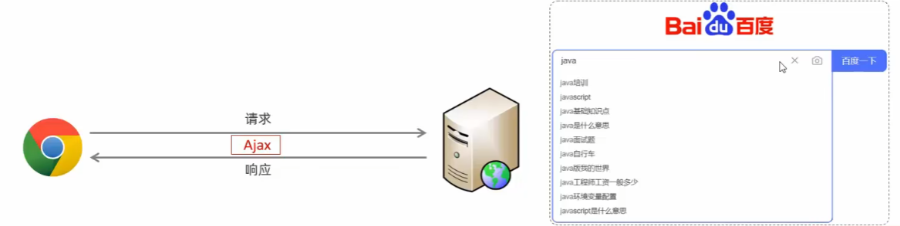
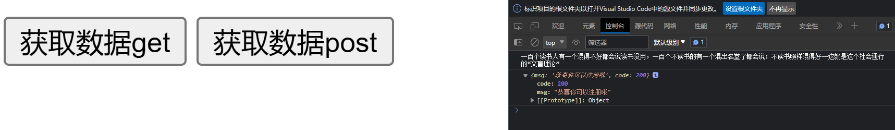

# Ajax

* 概念：**Asynchronous JavaScript And XML**，异步的 JavaScript 和XML
* 作用：
  * **数据交换**：通过Ajx可以给服务器**发送请求**，并**获取服务器响应的数据**。
  * **异步交互**：可以在**不重新加载整个页面**的情况下，与服务器**交换数据并更新部分网页**的技术，如：搜索联想、用户名是否可用的校验等等。




* 缺点：
  * 没有浏览历史，不能回退
  * 存在**跨域问题**（同源）
  * SEO不友好（SEO：搜索引擎优化Search Engine Optimization），Ajax请求的数据爬虫爬不到，或者说源代码（响应体）中没有Ajax数据，Ajax数据是Js动态创建的


# HTTP

HTTP ( Hypertext Transport Protocol ) 超文本传输协议，规定了**浏览器和万维网服务器之间互相通信的规则**


接下来重点介绍请求响应格式与参数

## 请求报文

浏览器向服务器发送请求

get请求：请求体是空的，

post请求：请求体可以为空

```
请求行 GET /URL路径 HTTP协议版本 
请求头 Key: Value
空行 
请求体 username=kenny
```


## 响应报文

服务器向浏览器响应请求

```
响应行 HTTP协议版本 响应状态码（200） 状态字符串（OK）
响应头 Key: Value
空行 
响应体 <html>...</html>
```


# Express框架

因为Ajax需要给服务端发请求，需要一个服务端

**Express**：基于Node.js平台，快速、开放、极简的Web开发框架

当然Java佬用SpringBoot也可以


## 安装Express框架

在项目目录下初始化npm包管理工具

```bash
 npm init --yes
```

安装Express

```bash
npm i express
```


## 基本使用

>  express.js

```js
// 1. 引入express
const express = require('express');

// 2. 创建应用对象
const app = express();

// 3. 创建路由规则
app.get('/', (request, response)=>{
    //设置响应体
    response.send('HELLO EXPRESS');
});

// 4. 监听端口，启动服务
app.listen(8000,()=>{
    console.log("服务已经启动，8000端口监听中...");
})
```


在这个js文件目录启动终端，用node命令启动服务

```bash
node express.js
```


可以在127.0.0.1:8000 查看


# 原生Ajax

## GET示例：

需求：点击按钮给服务端**发送数据**，将服务端**响应体结果**呈现在div中


> 页面与服务器准备

```HTML
<!DOCTYPE html>
<html lang="en">
<head>
    <meta charset="UTF-8">
    <meta name="viewport" content="width=device-width, initial-scale=1.0">
    <title>Ajax GET</title>
    <style>
        #result {
            width: 200px;
            height: 200px;
            border: solid 1px pink;
        }
    </style>
</head>
<body>
    <button>点击发送请求</button>
    <div id="result"></div>
</body>
</html>
```


服务器js代码

```js
// 1. 引入express
const express = require('express');

// 2. 创建应用对象
const app = express();

// 3. 创建路由规则
app.get('/server', (request, response)=>{
    //设置响应头 设置允许跨域（跨域后面说）
    response.setHeader('Access-Control-Allow-Origin', '*')

    //设置响应体
    response.send('HELLO EXPRESS');
});

// 4. 监听端口，启动服务
app.listen(8000,()=>{
    console.log("服务已经启动，8000端口监听中...");
})
```


> Ajax操作步骤

将服务端js代码改一改

```js
// 1. 引入express
const express = require('express');

// 2. 创建应用对象
const app = express();

// 3. 创建路由规则
app.get('/server', (request, response)=>{
    //设置响应头 设置允许跨域（跨域后面说）
    response.setHeader('Access-Control-Allow-Origin', '*')

    //设置响应体
    response.send('HELLO EXPRESS');
});

// 4. 监听端口，启动服务
app.listen(8000,()=>{
    console.log("服务已经启动，8000端口监听中...");
})
```


页面端html添加js代码

```html
<script>
        //获取button元素 result元素
        const btn = document.querySelector('button');
        const result = document.querySelector('#result');
        //绑定事件
        btn.addEventListener('click',()=>{
            //1.创建对象
            const xhr = new XMLHttpRequest()
            //2.初始化 设置请求方法 和 url
            xhr.open('GET', 'http://127.0.0.1:8000/server')
            //3.发送
            xhr.send()
            //4.事件绑定，处理服务端返回的结果
            // readystate 是xhr对象中的属性，表示状态0 1 2 3 4
            xhr.onreadystatechange = function(){
                //判断（服务端返回了所有结果 4）
                if(xhr.readyState === 4){
                    //判断响应状态码
                    if(xhr.status >= 200 && xhr.status< 300){
                        //处理结果 行 头 空行 体
                        //1. 响应行
                        console.log(xhr.status); //状态码
                        console.log(xhr.statusText); //状态字符串
                        console.log(xhr.getAllResponseHeaders()); //所有响应头
                        console.log(xhr.response); //响应体

                        //设置result文本
                        result.innerHTML = xhr.response
                    }else{

                    }
                }
            }
        })
    </script>
```


步骤：

* 创建XMLHttpRequest对象：用于和服务器交换数据
* 向服务器发送请求
* 获取服务器响应数据


示例：

```html
<!DOCTYPE html>
<html>
<body>

<div id="demo">
<h2>The XMLHttpRequest Object</h2>
<button type="button" onclick="loadDoc()">Change Content</button>
</div>

<script>
function loadDoc() {
    //创建XMLHttpRequest对象
    const xhttp = new XMLHttpRequest();
    //监听数据
    xhttp.onload = function() {
        document.getElementById("demo").innerHTML =
        this.responseText; //以字符串的形式返回响应数据
    }
    //向服务器发送请求
    xhttp.open("GET", "https://www.w3schools.com/js/ajax_info.txt");
    xhttp.send();
}
</script>

</body>
</html>
```


## GET参数

```js
xhr.open('GET', 'url?a=100')
```


## POST示例

需求，把鼠标放到div上的时候，向服务器发送POST请求，将响应的结果放回div里面


页面端

```html
<!DOCTYPE html>
<html lang="en">
<head>
    <meta charset="UTF-8">
    <meta name="viewport" content="width=device-width, initial-scale=1.0">
    <title>Ajax POST</title>
    <style>
        #result {
            width: 200px;
            height: 200px;
            border: solid 1px red;
        }
    </style>
</head>
<body>
    <div id="result"></div>
    <script>
        // 获取result元素
        const result = document.querySelector('#result');
        //绑定事件
        result.addEventListener('mouseover',()=>{
            //1.创建对象
            const xhr = new XMLHttpRequest()
            //2.初始化 设置请求方法 和 url
            xhr.open('POST', 'http://127.0.0.1:8000/server')
            //3.发送
            xhr.send()
            //4.事件绑定，处理服务端返回的结果
            // readystate 是xhr对象中的属性，表示状态0 1 2 3 4
            xhr.onreadystatechange = function(){
                //判断（服务端返回了所有结果 4）
                if(xhr.readyState === 4){
                    //判断响应状态码
                    if(xhr.status >= 200 && xhr.status< 300){
                        //设置result文本
                        result.innerHTML = xhr.response
                    }else{

                    }
                }
            }
        })
    </script>
</body>
</html>
```


服务端

```js
app.post('/server', (request, response)=>{
    //设置响应头 设置允许跨域（跨域后面说）
    response.setHeader('Access-Control-Allow-Origin', '*')

    //设置响应体
    response.send('HELLO EXPRESS POST');
});
```


## POST参数

在send里面设置

```js
//3.发送
xhr.send('a=100?b=200')
```


理论上请求体内容可以随便写，只要服务端能处理相关格式的数据就可以


## 请求头设置

```js
xhr.setRequestHeader()
```

比如

```js
xhr.setRequestHeader('Content-Type','application/x-www-form-urlencoded')
```

Content-Type：设置请求体内容类型。  后面那一长串是参数查询字符串的固定写法

不用记


前面的是预定义请求头，还可以自定义

> 自定义请求头

```js
xhr.setRequestHeader('name','kenny')
```

请求报文的自定义头一般由后端人员设置，并且需要在服务端允许自定义响应头

```js
//设置自定义响应头
response.setHeader('Access-Control-Allow-Headers', '*')
```


## 响应Json数据

### 示例

需求：在窗口内任意位置按下键盘按键，发起请求并相应服务器的Json数据


页面html代码

```html
<!DOCTYPE html>
<html lang="en">
<head>
    <meta charset="UTF-8">
    <meta name="viewport" content="width=device-width, initial-scale=1.0">
    <title>Ajax Json</title>
    <style>
        #result {
            height: 200px;
            width: 200px;
            border: solid 1px pink;
        }
    </style>
</head>
<body>
    <div id="result"></div>


    <script>
        const result = document.querySelector('#result')
        //绑定键盘按下事件
        window.addEventListener('keydown', ()=>{
            //发送请求
            const xhr = new XMLHttpRequest();

            //设置响应体类型，可以自动转换接收到的数据
            xhr.responseType = 'json' 

            //初始化
            xhr.open('GET','http://127.0.0.1:8000/json-server')
            //发送
            xhr.send()
            //处理事件
            xhr.onreadystatechange = function(){
                if(xhr.readyState === 4){
                    if(xhr.status >= 200 && xhr.status < 300){
                        //
                        console.log(xhr.response);
                        //接收到的是一个JSON字符串
                        // result.innerHTML = xhr.response

                        // 手动对数据进行转化为JSON对象
                        // let data = JSON.parse(xhr.response)
                        // console.log(data);
                        // result.innerHTML = data.name


                        // 自动转换，借助XMLHttpRequest对象responseType
                        console.log(xhr.response);
                        result.innerHTML = xhr.response.name
                    }
                }
            }
        })
    </script>
</body>
</html>
```


 服务端js

```js
app.get('/json-server', (request, response)=>{
    //设置响应头 设置允许跨域（跨域后面说）
    response.setHeader('Access-Control-Allow-Origin', '*')

    //设置响应体
    const data = {
        name: 'Kenny'
    }
    //字符串转换
    let str = JSON.stringify(data)
    response.send(str);
});
```


## XMLHttpRequest 对象属性

| Property           | Description                                                  |
| :----------------- | :----------------------------------------------------------- |
| onload             | 定义接收(加载)请求时要调用的函数。                           |
| onreadystatechange | 定义当readyState 属性发生变化时被调用的函数                  |
| readyState         | 保存 XMLHttpRequest 的状态 <br />* 0: 请求未初始化 <br />* 1: 服务器链接已建立 <br />* 2: 请求已收到  <br />* 3: 正在处理请求 <br />* 4: 请求已完成且相应已建立 |
| responseText       | Returns the response data as a string                        |
| responseXML        | Returns the response data as XML data                        |
| status             | 返回请求的状态号 <br />* 200: "OK" <br />* 403: "Forbidden" <br />* 404: "Not Found" <br /><br />完整列表请访问 [Http Messages Reference](https://www.w3schools.com/tags/ref_httpmessages.asp) |
| statusText         | 返回状态文本 (e.g. "OK" or "Not Found")                      |


所以为了确保请求成功

可以将代码写成这样

```js
function loadDoc() {
    //创建XMLHttpRequest对象
    const xhttp = new XMLHttpRequest();
    //监听数据
    xhttp.onload = function() {
        if (this.readyState == 4 && this.status == 200) { //确保请求成功
            document.getElementById("demo").innerHTML =
            this.responseText; //以字符串的形式返回响应数据
        }
    }
    //向服务器发送请求
    xhttp.open("GET", "https://www.w3schools.com/js/ajax_info.txt");
    xhttp.send();
}
```


# Axios

原生Ajax比较繁琐，以及存在一些早期的浏览器兼容问题， 现在项目中一般使用原生Ajax封装的Axios

* 介绍：Axios 对原生Ajax进行了封装，简化了书写，加快开发
* 官网：https://www.axios-http.cn/


## Axios入门

1. 引入 Axios.js 文件

2. 使用Axios发送请求，获取响应结果

示例：

```html
<!DOCTYPE html>
<html lang="en">
<head>
    <meta charset="UTF-8">
    <meta name="viewport" content="width=device-width, initial-scale=1.0">
    <script src="https://cdn.jsdelivr.net/npm/axios/dist/axios.min.js"></script>
    <title>Document</title>
</head>
<body>
    <input type="button" value="获取数据get" onclick="get()">
    <input type="button" value="获取数据post" onclick="post()">
    
</body>
<script>
    function get(){
        //通过Axios发送异步请求-get
        axios({
            method: 'get',
            url:'https://autumnfish.cn/api/joke'
        }).then( result =>{
            console.log(result.data);
        })
    }

    function post(){
        //通过Axios发送异步请求-post
        axios({
            method: 'post',
            url:'https://autumnfish.cn/api/user/check',
            data: "username=name"
        }).then( result =>{
            console.log(result.data);
        })
    }
</script>

</html>
```




## Axios请求方式别名

更加快速的使用

别名：

* axios.get(url [config])
* axios.delete(url [config])
* axios.post(url [data[,config]])
* axios.put(url [data[,config]])

> 发送get请求：

```js
axios.get("https://autumnfish.cn/api/joke").then((result)=>{
	console.log(result.data)	
})
```

> 发送post请求

```js
axios.post("https://autumnfish.cn/api/user/check","username=name").then((result)=>{
	console.log(result.data)	
})
```


简化代码之后：

```html
<script>
    function get(){
        //通过Axios发送异步请求-get
        axios.get("https://autumnfish.cn/api/joke").then((result)=>{
	console.log(result.data)	
})
    }

    function post(){
        //通过Axios发送异步请求-post
        axios.post("https://autumnfish.cn/api/user/check","username=name").then((result)=>{
	console.log(result.data)	
})
    }
</script>
```


