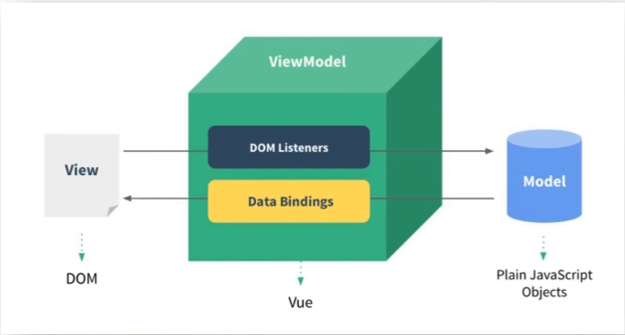
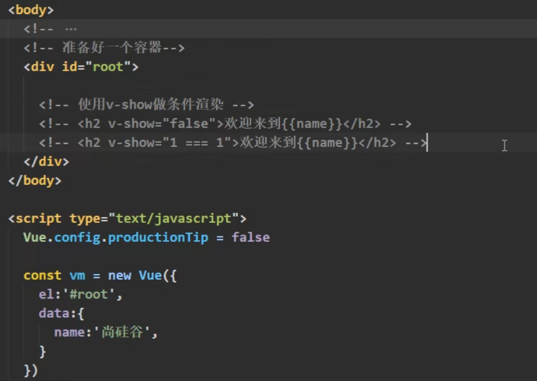
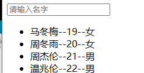
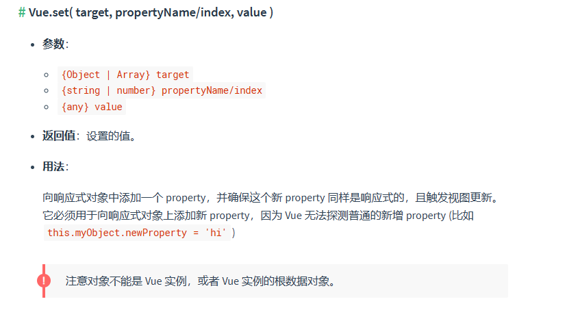
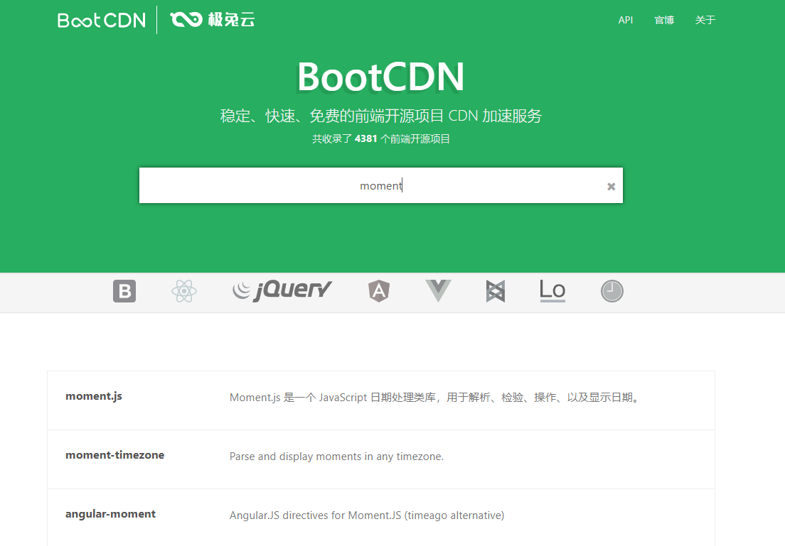
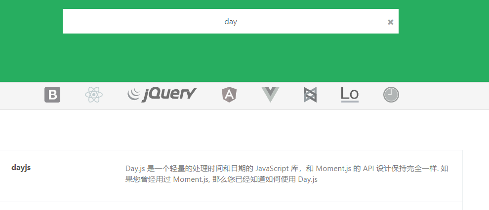
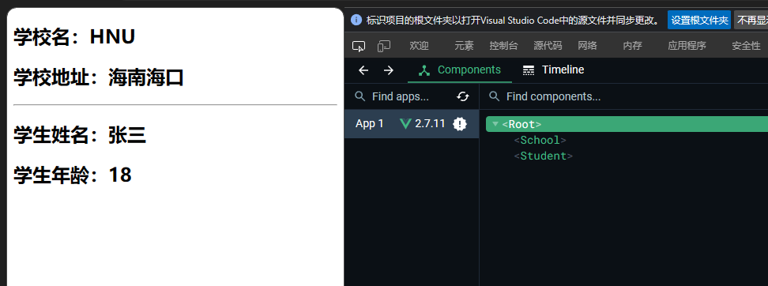
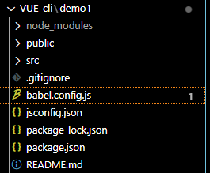
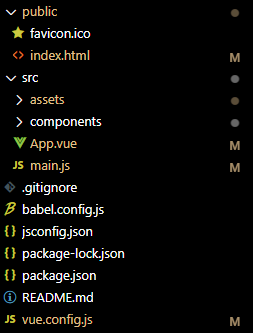

# 第一章：Vue核心

## 1.1.vue简介

Vue是一套用于**构建用户界面**的 **渐进式** JavaScript框架

特点：

* 采用**组件化**模式，提高代码复用率，且让代码更好维护。（一个.vue文件就是一个组件）
* **声明式**编码，让编码人员无需直接操作DOM，提高开发效率。


<!--more-->


学习Vue之前要掌握的JavaScript:基础知识？

* ES6语法规范
* ES6模块化
* 包管理器
* 原型、原型链
* 数组常用方法
* axios
* promise
* ...


### 安装

两种方式

* 直接`<script>`引用
  * CDN
* NPM
  * 命令行工具


## 1.2.第一个VUE实例

```html
<head>
    <title>初始VUE</title>
    <script src="https://unpkg.com/vue@3/dist/vue.global.js"></script>
    <!-- <script src="https://cdn.jsdelivr.net/npm/vue@2"></script> -->
	<!--<script src="https://cdn.jsdelivr.net/npm/vue@2.7.11/dist/vue.js"></script>--> 
</head>
</head>
<body>
     <!-- 容器 -->
    <div id="root">
        <h1>hello, {{name}}</h1>
        <!--{{里面要么写vue定义的元素，要么写js表达式，比如Date.now()}}-->
    </div>
    
    <script type="text/javascript">
        //创建vue实例
        //VUE2
        // const x = new Vue({
        //     el: '#root',  //匹配容器实例 值通常为css选择器字符串
        //     //el: document.getelementById('root')
        //     data:{
        //         name: 'ljc'
        //     }
        // })

        //VUE3
        Vue.createApp({
            data() {
                return {
                    name: 'ljc'
                }
            }
        }).mount('#root')

    </script>
</body>
```


==注意：一个容器和一个vue实例必须一一对应==

VUE将数据交给vue实例报关，可以动态更新数据


## 1.3.模板语法


### 插值语法

```html
    <div id="root">
        <h1>插值语法</h1>
        <h3>你好，{{name}}</h3>
    </div>

    <script type="text/javascript">
        Vue.config.productionTip = false;

        new Vue({
            el: '#root',
            data:{
                name:'jack'
            }
        })
    </script>
```


### 指令语法

```html
    <div id="root">
        <h1>指令语法</h1>
        <a v-bind:href="url">点我去百度</a>
    </div>

    <script type="text/javascript">
        Vue.config.productionTip = false;
        new Vue({
            el: '#root',
            data:{
                url:'http://www.baidu.com'
            }
        })
    </script>
```


**注意**：

加上 `v-bind` 属性后，`" "`中的内容将被视为 Js 表达式

**v-bind 简写**

```html
<a v-bind:href="url"></a>
<a :href="url"></a>
```


>  什么时候用插值，什么时候用指令？
>
> 插值语法一般用于标签体内容
>
> 指令语法一般用于解析标签（包括：标签属性，标签体内容，绑定事件...）
>
> 注意：Vue有很多属性，形式为：v-xxx


## 1.4.数据绑定

### 1.4.1.单向绑定

* v-bind

```html
    <div id='root'>
        单向数据绑定：<input type="text" v-bind:value="name">
    </divid>

    <script type="text/javascript">
        Vue.config.productionTip = false;

        new Vue({
           el:'#root',
           data:{
                name:'kenny'  
           }

        })
    </script>
```


### 1.4.2.双向绑定

* v-model

```html
    <div id='root'>
        单向数据绑定：<input type="text" v-bind:value="name"><br>
        双向数据绑定：<input type="text" v-model:value="name">
    </divid>

    <script type="text/javascript">
        Vue.config.productionTip = false;

        new Vue({
           el:'#root',
           data:{
                name:'kenny'  
           }

        })
    </script>
```


> 注意！！v-model只能应用在表单类元素（输入类元素）上

v-model两种写法

```
v-model:vallue=""
v-model=""
```


> el和data的两种写法

* el

```js
const v = new Vue({
    // el:'#root',
    data:{
        name:'haha'
    }
})
v.$mount('#root')
```


* data

```js
//对象式
data:{
    name:'kenny'
}

//函数式
data:function(){
	return{
        name:'kenny'
    }
}
//简略写法
data(){
    return{
        name:'kenny'
    }
}
```

**之后用到组件时，data必须用函数式，否则会报错**

**由Vue所管理的函数，一定不能写成箭头函数，否则this指向Window**


## 1.5.MVVM模型(vue)

1.**M** 模型Model：对于data中的数据

2.**V**  视图View：模板

3.**VM**：视图模型ViewModel： Vue实例对象



```html
    <div id="root">        <!--View-->
        <h1>学校名称：{{name}}</h1>
        <h1>学校地址：{{address}}</h1>
    </div>

    <script>
        Vue.config.productionTip = false

        const vm = new Vue({     //-------》ViewModel
            el:'#root',
            data:{        //-------》Model
                name:'HNU',
                address:'海南'
            }
        })
    </script>
```

因为Vue的设计收到了MVVM的启发，因此文档中经常用 `vm` （ViewModel）这个变量名来代表Vue实例

**vm身上所有的属性，以及Vue原型上所有属性，在Vue模板中都可以使用**


## 数据处理（补充）

### Object.defineProperty

```js
let person = {
    name:'张三',
    sex:'男'
}

Object.defineProperty(person, 'age', {  
    value:18,
    enumerable:true,    //可枚举，默认不可枚举
    writable:true,   //可以被修改，默认不能被修改
    configurable:true //可以被删除，默认false
})   //(对象，属性，{配置项})
```


get配置项

```js
let number = 20
let person = {
    name:'张三',
    sex:'男',
}

Object.defineProperty(person, 'age', {  
    //当有人读取person的age属性时，get函数(getter)就会被调用，且返回值就是age的值
    get:function(){
        console.log('有人读取age属性了')
        return number
    }
    
    //当有人修改person的age属性时，set函数（setter）就会被调用，且会收到修改的具体值
     set(value){
    	console.log('有人修改了age属性，且值是',value)
	}

})   //(对象，属性，{配置项})

console.log(person);
```


### 数据代理

通过一个对象代理另一个对象中属性的操作（读/写）

* 简单的示例

```js
let obj1 = {x:100}
let obj2 = {y:200}
//通过obj2操作obj1
Object.defineProperty(obj2,'x',{
    get(){
        return obj.x;
    }
    set(value){
    	obj.x = value;
	}
})
```


Vue的data就是数据代理的实现


## 1.6.事件处理

### 事件基本使用

```html
<body>
    <div id="root">
        <h2>欢迎学习{{name}}</h2>
        <button v-on:click="showInfo">点我提示信息</button>
    </div>
</body>

<script>
    Vue.config.productionTip = false
    const vm = new Vue({
        el:'#root',
        data:{
            name:'VUE'
        },
        methods:{
            showInfo(event){
                alert('hello')
                console.log(event.target.innerText)  //打印事件绑定元素内容
                console.log(this === vm);   //this 是 vm（vue实例对象）
            }
        }
    })
</script>
```


v-on:  简写  @

```html
<button @click="showInfo">点我提示信息</button>
```


* 如何传递参数？

在绑定的函数名后加 (arg)

直接加上参数不做其他操作会把event代替掉，解决方法：添加==$event==参数

```html
<body>
    <div id="root">
        <h2>欢迎学习{{name}}</h2>
        <button v-on:click="showInfo(666,$event)">点我提示信息</button>
    </div>
</body>

<script>
    Vue.config.productionTip = false
    const vm = new Vue({
        el:'#root',
        data:{
            name:'VUE'
        },
        methods:{
            showInfo(number,e){
                alert('hello')
                console.log(event.target.innerText)  //打印事件绑定元素内容
                console.log(this === vm);   //this 是 vm（vue实例对象）
            }
        }
    })
</script>
```


事件的基本使用：

* 1.使用v-on:xxx或@xxx绑定事件，其中xxx是事件名
* 2.事件的回调需要配置在methods,对象中，最终会在vm上
* 3.methods中配置的函数，不要用箭头函数！否则this就不是vm了
* 4.methods中配置的函数，都是被Vue所管理的函数，this的指向是vm或组件实例对象
* 5.@click:="demo"和@click="demo($event)"效果一致，但后者可以传参


### 事件修饰符

举例：

```html
<body>
    <div id="root">
        <h2>欢迎学习{{name}}</h2>
        <a href="www.baidu.com" @click.prevent="showInfo">点我提示信息</a>
    </div>
</body>

<script>
    Vue.config.productionTip = false
    const vm = new Vue({
        el:'#root',
        data:{
            name:'VUE'
        },
        methods:{
            showInfo(number,e){
                //e.preventDefault()   //上面的@click.prevent就是实现这行代码
                alert('hello')
            }
        }
    })
</script>
```

这个@click紧接着的.prevent 就是事件修饰符


**Vue中的事件修饰符**：

* 1.prevent:阻止默认事件（常用）：（比如form 有 @submit事件 可以用@submit.prevent  ）
* 2.stop:阻止事件冒泡（常用）：
* 3.once:事件只触发一次（常用）
* 4.capture:使用事件的捕获模式：
* 5.self:只有event.target是当前操作的元素是才触发事件：
* 6.passive:事件的默认行为立即执行，无需等待事件回调执行完毕：


>  解释一下passive：

例如在滚动事件时，（可以用scroll，可以用wheel）

```html
<body>
    <div id="root">
        <ul @wheel="demo" class="list">
            <li>1</li>
            <li>2</li>
            <li>3</li>
    	</ul>
    </div>
</body>

<script>
	new Vue({
        el:'#root',
        methods:{
            demo(e){
                for(let i=0;i<1000;i++){
                    console.log('#')
                }
                console.log('累坏了')
            }
        }
    })
</script>
```

在遇到事件时，默认时先执行回调函数，再执行事件，所以用passive（比如@wheel.passive）可以优化：先立即执行事件。多用于移动端


### 键盘事件

@keyup, @keydown

举例

```html
<body>
    <div id="root">
        <h2>欢迎学习{{name}}</h2>
        <input type="textp" laceholder="按下回车提示输入" @keyup.enter="showInfo">
    </div>
</body>

<script>
    Vue.config.productionTip = false
    const vm = new Vue({
        el:'#root',
        data:{
            name:'VUE'
        },
        methods:{
            showInfo(e){
                //我们想要按下回车时才进行回调
                //if(e.keyCode !== 13) return;
                alert('hello')
            }
        }
    })
</script>	
```

可以用@keyup.enter 代替注释的代码，表示只有按下Enter键才执行回调，enter称为**按键别名**

1.Vue中常用的按键别名：

* 回车=>enter
* 除=>delete(捕获“删除”和“退格”键)
* 退出=>esc
* 空格=>space
* 换行=>tab  （**比较特殊，配合keydown使用**）
* 上=>up
* 下=down
* 左=>left
* 右=>right
* 切换大小写=>caps-lock(这是原始名，不是别名)

2.Vue未提供别名的按键，可以使用按键原始的key值去绑定，但注意要转为kebab-case(短横线命名)

3.**系统修饰键**（用法特殊）：ctrl、alt、shift、meta

* (1).配合keyup使用：按下修饰键的同时，再按下其他键，随后释放其他键，事件才被触发。
  * 可以指定配合的其他案件：`@keyup.ctrl.y`  ctrl+y
* (2),配合keydown使用：正常触发事件。

4.也可以使用**keyCode**去指定具体的按键（**不推荐**）

5.**Vue.config.keyCodes.自定义键名=键码**，可以去定制按键别名


## 1.7.计算属性与监视

### 计算属性computed

```html
<body>
    <div id="root">
        姓：<input type="text" v-model="firstName">  <br>
        名：<input type="text" v-model="lastName">  <br>
        姓名： <span>{{fullName}}</span>
    </div>
</body>
<script>
    Vue.config.productionTip = false;
    new Vue({
        el:'#root',
        data:{
            firstName:'张',
            lastName:'三',
        },
        computed:{
            fullName:{
                //get作用，当有人读取fullName时，get被调用，返回值作为fullName的值
                //get什么时候调用？  
                //1.初次读取fullName时，
                //2.所依赖的数据发生变化时
                get(){
                    console.log('get 调用ed')
                    return this.firstName + '-' + this.lastName
                }
                set(value){   //不是必须写，需要修改就写
                    const arr = value.split('-')
                    console.log(arr);
                    this.firstName=arr[0]
                    this.lastName=arr[1]
                }
            }
        }
    })
</script>
```

计算属性：

* 1.定义：要用的属性不存在，要通过已有属性计算得来
* 2,原理：底层借助了Objcet.defineproperty.方法提供的getter和setter.。
* 3.get函数什么时候执行？
  * (1).初次读取时会执行一次。
  * (2).当依赖的数据发生改变时会被再次调用。
* 4.优势：与methods实现相比，内部有**缓存机制**（复用），效率更高，调试方便。
* 5.备注：
  * 1,计算属性最终会出现在vm上，直接读取使用即可。
  * 2.如果计算属性要被修改，那必须写set函数去响应修改，且set中要引起计算时依赖的数据发生变化


#### 计算属性简写：

首先确定计算数学只展示，不修改

完整写法

```js
computed:{
            fullName:{
                //get作用，当有人读取fullName时，get被调用，返回值作为fullName的值
                //get什么时候调用？  
                //1.初次读取fullName时，
                //2.所依赖的数据发生变化时
                get(){
                    console.log('get 调用ed')
                    return this.firstName + '-' + this.lastName
                }
            }
}
```

简写,将fullName当成get函数用

```js
computed:{
            fullName(){ 
                    console.log('get 调用ed')
                    return this.firstName + '-' + this.lastName
            }
}
```


### 监视

监视元素是否被修改，可以拿到修改前后的值

```html
<body>
    <div id="root">
        <h2>今天天气很{{info}}</h2>
        <button @click="change">点击切换</button>
    </div>
</body>
<script>
    Vue.config.productionTip = false;
    new Vue({
        el:'#root',
        data:{
            ishot:true
        },
        computed:{
            info(){
                return this.ishot ? '炎热' : '凉爽'
            }
        },
        methods:{
            change(){
                this.ishot = !this.ishot
            }
        },
        watch:{    //==========监视===============================
            ishot:{
                immediate:true //初始化时让handler调用一下
                handler(newValue, oldvalue){
                    console.log('ishot 被修改', newValue, oldvalue);
                }
            }
        }
    })
</script>
```


也可以在外面绑定监视，不过记得加“”

```html
<body>
    <div id="root">
        <h2>今天天气很{{info}}</h2>
        <button @click="change">点击切换</button>
    </div>
</body>
<script>
    Vue.config.productionTip = false;
    vm = new Vue({
        el:'#root',
        data:{
            ishot:true
        },
        computed:{
            info(){
                return this.ishot ? '炎热' : '凉爽'
            }
        },
        methods:{
            change(){
                this.ishot = !this.ishot
            }
        },
    })
    vm.$watch('ishot',{     //注意一定要加引号，否则会直接读取变量
        handler(newValue, oldvalue){
            console.log('ishot 被修改', newValue, oldvalue);
        }
    })
    
</script>
```

监视属性watch:

* 1.当被监视的属性变化时，回调函数自动调用，进行相关操作
* 2.监视的属性必须存在，才能进行监视！！
* 3.监视的两种写法：
  * (1).new Vuel时传入watch配置
  * (2).通过vm.$watch监视


#### 深度监视

监视多级结构

```js
data:{
	a:{
		b:1
	}
}
```


```js
 watch:{   
     'a.b'{
         
     }
 }
```


深度监视

```js
data:{
	a:{
		b:1
	}
}
watch:{
	deep:true,   //  可以监视多级结构中所有属性的变化
	a;{
		handler(newValue, oldvalue){
        }
	}
}
```

深度监视：
(1).Vue中的watch默认不监测对象内部值的改变（一层）。
(2).配置deep:true可以监测对象内部值改变（多层）。
备注
(1).Vue自身可以监测对象内部值的改变，但Vue提供的watch默认不可以！
(2),使用watch时根据数据的具体结构，决定是否采用深度监视。


#### 监视简写

如果不需要immediate和deep，就可以简写（只有handler）

* 正常写法：

```js
watch:{    //==========监视===============================
    ishot:{
        handler(newValue, oldvalue){
            console.log('ishot 被修改', newValue, oldvalue);
        }
    }
}
```


* 简写：

```js
watch:{
    ishot(newValue, oldvalue){
        console.log('ishot 被修改', newValue, oldvalue);
    }
}
```


```js
vm.$watch('ishot',function(newValue, oldvalue){
    console.log('ishot 被修改', newValue, oldvalue);
})
```

computed和watch之间的区别：
1,computedi能完成的功能，watch都可以完成。
2.watch能完成的功能，computed不一定能完成，例如：watch可以进行异步操作。
两个重要的小原则：
1.所被Vue管理的函数，最好写成普通函数，这样this的指向才是vm或组件实例对象。
2.所有不被Vue所管理的函数（定时器的回调函数、ajax的回调函数等、Promise的回调函数），最好写成箭头函数，
这样this的指向才是vm或组件实例对象。


## 1.8.class与style绑定

在应用界面中，某些元素的样式是变化的

class/style 绑定就是实现动态样式效果

### 绑定class

```html
<style>
    .basic{
        
    }
    
    .update{
        
    }
</style>

<div id="root">
    <div :class="class" @click="change">
        {{name}}
    </div>
</div>
<script>
	new Vue({
        el:'#root',
        data:{
            name: 'kenny',
            class: 'basic'    //在这儿绑定
        },
        methods:{
            change(){
                this.class = "update"
            }
        }
    })
</script>
```


* 通过对象绑定

```html
<style>
    .basic{
        
    }
    
    .update{
        
    }
</style>

<div id="root">
    <div :class="classObj" >
        {{name}}
    </div>
</div>
<script>
	new Vue({
        el:'#root',
        data:{
            name: 'kenny',
            classObj:{
                basic:true,
                update:false,
        	},
        	//也可以通过数组绑定
            //classArr:['basic','update']
        },
        
    })
</script>
```


### 绑定style

```html
<style>
    .basic{
        
    }
    
    .update{
        
    }
</style>

<div id="root">
    <div :class="classObj"  :style="{fontSize: fsize+'px'}">
        {{name}}
    </div>
</div>
<script>
	new Vue({
        el:'#root',
        data:{
            name: 'kenny',
            classObj:{
                basic:true,
                update:false,
        	},
			fsize:40
        },
        
    })
</script>
```

在style里面放js对象

也可以这样：

```html
<style>
    .basic{
        
    }
    
    .update{
        
    }
</style>

<div id="root">
    <div :class="classObj"  :style="styleObj">
        {{name}}
    </div>
</div>
<script>
	new Vue({
        el:'#root',
        data:{
            name: 'kenny',
            classObj:{
                basic:true,
                update:false,
        	},
			styleObj:{
                fontSize: '40px'
            }
        },
        
    })
</script>
```


## 1.9.条件渲染

* 使用v-show做条件渲染



v-show只会隐藏，不会删除结构


* v-if

```html
<div v-show="false"></div>
<div v-if="false"></div>
<div v-else-if = "1===3"></div>
<div>@</div>    中间不能被打断，否则之后的不奏效
<div v-else></div>
```

会隐藏，也删除结构

有v-if，也有v-else-if，如果if成立，else-if就不会生效

也有v-else


>  条件渲染：

* 1.v-if
  写法：

  * (1).v-if="表达式”
  * (2).v-e1se-if="表达式"
  * (3).v-else="表达式

  适用于：切换频率较低的场景。
  特点：不展示的D0M元素直接被移除。
  注意：v-if可以和：v-else-if、v-else一起使用，但要求结构不能被“打断”。

* 2.v-show
  * 写法：V-show="表达式”
  * 适用于：切换频率较高的场景。
  * 特点：不展示的D0M元素未被移除，仅仅是使用样式隐藏掉
* 3.备注：使用V-if的时，元素可能无法获取到，而使用v-show一定可以获取到。


## 1.10.列表渲染

### **v-for**

```html
<div v-for="item in items">
  {{ item.text }}
</div>
```

列表渲染

```vue
data() {
  return {
    items: [{ message: 'Foo' }, { message: 'Bar' }]
  }
}
```

```html
<ul>
    <li v-for="item in items" :key="item.id">   
	  {{ item.message }}
	</li>
</ul>
```

:key   绑定唯一标识符


可以遍历接受两个值 (value,index)

```html
<li v-for="(value,index) in items" :key="index">   
    {{ item.message }}
</li>
```


也可以**遍历对象**

```js
data() {
  return {
    car:{
		name:'奥迪',
        price:"70w",
        color:'黑色'
	}
  }
}
```

```html
<li v-for="(value,k) in car" :key="k">   
    {{k}}--{{value}}
</li>
```


**遍历字符串同理**

还可以遍历**指定次数**：

```html
<li v-for="(value,index) in 5" :key="index">   
    {{value}}--{{index}}
</li>
```


### 列表过滤

用途：在搜索框中输入时，有筛选效果




用watch实现

```html
<body>
    <div id="root">
        <input type="text" placeholder="请输入名字" v-model="keyword">
        <ul>
            <li v-for="(p,index) in filPersons" :key="index">
                {{p.name}}--{{p.age}}--{{p.sex}}
            </li>
        </ul>
    </div>

</body>

<script>
    Vue.config.productionTip = false
    new Vue ({
        el:'#root',
        data:{
            keyword:'',
            persons:[
                {id:'001',name:'马冬梅',age:19,sex:'女'},
                {id:'002',name:'周冬雨',age:20,sex:'女'},
                {id:'003',name:'周杰伦',age:21,sex:'男'},
                {id:'004',name:'温兆伦',age:22,sex:'男'}
            ],
            filPersons:[]
        },
        //用watch实现
        watch:{
            keyword:{           
                immediate:true, 
                handler(val){              
                    console.log('keyword被改了',val); 
                    this.filPersons = this.persons.filter((p)=>{
                        return p.name.indexOf(val) !== -1
                    })
                }
            }
        }
    })
</script>
</html>
```


用compute实现：

```html
<script>
    Vue.config.productionTip = false
    new Vue ({
        el:'#root',
        data:{
            keyword:'',
            persons:[
                {id:'001',name:'马冬梅',age:19,sex:'女'},
                {id:'002',name:'周冬雨',age:20,sex:'女'},
                {id:'003',name:'周杰伦',age:21,sex:'男'},
                {id:'004',name:'温兆伦',age:22,sex:'男'}
            ]
        },
        //compute
        computed:{
            filPersons(){
                return this.persons.filter((p)=>{
                    return p.name.indexOf(this.keyword) !== -1
                })
            }
        }
    })
</script>
```


### 列表排序

在上一个的基础上增加排序


```html
<body>
    <div id="root">
        <input type="text" placeholder="请输入名字" v-model="keyword">
        <button @click="sortType = 2">年龄升序</button>
        <button @click="sortType = 1">年龄降序</button>
        <button @click="sortType = 0">年龄原排序</button>
        <ul>
            <li v-for="(p,index) in filPersons" :key="p.id">
                {{p.name}}--{{p.age}}--{{p.sex}}
            </li>
        </ul>
    </div>

</body>

<script>
    Vue.config.productionTip = false
    new Vue ({
        el:'#root',
        data:{
            keyword:'',
            sortType:0,  //0原排序，1，降序，2，升序
            persons:[
                {id:'001',name:'马冬梅',age:19,sex:'女'},
                {id:'002',name:'周冬雨',age:20,sex:'女'},
                {id:'003',name:'周杰伦',age:21,sex:'男'},
                {id:'004',name:'温兆伦',age:22,sex:'男'}
            ],
            
        },
        //compute
        computed:{
            filPersons(){
                const arr =  this.persons.filter((p)=>{
                    return p.name.indexOf(this.keyword) !== -1
                })
                if(this.sortType!==0){
                    arr.sort((p1,p2)=>{
                        return this.sortType === 1 ? p2.age-p1.age : p1.age-p2.age
                    })
                }
                return arr
            }
        }
    })
</script>
</html>
```


### vue监测数据改变的原理

>  Vue检测对象数据改变

https://www.bilibili.com/video/BV1Zy4y1K7SH?p=34&vd_source=c2c8a4fe07a11ba495278ab92632a245


>  Vue.set()方法

为Vue中的**属性或对象**添加响应式的属性（对象）

**不能直接给Vm._data添加**

```vue
Vue.set(target, key, val)

Vue.set(vm._data.student,'sex','男')
Vue.set(vm.student,'sex','男')
```

也可以

```
vm.$set(vm.student,'sex','男')
```


官方说法




## 1.11.收集表单数据

收集表单数据：
若：`<input type="text"/>`,则v-model收集的是value值，用户输入的就是value值。
若：`<input type="radio"/>`,则v-model收集的是value值，且要给标签配置value值。
若：`<input type="checkbox"/>`

​	1.没有配置input的value属性，那么收集的就是checked(勾选or未勾选，是布尔值)

​	2.配置input的value属性：

​		(1)-model的初始值是非数组，那么收集的就是checked(勾选or未勾选，是布尔值)

​		(2)v-mode1的初始值是**数组**，那么收集的的就是value组成的数组

备注：

* v-model的三个修饰符：
* lazy:失去焦点再收集数据
* number:输入字符串转为有效的数字
* trim:输入首尾空格过滤

```html
<body>
    <div id="root">
        <form >
            <label for="demo">账号：</label>
            <input type="text" id="demo" v-model="account">  <br> <br>
            <label for="demo2">密码：</label>
            <input type="text" id="demo2" v-model="passwd"><br><br>
            性别： 
            男<input type="radio" name="sex" value="male" v-model="sex">
            女<input type="radio" name="sex" value="female" v-model="sex"> <br><br>
            爱好：
            学校<input type="checkbox" v-model="hobby" value="study">
            打游戏<input type="checkbox" v-model="hobby" value="game">
            吃饭<input type="checkbox" v-model="hobby" value="eat">   <br><br>
            所属校区
            <select v-model="city">
                <option value="">请选择校区</option>
                <option value="beijing">北京</option>
                <option value="shanghai">上海</option>
                <option value="深圳">深圳</option>
                <option value="武汉">武汉</option>
            </select> <br><br>
            其他信息：
            <textarea v-model="other"></textarea>  <br><br>
            <input type="checkbox" v-model="agree"> 阅读并接受<a href="#">《用户协议》</a>
            <button>提交</button>
        </form>
    </div>
</body>
<script>
    Vue.config.productionTip = false
    new Vue({
        el: '#root',
        data:{
            account:'',
            passwd:'',
            sex:'',
            hobby:[], 
            city:'',
            other:'',
            agree:'',
        }
    })
</script>
```


## 1.12.过滤器

### 1.12.1效果


### 1.12.2第三方库

moment（体积稍大）




day（轻量）



```html
<body>
    <div id="root">
        <h2>显示格式化后的时间</h2>
        <!-- 计算属性实现 -->
        <h3>现在是:{{fmtTime}}</h3>
        <!-- methods也可以实现，同理上面 -->
        <h3>现在是:{{getfmtTime()}}</h3>
        <!-- 过滤器实现 -->
        <h3>现在是：{{time | timeformater}}</h3>
        <!-- 过滤器实现(传参)  这里加上括号就可以接受其他参数，time也是可以自动接收的 -->
        <h3>现在是：{{time | timeformater('YYYY_MM_DD')}}</h3>
        <!-- 再过滤，只剩年 -->
        <h3>现在是：{{time | timeformater('YYYY_MM_DD') | sliceAgan}}</h3>
    </div>
</body>
<script>
    new Vue({
        el:'#root',
        data:{
            time: Date.now(),
        },
        computed:{
            fmtTime(){
                return dayjs().format('YYYY-MM-DD HH:mm:ss')
            }
        },
        methods:{
            getfmtTime(){
                return dayjs().format('YYYY-MM-DD HH:mm:ss')
            }
        },
        filters:{
            timeformater(value, str='YYYY-MM-DD HH:mm:ss'){
                //这里的value就是time
                return dayjs(value).format(str)
            },
            sliceAgan(value){
                return value.slice(0,4)
            }
        }
    })
</script>
```


>  过滤器：

定义：对要显示的数据进行特定格式化后再显示（适用于一些简单逻辑的处理）。

语法：

* 1.注册过滤器（全局）：Vue.filter(name,cal1back)或new Vue{filters:{}]}

* 2.使用过滤器：{(xxx|过滤器名}或v-bind:属性="xxx【过滤器名"

  备注：

* 1,过滤器也可以接收额外参数、多个过滤器也可以串联
* 2.并没有改变原本的数据，是产生新的对应的数据


## 1.13.内置指令与自定义指令

我们学过的指令：

* v-bind
  单向绑定解析表达式，可简写为:XXX
* v-model
  双向数据绑定
* v-for
  遍历数组/对象/字符串
* v-on
  绑定事件监听，可简写为@
* v-if
  条件渲染（动态控制节点是否存存在）
* v-else
  条件渲染（动态控制节点是否存存在）
* v-show
  条件渲染（动态控制节点是否展示）


### v-text

```html
<div>{{name}}</div>
<div v-text="name"></div>
```

v-text会拿到值，**当成文本**替换掉div里面的内容

所谓当成文本，不支持结构解析，即如果文本为标签，则不会渲染标签


### v-html

支持结构解析的v-text

v-html指令：

* 1.作用：向指定节点中渲染包含html结构的内容。
* 2,与插值语法的区别：
  * (1).v-html会替换掉节点中所有的内容，((xx}则不会。
  * (2).v-html可以识别html结构。
* 3.严重注意：v-html有安全性问题！！！！
  * (1).在网站上动态渲染任意HTML是非常危险的，容易导致XSS攻击。
  * (2).一定要在可信的内容上使用v-html,永不要用在用户提交的内容上！


### v-cloak

v-cloak指令（没有值）：

1.本质是一个特殊属性，Vue实例创建完毕并接管容器后，会删掉v-c1oak属性。

2.使用css配合V-cloak可以解决网速慢时页面展示出{(xxx)}的问题。


### v-once

v-once指令：

1.v-once所在节点在**初次动态渲染**后，就视为静态内容了。

2.以后数据的改变不会引起v-once所在结构的更新，可以用于优化性能。


### v-pre

v-pre指令：

1.跳过其所在节点的编译过程。

2.可利用它**跳过**：没有使用指令语法、没有使用插值语法的节点，会**加快编译**。


### 自定义指令

```html
<body>
    <div id="root">
        <h2>当前的值是：<span v-text="n"></span></h2>
        <h2>放大十倍后的值是: <span v-big="n"></span></h2>
        <button @click="n++">点我n++</button>
    </div>
</body>
<script>
    new Vue({
        el:'#root',
        data:{
            n:1,
        },
        directives:{ //定义指令
            //big函数何时被调用：1.指令和元素成功绑定时调用  2.指令所在的模板被重新解析时
            big(element, binding){
                element.innerText = binding.value*10
            }
        }
    })
</script>
```

Vue模板语法有2大类：

1.插值语法：

功能：用于解析标签体内容。

写法：(xxx)},xxx是js表达式，且可以直接读取到data中的所有属性。

2.指令语法：

功能：用于解析标签（包括：标签属性、标签体内容、绑定事件，··）

举例：v-bind:href="xxx"或简写为：href="xxx",Xxx同样要写js表达式，且可以直接读取到data中的所有属性。

备注：Vue中有很多的指令，且形式都是：v-???,此处我们只是拿v-bind举个例子。


自定义指令总结：
定义语法：
(1).局部指令：

new Vue({directives:{指令名：配置对象}})
或

new Vue({directives(指令名：回调函数)})

(2).全局指令：
Vue.directive(指令名，配置对象)或
Vue.directive(指令名，回调函数)
配置对象中常用的3个回调：
(1).bind:指令与元素成功绑定时调用。
(2).inserted:指令所在元素被插入页面时调用。
(3).update:指令所在模板结构被重新解析时调用。
三、备注：
1.指令定义时不加v-,但使用时要加v-:
2.指令名如果是多个单词，要使用kebab-case命名方式，不要用camelCase命名。


## 1.14.过渡案例(引出生命周期)

下方代码会在浏览器生成文字透明度的渐变效果（**使用生命周期函数**）

```html
<!DOCTYPE html>
<html lang="en">
<head>
    <meta charset="UTF-8">
    <meta http-equiv="X-UA-Compatible" content="IE=edge">
    <meta name="viewport" content="width=device-width, initial-scale=1.0">
    <title>Document</title>
    <script src="https://cdn.jsdelivr.net/npm/vue@2.7.11/dist/vue.js"></script>
</head>
<body>
    <div id="root">
        <h2 :style="{opacity}">欢迎学VUE</h2>
    </div>
</body>
<script>
    new Vue({
        el:'#root',
        data:{
            opacity:1,
        },
        //Vue完成模板的解析并把初始的真实DOM元素放入页面后（挂载完毕） 调用mounted生命周期函数（钩子）
        mounted(){
            setInterval(()=>{
                this.opacity -= 0.01
                if(this.opacity<=0) this.opacity=1;
            },16)
        }
    })
</script>
</html>
```


**不使用生命周期函数会有哪些问题？**

一般不会把跟vue模板操作相关的代码（全局定义除外）放在 Vue( ) 之外，所以最好不把**setInterval**函数放在外面。

但是如果放在里面使用**methods**属性来存放**setInterval**，则会在更新数据data时，同时又重新解析页面，然后又重新调用**setInterval**（无限循环）

比如

```html
<div id="root">
    <h2 :style="{opacity}">欢迎学VUE</h2>
    {{change()}}
</div>
```

```js
new Vue({
        el:'#root',
        data:{
            opacity:1,
        },
        methods：{
    		change(){
    			setInterval(()=>{
                    this.opacity -= 0.01
                    if(this.opacity<=0) this.opacity=1;
                },16)
            }
        }
    })
```


 


# 第一点五章：Vue生命周期


常用的生命周期钩子：

* 1.**mounted**:发送ajax请求、启动定时器、绑定自定义事件、订阅消息等【初始化操作】
* 2.**beforeDestroy**:清除定时器、解绑自定义事件、取消订阅消息等【收尾工作】。


## 挂载流程

* before


## 更新流程

在挂在完毕（mounted）与销毁之前（beforeDestroy），如果页面发生变化，则会进入**更新流程**。

* beforeUpdate：
  * 此时，**数据是新的，但是页面是旧的**（页面尚未渲染新数据）
* 正在根据新数据生成新的虚拟DOM，随后与旧的虚拟DOM进行比较，最终完成视图（Model->View）的更新

* updated：**数据、页面都是新的**


## 销毁流程

* beforeDestroy
* destroyed


关于销毁Vue实例

* 1.销毁后借Vue开发者工具看不到任何信息。
* 2.销毁后自定义事件会失效，但**原生D0M事件依然有效。**
* 3.一般不会再beforeDestroy操作数据，因为即便操作数据，也不会再触发更新流程了。


## 官方图片（Vue3文档）

此图结合Vue组件化编程查看

[生命周期选项 | Vue.js (vuejs.org)](https://cn.vuejs.org/api/options-lifecycle.html)


# 第二章：Vue组件化编程

## 2.1模块与组件，模块化与组件化

### 2.1.1 模块

理解：向外提供特定功能的js程序，就是一个js文件

为什么：js文件很多很复杂

作用：服用js，简化js编写，提高效率


### 2.1.2 组件

理解：用来实现局部（特定）功能效果的代码集合（html/css/js/image）

为什么：一个界面的功能很复杂

作用：复用，简化，提高效率


### 2.1.3 模块化，组件化

程序使用模块，和组件的方式来编写的，就是模块化，组件化


## 2.2 非单文件组件

### 基本使用

一个文件中包含有n个组件，**开发时一般不用，这里为了过渡学习**



```html
<body>
    <div id="root">
        <!-- 组件标签 -->
        <school></school>  
        <hr>
        <student></student>
    </div>
</body>
<script>

    //第一步：创建组件
    //创建school组件：
    const school = Vue.extend({
        // el:'#root',  不能用！只有在创建new Vue({})时候才能使用el
        //可以理解为组件要复用，不能固定绑定某一个对象
        //data也不能直接写成对象，要写成函数式
        template: `
            <div>
                <h2>学校名：{{schoolName}}</h2>
                <h2>学校地址：{{address}}</h2>  
            </div>
        `,
        data(){
            return {
            schoolName:'HNU',
            address:'海南海口'
            }
        }
    })
    const student = Vue.extend({
        template: `
            <div>
                <h2>学生姓名：{{studentName}}</h2>
                <h2>学生年龄：{{age}}</h2>
            </div>
        `,
        data(){
            return {
            studentName:'张三',
            age:18
            }
        }
    })

    //第二部：注册组件
    //创建Vm
    new Vue({
        el:'#root',
        //局部注册
        components:{
            school: school,    //组件名: 绑定的对象,
            student: student
        }
    })
</script>
```


一个vm里面多个组件互不影响


>  如何全局注册？

```html
<body>
    <div id="root">
        <hello></hello>
    </div>
    <hr>
    <div id="root2">
        <hello></hello>
    </div>
</body>
<script>
    const hello = Vue.extend({
        template:`
            <div>
                <h2>你好呀</h2>        
            </div>
        `,
    })
    //注册全局组件
    Vue.component('hello', hello)  //注意不是compunents
    new Vue({
        el:'#root',

    })

    new Vue({
        el: '#root2',
    })

</script>
```


### 组件注意点

几个注意点：

* 1.关于组件名：
  * 一个单词组成：
    第一种写法（首字母小写）：school
    第二种写法（首字母大写）：School
  * 多个单词组成：
    第一种写法(kebab-case命名)：my-school
    第二种写法(CamelCase命名)：MySchool**(需要Vue脚手架支持)**
    备注：
    (1).组件名尽可能回避HTML中已有的元素名称，例如：h2、H2都不行。
    (2).可以使用name配置项指定组件在开发者工具中呈现的名字。
* 2.关于组件标签：
  * 第一种写法：`<schoo1></schoo1>`
  * 第二种写法：`<school/>`
    **备注：不用使用脚手架时，`<schoo1/>`会导致后续组件不能渲染。**
* 3.一个简写方式：
  `const school=Vue.extend(options)`可简写为：`const school = options`	

```js
const hello = {
        template:`
            <div>
                <h2>你好呀</h2>        
            </div>
        `,
    }
//原来是 const hello = Vue.extend({})
```


### 组件的嵌套

```html
<body>
    <div id="root">
        <!-- 组件标签 -->
        <app></app>
        <hr>

    </div>
</body>
<script>

 
    const student = Vue.extend({
            template: `
                <div>
                    <h2>学生姓名：{{studentName}}</h2>
                    <h2>学生年龄：{{age}}</h2>
                </div>
            `,
            data(){
                return {
                studentName:'张三',
                age:18
                }
            }
        })

    //创建school组件：
    const school = Vue.extend({
        // el:'#root',  不能用！只有在创建new Vue({})时候才能使用el
        //可以理解为组件要复用，不能固定绑定某一个对象
        //data也不能直接写成对象，要写成函数式
        template: `
            <div>
                <h2>学校名：{{schoolName}}</h2>
                <h2>学校地址：{{address}}</h2>  
                <hr>
                <student></student>
            </div>
        `,
        data(){
            return {
            schoolName:'HNU',
            address:'海南海口'
            }
        },
        components:{
            student,
        }
    })
    
    const app = Vue.extend({
        template: `
            <div>
                <school></school>
            </div>
        `,
        components:{
            school,
        }
    })
    //创建Vm
    new Vue({
        el:'#root',
        //局部注册
        components:{
            app,    //组件名: 绑定的对象,

        }
    })
</script>
```


### VueComponent构造函数

关于VueComponent:

1.school组件本质是一个名为VueComponent的构造函数，且不是程序员定义的，**是Vue.extend生成的**。

2.我们只需要写`<school/>`或`<school></school>`,Vue解析时会帮我们创建schoo1组件的实例对象，
即Vue择我们执行的：new VueComponent(options)。

3.特别注意：**每次调用Vue.extend,返回的都是一个全新的VueComponent**!!!!

4.关于this指向：

* (1).组件配置中：
  data函数、methods中的函数、watch中的函数、computed中的函数它们的**this均是【VueComponent实例对象】**
* (2).new Vue()配置中：
  data函数、methods中的函数、watch中的函数、computed中的函数它们的this均是【Vue实例对象】。

5.VueComponent的实例对象，以后简称**vc** (也可称之为：组件实例对象)。
Vue的实例对象，以后简称vm。


### 一个重要的内置关系

VM与VC的关系

1,个重要的内置关系：

VueComponent.prototype.proto ==Vue.prototype

2,为什么些有这个关系：**让组件实例对象(vc)可以访同到Vu原型正的属作、万法**。

3.VM与VC区别：VC不能绑定el，且data必须是函数式


## 2.3 单文件组件

一个文件中只包含有1个组件

首先编写组件School.vue

```vue
<template>
    <!-- 组件的结构 -->
    <div class="'demo'">
        <h2>学校名称:{{ schoolName }}</h2>
        <h2>学校地址：{{ address }}</h2>
        <button @click="showName">点我提示学校名</button>
    </div>
</template>

<script>
    //组件交互代码
    export default {
        name:'School',
        date(){
            return {
                schoolName:'HNU',
                address:'hainan'
            }
        },
        methods:{
            showName(){
                alert(this.schoolName);
            }
        }
    }

</script>

<style>
    /* 组件样式 */
    .demo{
        background-color: orange;
    }
</style>


```


用App汇总组件

```vue
<template>
    <div>
        <School></School>
    </div>
</template>

<script>
    import School from './School'
    export default {
        components:{
            School,
        }

    }
</script>

<style>

</style>
```


编写main.js, 编写Vue（vm）实例

```js
import App from './App.vue'

new Vue({
    el:'#root',
    template: `
        <App></App>
    `,
    components:{
        App,
    }
})
```


编写模板 index.html

```html
<!DOCTYPE html>
<html lang="en">
<head>
    <meta charset="UTF-8">
    <meta http-equiv="X-UA-Compatible" content="IE=edge">
    <meta name="viewport" content="width=device-width, initial-scale=1.0">
    <title>练习单文件组件</title>
</head>
<body>
    <!-- 准备一个容器 -->
    <div id="root"></div>

    <!-- <script src="https://cdn.jsdelivr.net/npm/vue@2.7.11/dist/vue.js"></script>
    <script src="./main.js"></script> -->
</body>
</html>
```


# 第三章：使用Vue脚手架

## 3.1 初始化脚手架

### 安装

> Vue脚手架：官方提供的标准化开发工具
>
> 官方文档: [Home | Vue CLI (vuejs.org)](https://cli.vuejs.org/zh/)


安装前时要注意配置淘宝镜像

`npm config set registry https://registry.npm.taobao.org`


具体步骤

* 第一步（仅第一次执行）：全局安装@Vue/cli
  * `npm install -g @vue/cli`


* 第二部。切换到要创建项目的目录，然后使用命令行创建项目
  * `vue create xxxx`


* 第三步：启动
  * `npm run serve`


### 各文件说明



* babel：
  * es6-》es5
* package*：
  * 包和项目的配置说明


运行npm run serve后，会直接运行main.js


> main.js

是整个项目的入口文件

```js
//引入Vue
import Vue from 'vue'
//引入App组件，是所有组件的父组件
import App from './App.vue'

//关闭生产版本提示
Vue.config.productionTip = false

//创建实例对象
new Vue({
  //下面这一行代码作业：将App组件放入容器中 （#app）
  render: h => h(App),
}).$mount('#app')

```


> app.vue

```vue
<template>
    <div>
        
        <School></School>
    </div>
</template>

<script>
    import School from './components/School'
    export default {
        components:{
            School,
        }

    }
</script>

<style>

</style>
```


> index.html 

```html
<!DOCTYPE html>
<html lang="">
  <head>
    <meta charset="utf-8">
    <!-- 针对IE浏览器的特殊配置 -->
    <meta http-equiv="X-UA-Compatible" content="IE=edge">
    <!-- 开启移动端的理想视口 -->
    <meta name="viewport" content="width=device-width,initial-scale=1.0">
    <!-- 页签图标  BASE_URL 指的是 public-->
    <link rel="icon" href="<%= BASE_URL %>favicon.ico">
    <!-- 配置网页标题 会找package.jason中的name -->
    <title><%= htmlWebpackPlugin.options.title %></title>
  </head>
  <body>
    <!-- 当浏览器不支持js时，noscript中的元素就会被渲染 -->
    <noscript>
      <strong>We're sorry but <%= htmlWebpackPlugin.options.title %> doesn't work properly without JavaScript enabled. Please enable it to continue.</strong>
    </noscript>
    <!-- 容器 -->
    <div id="app"></div>
    <!-- built files will be auto injected -->
  </body>
</html>

```


### render函数

main.js中的 render配置项

```js
//创建实例对象
new Vue({
  //下面这一行代码作业：将App组件放入容器中 （#app）
  render: h => h(App),
}).$mount('#app')
```


必须使用render函数，而不能像之前学习单文件组件时用template和components绑定app组件，否则会报错（runtime-only build），因为vue残缺了模板解析器

解决：

* 要么把需要编译的模板交给render函数
  * 因为没有模板解析器，所以不能使用template配置项，必须使用render函数中的createElement函数指定具体内容
* 要么使用compiler-included build （引入完整版vue）
  * 不建议引入完整版vue，因为用webpack打包代码时候，会把模板解析器一起打包进去，但实际开发中，将vue解析为js之后不再使用模板解析器了


老实人写法：

```js
render(createElement){
    return createElement('h1','你好')
}

//render: createElement => createElement('h1','你好')
```


简便写法

```js
render: h => h(App)
```


### 修改默认配置

Vue脚手架隐藏了所有webpack相关的配置，若想查看具体的webpack配置，请执行：

`vue inspect > output.js`


哪些文件不能随便改：




public，src，main.js不能随便改，而一般只更改组件，

更改配置文件在vue.config.js（这是一个可选配置文件）里面更改；且放在与src同级的目录下

vue cli 参考配置官网： [配置参考 | Vue CLI (vuejs.org)](https://cli.vuejs.org/zh/config/)


### pages

如果`vue.config.js`文件修改了，**一定要重新 `npm run serve`**

官网中的pages选项

```js
module.exports = {
  pages: {
    index: {
      // page 的入口
      entry: 'src/index/main.js',
      // 模板来源
      template: 'public/index.html',
      // 在 dist/index.html 的输出
      filename: 'index.html',
      // 当使用 title 选项时，
      // template 中的 title 标签需要是 <title><%= htmlWebpackPlugin.options.title %></title>
      title: 'Index Page',
      // 在这个页面中包含的块，默认情况下会包含
      // 提取出来的通用 chunk 和 vendor chunk。
      chunks: ['chunk-vendors', 'chunk-common', 'index']
    },
    // 当使用只有入口的字符串格式时，
    // 模板会被推导为 `public/subpage.html`
    // 并且如果找不到的话，就回退到 `public/index.html`。
    // 输出文件名会被推导为 `subpage.html`。
    subpage: 'src/subpage/main.js'
  }
}
```

如果要写pages，则entry一定要写，否则运行不了（不会执行默认配置）


### lintOnSave：语法检查

```js
lintOnSave:false
```

建议关闭


## 3.2 组件间传值

### ref属性

app.vue

```vue
<template>
  <div>
    <h1 v-text="msg" ref="title"></h1>
    <button @click="showDOM" ref="btn">点我输出上方元素</button>
    <School ref="sch"></School>
  </div>
</template>

<script>
    import School from './components/School'
    export default {
        name:'App',
        components:{
            School,
        },
        data(){
            return {
                msg:'欢迎学习Vue',
            }
        },
        methods:{
            showDOM(){
                console.log(this.$refs.title);
                console.log(this.$refs.btn);
                console.log(this.$refs.sch);
            }
        }
    }
</script>

<style>

</style>
```


>  ref属性
>
> 1.被用来给元素或子组件注册引用信息 (id的替代者)
>
> 2.应用在ht1标签上获取的是真实D0M元素，应用在组件标签上是组件实例对象(vc)
>
> 3.使用方式：
>
> 打标识：<h1 ref="xxx">....</h1>或<School ref="xxx"></School>
> 获取：this.$refs.Xxx


### props属性

> 父组件向子组件传值

功能：让组件接收外部传过来的数据

(1). 父组件传递数据：
`<Demo name="xxx"/>`

(2). 子组件接收数据：
第一种方式（只接收）：
`props:['name']`

第二种方式（限制类型）：

```js
props:{
    name：{
		type:String,
        required:true   
    }
}
```

关闭弹幕
第三种方式（限制类型、限制必要性、指定默认值）：

```js
props:{
    name:{
        type:String,/类型
        required:true,//必要性
        default:'老王'//默认值
    }
}
```

备注：props是**只读的**，Vue底层会监测你对props的修改，如果进行了修改，就会发出警告，
若业务需求确实需要修改，那么请复制props的内容到data中一份，然后去修改data中的数据。

```vue
<template>
  <div class="school">
    <h2>学校名称：{{ SchoolName }}</h2>
    <h2>学校地址：{{ SchoolAddress }}</h2>
    <h3>学生：{{ studentName }}</h3>
    <h3>年龄：{{ age }}</h3>
    <h3>老师名字：{{ name }}</h3>
  </div>
</template>

<script>
    export default {
        name:'School',
        data(){
            return{
                SchoolName:'HNU',
                SchoolAddress:'Hainan',
            }
        },
        //简单接收
        // props:['studentName','age']  
        
        //限制类型、限制必要性、指定默认值
        props:{
            name:{
                type:String,
                require:true,
                default:'老王'
            }
        }

    }
</script>

<style>
    .school{
        background-color: gray;
    }
</style>

```


```vue
<template>
  <div class="box">
    <School :name="name"></School>
    <!-- <School name="王老师"></School>  如果不用data动态绑定的话--> 
  </div>
</template>

<script>
    export default {
        name:'School',
        data(){
            return{
                name: '李老师'
            }
        }

    }
</script>

<style>
</style>
```


```
<nav class="navbar navbar-expand-lg navbar-dark bg-dark fixed-top">
  <div class="container">

    <!-- TEAM LOGO -->
    

    <!---- TEAM NAME ---->
    <a class="navbar-brand" href="#">HainanU-China</a>

    <!---- SMALL SCREEN MENU ICON ---->
    <button class="navbar-toggler" type="button" data-bs-toggle="collapse" data-bs-target="#navbarSupportedContent" aria-controls="navbarSupportedContent" aria-expanded="false" aria-label="Toggle navigation">
      <span class="navbar-toggler-icon"></span>
    </button>

    <div class="collapse navbar-collapse" id="navbarSupportedContent">
      <ul class="navbar-nav ml-auto left-aligned">

        <!---- HOME ---->
        <li class="nav-item">
          <a class="nav-link" href="{{ url_for('home') }}">Home</a>
        </li>

        <!---- TEAM ---->
        <li class="nav-item dropdown">
          <a class="nav-link dropdown-toggle" href="{{ url_for('pages', page='team') }}" id="navbarDropdown" role="button" data-bs-toggle="dropdown" aria-expanded="false">
            Team
          </a>
          <ul class="dropdown-menu" aria-labelledby="navbarDropdown">
            <li><a class="dropdown-item" href="{{ url_for('pages', page='team') }}">Team</a></li>
            <li><a class="dropdown-item" href="{{ url_for('pages', page='attributions') }}">Attributions</a></li>
          </ul>
        </li>

        <!---- PROJECT ---->
        <li class="nav-item dropdown">
          <a class="nav-link dropdown-toggle" href="#" id="navbarDropdown" role="button" data-bs-toggle="dropdown" aria-expanded="false">
            Project
          </a>
          <ul class="dropdown-menu" aria-labelledby="navbarDropdown">
            <li><a class="dropdown-item" href="{{ url_for('pages', page='contribution') }}">Contribution</a></li>
            <li><a class="dropdown-item" href="{{ url_for('pages', page='description') }}">Description</a></li>
            <li><a class="dropdown-item" href="{{ url_for('pages', page='engineering') }}">Engineering</a></li>
            <li><a class="dropdown-item" href="{{ url_for('pages', page='experiments') }}">Experiments</a></li>
            <li><a class="dropdown-item" href="{{ url_for('pages', page='notebook') }}">Notebook</a></li>
            <li><a class="dropdown-item" href="{{ url_for('pages', page='results') }}">Results</a></li>
          </ul>
        </li>

        <!---- SAFETY ---->
        <li class="nav-item">
          <a class="nav-link" href="{{ url_for('pages', page='safety') }}">Safety</a>
        </li>

        <!---- HUMAN PRACTICES ---->
        <li class="nav-item">
          <a class="nav-link" href="{{ url_for('pages', page='human-practices') }}">Human Practices</a>
        </li>

        <!---- AWARDS ---->
        <li class="nav-item dropdown">
          <a class="nav-link dropdown-toggle" href="#" id="navbarDropdown" role="button" data-bs-toggle="dropdown" aria-expanded="false">
            Awards
          </a>
          <ul class="dropdown-menu" aria-labelledby="navbarDropdown">
            <li><a class="dropdown-item" href="{{ url_for('pages', page='education') }}">Education</a></li>
            <li><a class="dropdown-item" href="{{ url_for('pages', page='entrepreneurship') }}">Entrepreneurship</a></li>
            <li><a class="dropdown-item" href="{{ url_for('pages', page='hardware') }}">Hardware</a></li>
            <li><a class="dropdown-item" href="{{ url_for('pages', page='inclusivity') }}">Inclusivity</a></li>
            <li><a class="dropdown-item" href="{{ url_for('pages', page='measurement') }}">Measurement</a></li>
            <li><a class="dropdown-item" href="{{ url_for('pages', page='model') }}">Model</a></li>
            <li><a class="dropdown-item" href="{{ url_for('pages', page='plant') }}">Plant</a></li>
            <li><a class="dropdown-item" href="{{ url_for('pages', page='software') }}">Software</a></li>
            <li><a class="dropdown-item" href="{{ url_for('pages', page='sustainable') }}">Sustainable</a></li>
          </ul>
        </li>

      </ul>
    </div>
  </div>
</nav>

```


### emit属性

> 子组件向父组件传值


## 3.3mixin混入

略


## 3.4 插件

定义插件plugins.js

```js
export default {
    install(Vue){
        console.log('@@install');
        console.log(Vue); //参数就是vue
        //这里面可以定义函数功能等等，比如全局过滤器，全局指令，混入，给原型添加方法等
        
    }
    
    //install也可以接受多个参数，在Vue后面添加x，y，...
}
```


使用：

```js
import Vue from 'vue'
import App from './App'
import plugins from './plugins'
Vue.config.productionTip = false
//应用插件
Vue.use(plugins)  

new Vue({
  el:'#app',
  render: h =>h(App)
})
```


## 3.5 scoped 处理类名冲突

### scoped

处理在style中与其他组件style的类名或者style作用对象名称的冲突

```html
<style scoped>

</style>
```

scoped限制了作用域尽在该组件内

**App不适用**


补充：lang

### lang

指定语言

```html
<style lang="less"></style>
```


## 3.6 Todo-list案例


### 组件化编码流程

* 1.实现静态组件：抽取组件，使用组件实现静态网页效果
* 2.展示动态效果：
  * 2.1.数据的类型，名称是什么？
  * 2.2.数据保存在哪个组件？

* 3.交互，绑定事件


> 总结TodoList案例

1.组件化编码流程：

​	(1).拆分静态组件：组件要按照功能点拆分，命名不要与html元素冲突。
​	(2).实现动态组件：考虑好数据的存放位置，数据是一个组件在用，还是一
些组件在用：

​		1).一个组件在用：放在组件自身即可。
​		2).一些组件在用：放在他们共同的父组件上（**状态提升**）。
(3)实现交互：从绑定事件开始。

2.**props**适用于：
	(1).父组件=>子组件通信
	(2).子组件=>父组件通信（要求父先给子一个函数）

3.使用v-model时要切记：v-model绑定的值不能是props传过来的值，因为props
是不可以修改的！

4.pops传过来的若是对象类型的值，修改对象中的属性时Vue不会报错，但不推
荐这样做。


## 3.7 操作浏览器本地存储

localStorage  （**需要手动清除**）

```js
localStorage.setItem('name','value')

localStorage.getItem('name')

localStorage.removeItem('name')   //如果删除不存在的对象，则返回null

localStorage.clear()   //清空
```


sessionStorage   (**缓存会随着浏览器关闭而消失**)

```js
sessionStorage.setItem('name','value')

sessionStorage.getItem('name')

sessionStorage.removeItem('name')   //如果删除不存在的对象，则返回null

sessionStorage.clear()   //清空
```


## 3.8 组件的自定义事件

### 绑定自定义事件

绑定事件监听

```vue
<Header @addTodo="addTodo"/>
<Header @addTodo.once="addTodo"/>
或者
<Header ref="header"/>
this.$refs.header.$on('addTodo', this.addTodo)
this.$refs.header.$once('addTodo', this.addTodo)
```


触发事件

```js
this.$emit('addTodo', todo)
```

解绑

```js
this.$off('addTodo')  //解绑一个事件
this.$off(['addTodo','domo'])  //解绑多个事件
this.$off()   //解绑所有   
```


## 3.9 全局事件总线

实现任意组件间通信

配置全局事件总线：

```js
new Vue({
    ...
	beforeCreate(){
        Vue.prototype.$bus = this
    }
    ...
})
```


使用事件总线

```js
methods(){
    demo(data){...}
}
    
mounted(){
    this.$bus.$on('xxx',this.demo)   //绑定事件
}
```


提供数据

```js
this.$bus.$emit('xxx',this.demo)
```


## 3.10 消息订阅与发布

第三方库：pubsub-js

### pubsub-js

下载: npm install -S pubsub-js 

相关语法

 (1) import PubSub from 'pubsub-js' // 引入

 (2) PubSub.subscribe(‘msgName’, functon(msgName, data){ })  订阅

(3) PubSub.publish(‘msgName’, data): 发布消息, 触发订阅的回调函数调用 

(4) PubSub.unsubscribe(token): 取消消息的订阅


## 3.11 nextTick

1. 语法：`this.$nextTick(回调函数)`
2. 作用：在下一次DOM更新结束后执行其指定的回调
3. 什么时候用：当改变数据后，要基于更新后的DOM进行某些操作时，要在nextTick所指定的回调函数中执行


# 第四章：Vue中的Ajax

# 第五章：vuex

# 第六章：vue-router

# 第七章：Vue UI组件库
