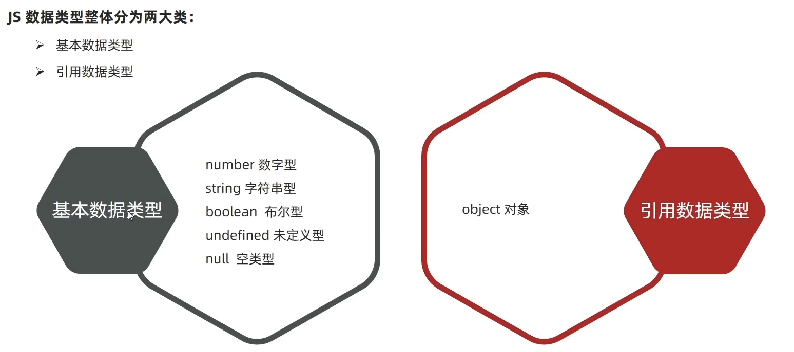
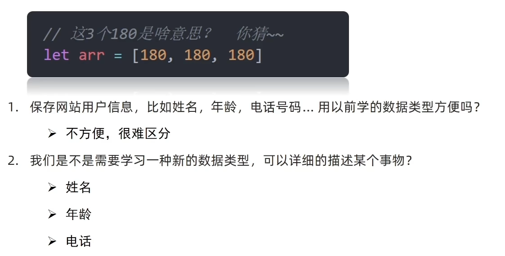
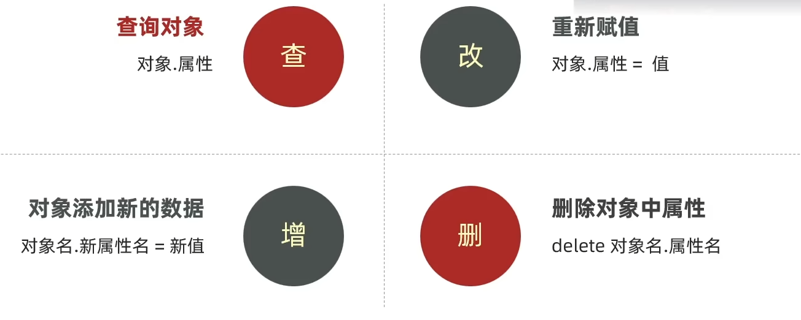
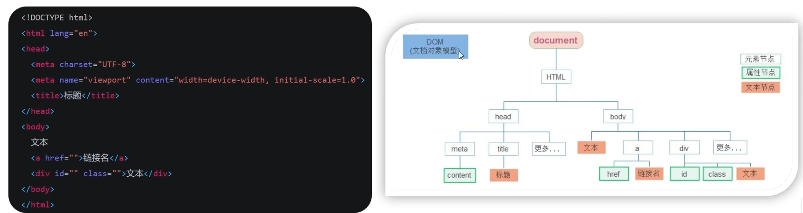
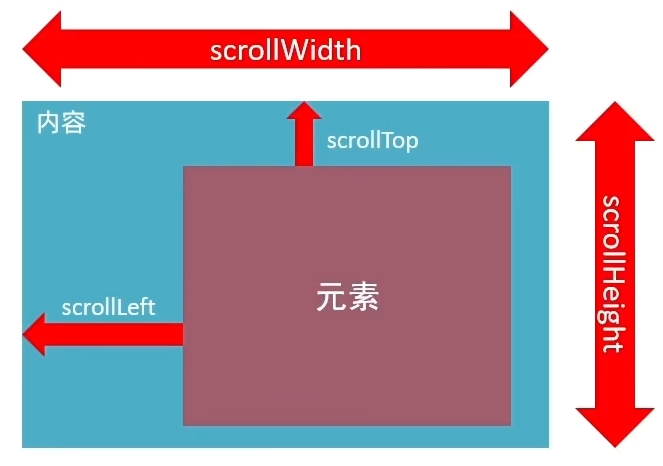
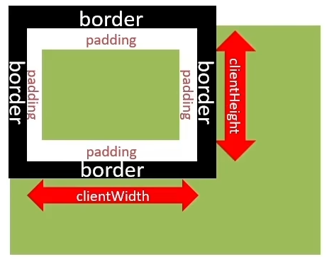
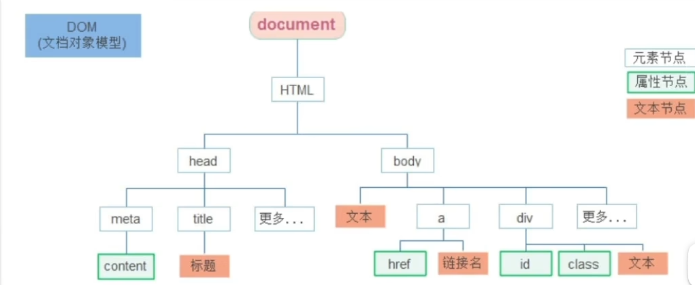
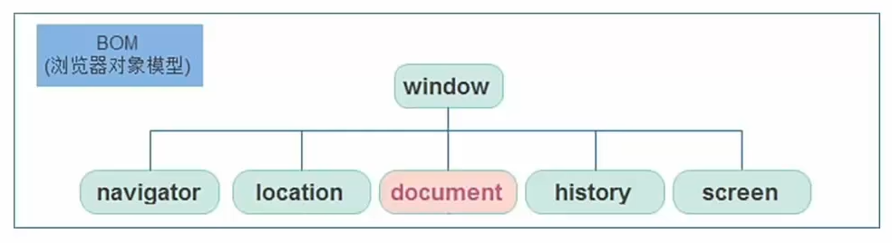

JavaScript

# 基础

浏览器分成两部分：渲染引擎和S引擎

* 渲染引擎：用来解析HTML与CSS,俗称内核，比如chrome浏览器的blink,老版本的webkit

* JS引擎：也称为JS解释器。用来读取网页中的)avaScript代码，对其处理后运行，比如chrome浏览器的V8

浏览器本身并不会执行S代码，而是通过内置JavaScript引擎（解释器）来执行JS代码。JS引擎执行代码时逐行解释
每一句源码（转换为机器语言），然后由计算机去执行，所以JavaScript语言归为**脚本语言**，会逐行解释执行。


> 笔记正在更新：

- [ ] Web-API
  - [x] DOM（正在更新）
  - [ ] BOM


<!--more-->

JS的组成

* ECMAScript
* DOM 文档对象模型
* BOM  浏览器对象模型


js代码推荐使用单引号


## 快速入门

### 引入

引入Javascript

* 内部引入：类似style引入css， js使用<script></script>>引入

* 行内引入
* js文件引入:   <script src="xx.js"></script>


我们将\<script>放在HTML文件的**底部**附近的原因是浏览器会按照代码在文件中的**顺序加载HTML。**
如果先加载的javaScript期望修改其下方的HTML,那么它可能由于HTML尚未被加载而失效。
因此，将JavaScript代码放在HTML页面的底部附近通常是最好的策略。


### Js输入输出语法

> 输出语法

语法1

```js
document.write('要输出的内容')
```

语法2

```js
alert('XXX')
```

语法3

```js
console.log('XXX')
```


> 输入语法

语法

```js
prompt('请输入')
```

作用：显示一个对话框，对话框中包含一条文字信息，用来提示用户输入文字


### 字面量

在计算机科学中，字面量(literal)是在计算机中描述 事 / 物
比如：

>我们工资是：10001 此时1000就是数字字面量
>'黑马程序员' 字符串字面量
>还有接下来我们学的 [] 数组字面量   {}对象字面量等等


### 变量

声明

```js
let 变量名
let age
```

赋值

```js
age = 18
```


声明多个变量

```js
let age=18, name='Zhangsan'
```


> let和var区别：

在较旧的avaScript,使用关键字var来声明变量，而不是let。

var现在开发中一般不再使用它，只是我们可能再老版程序中看到它。

let为了解决var的一些问题。

var声明：

* 可以先使用， 在声明（不合理）
* var声明过的变量可以重复声明（不合理）
* 比如变量提升、全局变量、没有块级作用域等等


### 数组

```js
let 数组名 = [数据1,数据2 [,...]]
```


### 数据类型




### 模板字符串

用反引号 包含，里面用${}

```js
let age = 18
document.write(`我今年${age}岁了`)
```


## 函数

> 正常写法

```js
function fun(参数列表){
	
    [return xx]
}
```

返回值

* 在函数体中使用return关键字能将内部的执行结果交给函数外部使用
* return后面代码不会再被执行，会立即结束当前函数，所以return后面的数据不要换行写
* return函数可以没有return,这种情况函数**默认返回值为undefined**


> 匿名函数

没有名字的函数，无法直接使用。

使用方式：

* 函数表达式
* 立即执行函数

1.**函数表达式**

将匿名函数赋值给一个变量，并且通过变量名称进行调用我们将这个称为函数表达式

语法：

```js
let fn = function(){}

//调用
fn()
```


2.**立即执行函数**

场景介绍：避免全局变量之间的污染

语法:

```js
//方式1
(function () { console.log(11) })()

//方式2
(function () { console.log(11) }())
```


## 对象

思考：



* 对象

对象(object):JavaScript!里的一种**数据类型**

可以理解为是一种无序的数据集合，注意数组是有序的数据集合

```js
let obj = {
    name = 'KennyCaty',
    age: 18,
    gender: '未知'
}
```


### 对象

1. 声明对象语法

```js
let 对象名 = {}

let 对象名 = new Object()
```

实际开发中，我们多用花括号。{}}是对象字面量

2. 对象由属性和方法组成

属性：信息或叫特征（名词)。比如手机尺寸、颜色、重量等.

方法：功能或叫行为（动词)。比如手机打电话、发短信、玩游戏.…

```js
let obj = {
    属性名: 属性值.
    方法名: 函数
}
```

属性名可以使用引号括起来，**一般情况下省略**


### 对象增删改查




查询还有一种方法

```js
obj['属性名']  //注意加引号
```


### 对象的方法

```js
let person = {
    name = 'Zhangsan',
    song: function(){
        console.log('唱歌')
    }
}
```

1.方法是由方法名和函数两部分构成，它们之间使用：分隔

2.多个属性之间使用英文，分隔

3.方法是依附在对象中的函数

4.方法名可以使用"或"，一般情况下省略，除非名称遇到特殊符号如空格、中横线等


调用对象的方法：

```js
person.song()
```


### 对象的遍历

首先：对象里面是**无序的键值对**，没有规律.不像数组里面有规律的下标

> for 遍历对象 
>
> 不是普通的for，是 for in 语法

```js
for (let k in obj){
    console.log(k) //打印键（'属性名'） 如果用for in遍历数组，那么拿到的k是字符串的 '0', '1', '2'...
    console.log(obj[k]) //打印值   ！！不能用obj.key!! key是个字符串，相当于obj.'key' 是错误的
}
```


### 内置对象


#### Math

作用：提供了一系列做数学运算的方法

Mat的对象包含的方法有：

>random: 生成0-1之间的随机数（包含0不包括1)
>
>ceil: 向上取整
>
>floor: 向下取整
>
>round: 四舍五入
>
>max: 找最大数
>
>min: 找最小数
>
>pow: 幂运算
>
>abs: 绝对值

生成0-10的随机整数

```js
Math.floor(Math.random() * (10 + 1))
```


# Web-Api

BOM + DOM

* 作用：就是使用 JS 去操作 html 和浏览器
* 分类：**DOM** (文档对象模型)、**BOM**（浏览器对象模型)


## DOM

### 基础认知

>  DOM树

* 将HTML文档以树状结构直观的表现出来，我们称之为文档树或DOM树
* 描述网页内容关系的名词
* 作用：**文档树直观的体现了标签与标签之间的关系**




> DOM对象

* DOM对象：浏览器根据 html 标签生成的 **JS 对象**
  * 所有的**标签属性**都可以在这个对象上面找到
  * **修改对象的属性**会自动映射到标签身上


### 获取DOM对象

方式：

* **根据CSS选择器来获取DOM元素**（重点）
* 其他获取DOM元素方法（了解）


#### CSS选择器

> 选择匹配的**第一个**元素

```js
document.querySelector('CSS选择器')
```


如何层级选择？

```html
<ul>
    <li>01</li>
    <li>02</li>
    <li>03</li>
</ul>
```

```js
const li = document.querySelector('ul li:first-child')
```


> 选择匹配的**所有**元素

```js
 document.querySelectorAll('CSS选择器')
```

返回的是一个集合（数组列表）

得到的是一个**伪数组**：
* **有长度，有索引号**的数组
* 但是**没有 pop()，push()** 等数组方法
* 想要得到里面的每一个对象，则需要遍历 (for) 的方式获得。

```js
const lis = document.querySelectorAll('ul li')
for (li in lis){
    console.log(lis[li]);
}
```


#### 其他方式（了解）

```js
//根据d获取一个元素
document.getElementById('nav')
//根据标签获取一类元素获取页面所有div
document.getElementsByTagName('div')
//根据类名获取元素获取页面所有类名为w的
document.getElementsByClassName('W')
```


### 事件（老版本笔记）

>  事件三要素：事件源，事件类型，事件处理程序

事件：触发被JS检测到的行为，一种相应机制

比如：按钮被点击后触发响应(弹出对话框)

```js
//事件源：按钮
var btn = document.getElementById('btn');
//事件类型 点击  onclick
//事件处理程序 函数
btn.onclick = function(){
 	alert('弹出')   
}
```


执行事件步骤

* 获取事件源
* 绑定事件
* 添加事件处理程序（函数）


#### 常见鼠标事件

| 鼠标事件    | 触发条件         |
| ----------- | ---------------- |
| onclick     | 鼠标点击左键     |
| onmouseover | 鼠标经过触发     |
| onmouseout  | 鼠离开触发       |
| onfocus     | 获得鼠标焦点触发 |
| onblur      | 失去鼠标焦点触发 |
| onmousemove | 鼠标移动触发     |
| onmouseup   | 鼠标弹起触发     |
| onmousedown | 鼠标按下触发     |


### 操作DOM元素

#### 修改节点文本

拿到一个DOM节点后，我们可以对它进行更新。 可以直接修改节点的文本，方法有两种：

* **innerHTML**：
  * 这个方式非常强大，不但可以修改一个DOM节点的文本内容，还可以直接通过HTML片段修改DOM节点内部的子树
  * 要注意，是否需要写入HTML。如果写入的字符串是通过网络拿到了，要注意对字符编码来避免XSS攻击。
* innerText
  * 这样可以自动对字符串进行HTML编码，保证无法设置任何HTML标签：

这两个方法也可以获取内容 


#### 操作元素属性

* 常用属性
* 样式属性
* 表单属性
* 自定义

 

##### 操作元素常用属性

* 可以通过js设置/修改标签元素属性，比如通过src更换图片
* 常见的属性比如： herf、 title、 src 等
* 语法
  * 对象.属性 = 值


比如

```js
const pic = document.querySelector('img')

pic.src = './newImage.jpg'
pic.title = '周杰伦演唱会'
```


##### 操作元素样式属性

* 可以通过js设置/修改标签元素的样式属性
  * 比如 轮播图小圆点自动更换颜色样式
  * 点击按钮可以滚动图片
* 方式
  * 通过**style**属性操作css
  * 通过**类名**className 操作css
  * 通过**classList**操作类控制css


###### 1.通过style属性操作css

* 语法： 对象.style.样式属性 = '值'
  * 注意，只要有单位的属性，比如宽度 100px ，那么它一定是一个字符串，需要 ' '
  * **注意：background-color 这种有短横线的，需要小驼峰命名法 backgroundColor**


###### 2.通过类名操作css

* 如果修改的样式很多，直接通过style属性修改较为繁琐，可以通过类名修改，给他赋予一个class的全部属性
* 语法： 元素.className = 'activate'
  * 注意是写**className 不是 class** ，class是一个关键字
  * 如果原来设置过类，**会覆盖原来的类名**


```html
<div>
    this is a box
</div>

.box {
	backgroud-color : red;
}

<script>
	const div = document.querySelector('div')
    div.className = 'box'
    //注意box前不用加.   
</script>
```


###### 3.通过 classList 操作控制css

* H5新增

* 为了解决className 容易覆盖掉之前的类名，我们可以通过classList方式追加和删除类名
* 语法：
  * 追加一个类
    * 元素.classList.add('类名')
  * 删除一个类
    * 元素.classList.remove('类名')
  * 切换一个类（有就删掉，没有就加上）
    * 元素.classList.toggle('类名')


#####   操作表单属性

* 表单很多情况也需要修改属性，比如密码的时候点击眼睛可以看到密码，本质是把表单类型转换为文本框
* 获取： DOM对象 . 属性名
* 设置： DOM对象 . 属性名 = 新值


```js
    <input type="text" value="输入">
    <script>
        const uname = document.querySelector('input')

    	console.log(uname.value); 
    	// console.log(uname.innerHTML);  innerHTML得不到表单内容
    </script>
```


* 表单属性中，添加就有效果，一处就没有效果，一律用bool值表示，true为添加，false为移除
* 比如： disabled，checked，selected


##### 自定义属性data

* 标准属性：标签自带属性：比如class id title等，可以直接用语法操作比如：disabled、checked、selected
* 自定义属性：
  * html5 推出专门的 data-自定义属性
  * 在标签上一律以data-开头
  * 在DOM对象上一律以dataset方式获取
    * 可以在dataset上 . 属性获取


### 定时器-间歇函数

* 比如：每隔一段时间自动执行一段代码（倒计时）


定时器函数

* 开启定时器
  * `setInterval(函数名，间隔时间)`
  * 作用：每间隔时间，执行函数
  * 单位：mm
  * 注意：
    * 函数名不加（），加（）表示调用函数，这里可以理解为指定函数
    * 定时器**返回的是一个id数字**（为了区分不同定时器）

```js
function fn(){
	console.log('每秒执行一次')
}

let n = setInterval(fn, 1000)
console.log(n)    //注意这里用let 不用 const 因为每次重新开关定时器可能赋值会改变


//也可以这样：
setInterval(function(){
    console.log('每秒一次')
},1000)
```


* 关闭定时器
  * clearInterval(n)


> 练习：用户协议阅读倒计时

需求：按钮60秒之后才可以使用
分析：
①：开始先把按钮禁用(disabled属性)
②：一定要获取元素
③：函数内处理逻辑

* 秒数开始减减
* 按钮里面的文字跟着一起变化
* 如果秒数等于0停止定时器里面文字变为同意最后按钮可以点击

```html
<textarea name="" id="" cols="30" rows="10" disabled>
    用户注册协议
    欢迎注册成为XXX ，在注册过程中.... Lorem ipsum dolor sit amet, consectetur adipisicing elit. Rem itaque repellat numquam magnam iste assumenda nesciunt eveniet odio quo dolorem, aspernatur eligendi tempore fuga animi voluptatem cum laudantium aliquid consequatur.
</textarea>
<br />
<button class="btn" disabled>我已阅读用户协议（5）</button>

<script>
    const btn = document.querySelector('.btn')
    let i = 5 //倒计时5s
    let n = setInterval(function(){
        i--
        btn.innerHTML = `我已阅读用户协议(${i})`
        if(i==0) {
            clearInterval(n)
            btn.disabled = false
            btn.innerHTML = '同意'
        }
    }, 1000)
</script>
```


### 事件（新）

> 什么是事件？
> 事件是在编程时系统内发生的动作或者发生的事情
> 比如用户在网页上单击一个按钮

#### 事件监听

* 语法:

  `元素对象.addEventListener('事件类型',要执行的函数)`

* 事件监听三要素：
  * 事件源：那个dom元素被触发
  * 事件类型：用什么方式触发，比如鼠标点击click，鼠标经过mouseover
  * 事件调用的函数


示例：点击弹出对话框

老方法

```js
//事件源：按钮
var btn = document.getElementById('btn');
//事件类型 点击  onclick
//事件处理程序 函数
btn.onclick = function(){
 	alert('弹出')   
}
```


新方法：

```js
var btn = document.getElementById('btn');
btn.addEventListener('click',function(){
    alert('hello')
})
```


示例

```html
<head>
    <meta charset="UTF-8">
    <meta http-equiv="X-UA-Compatible" content="IE=edge">
    <meta name="viewport" content="width=device-width, initial-scale=1.0">
    <title>Document</title>
    <style>
        .box {
            position: relative;
            width: 1000px;
            height: 200px;
            background-color: pink;
            margin: 100px,auto;
            text-align: center;
            line-height: 200px;
            font-size: 50px;
            font-weight: 700;
        }

        .box1 {
            position: absolute;
            right: 20px;
            top: 10px;
            width: 20px;
            height: 20px;
            background-color: skyblue;
            text-align: center;
            line-height: 20px;
            font-size: 16px;
            /* 将游标改为小手 */
            cursor: pointer;  
        }
    </style>
</head>
<body>
    <div class="box">
        我是广告
        <div class="box1">X</div>
    </div>

    <script>
        const box1 = document.querySelector('.box1');
        const box = document.querySelector('.box');
        box1.addEventListener('click',function(){
            box.style.display = 'none';
        })
    </script>
</body>
```


#### 事件监听版本

* DOM L0
  * 事件源.on事件 = function(){}
* DOM L2
  * 事件源.addEventListener('事件',事件处理函数)

* 区别**on方式会被覆盖，addEventListener方式可绑定多次**，拥有事件更多特性

```js
btn.onclick = function() {alert(11)}

btn.onclick = function() {alert(22)}
//就只会弹出22 ，11会被覆盖


btn.addEventListener('click', function(){
    alert(11)
})

btn.addEventListener('click', function(){
    alert(22)
})
//依次执行11， 22
```


#### 事件类型

* 鼠标事件
  * click
  * mouseenter 鼠标经过
  * mouseleave 鼠标离开
* 焦点事件（用于表单光标）
  * focus 获得焦点
  * blur 失去焦点
* 键盘事件
  * keydown 键盘按下时触发
  * keyup 键盘抬起时触发
* 文本事件
  * input 输入事件


鼠标经过事件的区别：

* mouseover 和 mouseout 会有冒泡效果（子到父依次执行事件）
* mouseenter 和 mouseleave 没有冒泡效果（推荐）


#### 事件对象

* 获取事件对象
* 常用属性


##### 事件对象

* 一个对象，里面有事件触发时的相关信息
  * 例如：鼠标点击事件中，事件对象就存了鼠标点在哪个位置等信息

* 使用场景
  * 可以判断用户按下了哪个键
  * 判断鼠标点击了哪个元素


##### 获取事件对象

在事件绑定的回调函数的第一个参数就是事件对象

一般命名为event，ev，e

```js
elem.addEventListener('click',function(e){})
```


##### 常用属性

* type
  * 获取当前事件类型
* clientX / clientY
  * 获取光标相对于浏览器可见窗口左上角的位置
* offsetX / offsetY
  * 获取光标相对于当前DOM元素左上角的位置

*  key
  * 用户按下的键盘的值
  * 现在不提倡用keyCode


##### 应用


回车发布评论

```js
tx.addEventListener('keyup',function(e){
    if(e.key === 'Enter'){
        if (tx.value.trim()!=='') { //trime() 去掉前后的空字符
        	//发送/显示操作
        }
        //清空文本域
        tx.value = '';
    }
})
```


 


#### 环境对象

指的是函数内部特殊的**变量 this** ，它代表当前函数运行时所处的环境

每个函数里面都有 this 

* 普通函数里面的 this 指向的是 Window

  ```js
  function fn(){
      consloe.log(this)
  }
  
  //实际上 fn是 window.fn()
  ```

* 事件里面绑定的函数，指向事件源（调用者）


#### 回调函数

如果将函数A 作为参数传递给函数B 时，我们称函数A 为**回调函数**

```js
var btn = document.getElementById('btn');
btn.addEventListener('click',function(){
    alert('hello')
})
```


#### 事件流

事件流指事件完整执行过程中的流动路径


##### 两个阶段

* 捕获阶段：父到子
* 冒泡阶段：子到父


代码：

```js
DOM.addEventListener('事件类型',事件处理函数,是否使用捕获机制)

document.addEventListener('click',function(){},true)

//默认是false：冒泡
```


若是使用L0事件监听（onclick=function那种），则只有冒泡阶段，没有捕获


##### 阻止冒泡

* 原因：因为默认有冒泡的存在，容易导致事件影响到父元素
* 需求：若想把事件就限制在当前元素内，就需要组织冒泡
* 前提：拿到事件对象
* 语法

```js
事件对象.stopPropagation()
```

* **注意**：此方法本质是阻止事件流动传播，不光在冒泡阶段有效，捕获阶段也有效


#### 解绑事件

两种方法：


* （L0方法）on事件方法：直接使用null覆盖就可以解绑

```js
btn.onclick = function(){
    alert('haha');
}
btn.onclick = null;
```


* （L2方法）

```js
btn.addEventListener('click',function(){
    alert('haha');
})
btn.removeEventListener('click',??);
//注意！！：匿名函数无法解绑，因为不知道？？函数名
                        
//正确做法：
function fn(){
    alert('haha');
}  
btn.removeEventListener('click',fn);

```


#### 事件委托

事件委托是利用事件流的特征解决一些开发需求的知识技巧

* 优点：减少次数，提高性能
* 原理：事件冒泡的特点
  * 给**父元素注册事件**，触发子元素时，会冒泡到父元素身上，从而触发父元素


那么，既然触发的是父元素的事件，如何从事件中获取到某个子元素呢？

事件对象里有一个属性 **target**，代表了事件作用的对象

```js
e.target

 //获取元素名字
e,target.tagname
```


比如，一个ul里面有五个li，需要点击某个li，某个li就变色，如果事件加在li上，就要添加五次，我们可以添加在ul上

```js
const ul = document.querySelector('ul');
ul.addEventListener('click',function(e){
    if(e.target.tagName === 'LI'){           //注意！！返回的是大写名称，所以要匹配大写字符
        e.target.style.color = 'red';
    }
})
```


如果父元素内部，有某些子元素不需要这些事件被触发：就需要匹配事件 e 的target


#### 阻止冒泡

有些情况下要阻止默认行为的发生，比如 阻止连接的跳转，表单域跳转。

* 语法

```
e.preventDefault();
```


#### 其他事件


##### 页面加载事件

* 加载外部资源（如图片，外面css和JavaScript等）加载完毕时触发的事件
* 举例：
  * script代码可以写在body最后（body里面的最后），有些人也写在head最后（head里面最后），但是直接写在head里面是执行不了的，因为html代码是从上往下读取的，页面还没生成出来，自然不能执行对应的js代码。
* 事件名：**load**  
* 监听页面所有资源加载完毕：
  * 给**window添加load事件**


```html
<head>
    <script>
    	window.addEventListener('load', function(){
            //里面的代码就可以正常执行
        })
    </script>
</head>
```


* 当初始的HTML文档被完全加载和解析完成后， DOMContentLoaded 事件 被触发，而无需等待样式表，图像等完全被加载（只加载HTML文档结构，速度比load快）
* 事件名字：**DOMContentLoaded**

```js
document.addEventListener('DOMContentLoaded', function(){
    //
})
```


##### 页面滚动事件

* 滚动条在滚动时触发的事件

* 事件名：**scroll**


* 监听整个页面滚动

```js
window.addEventListener('scroll', function(){
    //
})
```


获取位置：

* scrollLeft和scrollTop （属性）
  * 获取被卷去的大小
  * 获取元素内容往左，往上滚出去看不到的距离
  * 这两个值是可以**读写**的  
    * 注意这个值**不带单位**，也就是赋值的话需要给纯数字型




获取普通元素被卷去的属性

```js
const div = document.querySelector('div')
div.scrollTop
```


获取整个页面被卷去的元素

```js
document.documentElement.scrollTop
```


##### 页面尺寸事件

窗口尺寸发生改变时候触发的事件：

* 事件名：**resize**


检测屏幕宽高：

* 获取宽高：
  * 获取元素可见部分宽高（**不包含边框，margin，滚动条等，包含padding**）
  * **clientWidth** 和 **clientHeight**
  * 返回值是纯数字




### 元素尺寸与位置

* 获取宽高：
* 获取元素的自身宽高，**包含元素自身设置的宽高，padding，border**
* offsetWidth 和 offsetHeight

* 取出来的是数值（纯数字），方便计算


获取位置：

* 获取元素距离自己**定位**父元素的左，上距离

* offsetLeft 和 offsetTop， **注意是只读属性**

* 父元素有定位，以相对父元素距离为准

* 没有定位，以相对最近的定位的祖先元素为准

  


### 日期对象

作用：可以得到当前系统时间

#### 实例化：

* new关键字创建： 
* 获得当前时间：

```js
const date = new Date();
```


* 返回指定的时间

```js
const date1 = new Date('2023-3-11 08:30:00');
```


#### 日期对象方法

目标：能够使用日期对象中的方法写出常见日期

场景：因为日期对象返回的数据我们不能直接使用，所以需要转化为实际开发中的常用格式

| 方法          | 作用               | 说明               |
| ------------- | ------------------ | ------------------ |
| getFullYear() | 获得年份           | 获取四位年份       |
| getMonth()    | 获得月份           | 取值为 0 ~ 11      |
| getDate()     | 获得月份中的每一天 | 不同月份取值不相同 |
| getDay()      | 获得星期           | 取值为 0 ~ 6       |
| getHours()    | 获得小时           | 取值为 0 ~ 23      |
| getMinutes()  | 获得分钟           | 取值为 0 ~ 59      |
| getSeconds()  | 获得秒             | 取值为 0 ~ 59      |


页面显示时间

需求：当前时间以：YYYY-MM-DD HH:mm  格式显示在页面

分析：

* 调用日期对象方法进行转换
* 记得数字要补0


#### 时间戳

目标：能够获得当前时间戳

* 场景：计算倒计时效果，前面的方法无法实现，需要借助时间戳


含义：

1970年01月01日00时00分00秒起至现在的毫秒数


**算法**

* 将来的时间 - 现在的时间戳 = 剩余毫秒数

* 剩余时间毫秒数 转换为 剩余时间的 年月日时分秒 就是倒计时
* 比如
  * 将来时间戳 2000ms - 现在时间戳1000ms = 1000ms
  * 1000ms 转换为就是 0 小时 0 分 1 秒


**三种方式获取时间戳**

* getTime()
  * 必须先实例化日期对象


* 简写 +new Date()
  * 本质也是实例化日期对象，然后转化为整数


* 使用 Date.now()
  * 不用实例化


### 节点操作


#### DOM节点

dom树里的每一个内容




#### 查找节点

站在关系的角度查找

* 父节点查找
  * **parentNode**属性
  * 返回最近一级的父节点，找不到返回null

```js
//先拿到dom节点
const node = document.querySelector('.class_');
console.log(node.parentNode);
```


* 子节点
  * **childNodes**
    * 获得所有子节点，包括文本节点（空格，换行），注释节点等
  * ==**children**属性==
    * 仅获得最近一级所有孩子元素节点以及元素里面所有内容 ，
    * 返回的是一个伪数组


* 兄弟关系查找
  * 下一个兄弟节点
    * **nextElementSibling** 属性
  * 上一个兄弟节点
    * **previousElementSibling **属性


#### 增加节点

步骤

* 创建一个新节点
* 把创建的新的节点放入到指定的元素内部


创建节点

```js
document.createElement('标签名')  
```


追加节点

```js
父元素.appendChild(要插入的元素)
```

默认插入到最后


插入到前面

```
父元素.insertBefore(要插入的元素，要在那个元素之前)
```


#### 克隆节点

```js
元素.cloneNode(布尔值)
```

* true，则代表克隆时包含后代节点一起克隆
* false，则代表克隆时不包含内容及后代节点（只克隆标签）
* 默认为**false**，一般加上**true**


#### 删除节点

在js原生DOM操作中，要删除元素必须通过父元素删除

语法：

```js
父元素.removeChild(要删除的元素)
```


### M端事件

M：mobile 移动端

* 触屏事件：**touch**
* 常见触屏事件：

| 触屏touch事件 | 说明                            |
| ------------- | ------------------------------- |
| touchstart    | 手指触摸到一个DOM元素时触发     |
| touchmove     | 手指在一个DOM元素上滑动时候触发 |
| touchend      | 手指从一个DOM元素上移开时触发   |


### JS插件


#### Swiper插件

>官网  https://www.swiper.com.cn/
>看在线演示，找到符合自己需求的demo https://www.swiper..com.cn/demo/index.html
>查看基本使用流程 https://wwWw.swiper.com.cn/usage/index.html
>查看APi文档，去配置自己的插件https:/www.swiper.com.cn/api/index.html
>注意：多个swiper同时使用的时候，类名需要注意区分


## BOM

浏览器对象模型




* window对象是一个**全局对象**，也可以说是JavaScript中的顶级对象
* 像document、.alert()、console.log()这些都是window的属性，基本BOM的属性和方法都是window的。
* 所有通过var定义在全局作用域中的变量、函数都会变成window对象的属性和方法
* window对象下的属性和方法调用的时候可以省略window


### 定时器-延时函数

延迟多少事件后执行

JavaScript内置的一个用来让代码延迟执行的函数，叫setTimeout

* 语法：

```js
setTimeout(回调函数, 等待毫秒数)
```

setTimeout仅仅只执行一次，所以可以理解为就是把一段代码延迟执行，平时省略window


* 清除延时函数

```js
clearTimeout(timer)
```


### location对象

Location的数据类型是对象，它拆分并保存了**URL地址的各个组成部分**

> 常用属性

* href 
  * 经常利用href， 使用js跳转页面

```js
location.href //可以拿到当前页面 的href

//可以通过赋值， 跳转页面
location.href = 'http://www.baidu.com'
```


* hash
  * hash属性获取地址中的哈希值，符号#后面部分

```js
location.hash
```


> 常用方法

* reload 
  * 刷新当前页面

```js
location.reload()

// 强制刷新 非从本地拉取，是从服务器重新拉取 类似CTRL+F5
location.reload(true)
```


