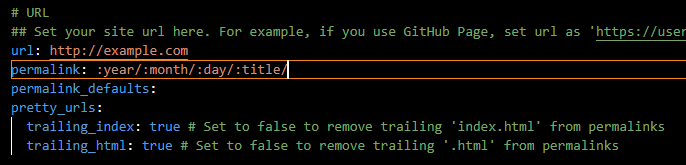

# Hexo路径与文件夹管理

## 简洁URL路径

如果一篇文章 `hello-world` 在2023年一月一日创建，那么默认URL是 `:year/:month/:day/:title/` 也就是`2023/01/01/hello-world`

可以修改 `_config.yml` 中的 `permalink`



将

```yml
permalink: :year/:month/:day/:title/
```

修改为：

```yml
permalink: :title/
```


## post子文件夹

所有文章都放在`_post` 目录下会很凌乱，查找不方便

可以 `_post` 目录下创建子文件夹进行文章分类

hexo会默认部署URL格式为：

``https://hexo.example/folder/hello-world`


比如我将Hexo文件夹单独建立目录：


则部署过后的URL：
