java期末复习随缘笔记

<!--more-->

# 目录

[toc]


# Chapter4 类与对象

> 发展过程

如C++、Java、C#等。指明了属性和操作行为的主 体，即对象，更符合人的思维模式。 

面向对象语言的四个特性==抽象，封装，继承，多态==


## 类与对象


> 对象

万事万物都可看作对象，对象可以是具体的，如现 实世界中某个实实在在存在的实体；对象也可以是抽象的， 如一种信仰、一种思想。

对象内部的性质从本质上可以分为两类：一类是对象的**状态（属性）**；一类是对象的**行为（功能）**。


### 类

> 类

面向对象程序计中一般不直接描述“对 象”，而是**将具有相同或相似属性和行为的同一类对象抽象定 义成“类”**，通过类实例化对象

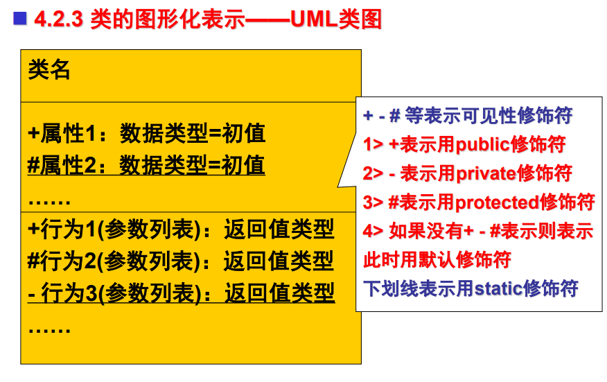


在Java中，根据类的来源不同，类可分为**系统类**和**用户类**


> 类的定义

```java
[public] [abstract] [final] class ClassName [extends SuperClassName] [implements InterFaceName]{
ClassBody //类体
}
```


注意：

* **当一个源程序文件中有多个类的定义时，最多有一个类可以被声 明为public类**，否则编译器会报错。所以，在编程时，应将不同的public类存放在不同的源程序文件中。

* **各关键字的出现顺序是有严格要求的， 不可颠倒。**


>  类的成员构成

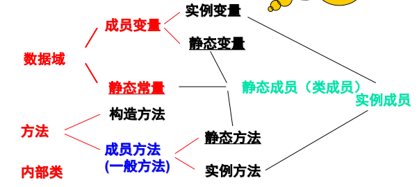


**成员变量**（根据是否用static修饰可进一步分为：实例变量（声明时 不用static修饰）和静态变量（也称类变量，声明时用static修饰））


**常量**（一般用final static修饰，为静态常量；当然你也可以可以不用 static修饰，此时常量不是静态常量，不过一般不这么写）


**方法**（可分为：构造方法 和 成员方法 (根据是否用static修饰可进一步 分为，成员方法可进一步分为实例方法和静态方法(也称类方法))；方法 体中声明的变量称为**局部变量**）

==方法不能嵌套定义==


### 数据域：成员变量和成员常量

数据域：在一个类中、在**方法外面声明**的变量（即成员常量）和常量 （即成员常量，用final static 修饰）组成该类的数据域。

**在类中、方法外面只允许有变量和常量的声明语句（如有初始化， 必须和数据类型声明写成一个整 体），不允许有对变量和常量进行操作的语句**

```java
class C{
    int a = 1;  //正确
    /*
    int a;
    a=1;        //错误
    */    
   
}
```


**成员变量**一经声明即使不初始化也有一个**默认的初始值**。

基本数据类型默认值都是0，包括boolean->false
引用数据类型：null
null表示空，什么都没有，只是占位。


* **实例变量**在所在类的静态方法中不能被直接访问，只能在该类的实 例方法和构造方法中可以直接访问；

* **静态变量**和常量可在所在类的 所有方法中直接访问。


### 局部变量

方法体内部的变量称为局部变量，

注意：==局部变量没有默认初始值！！！==，使用前必须先对其初始化

局部变量的作用范围在其所在语句块（代码块） **{ }**之内

在一个类中，成员变量（实例变量与静态变量）只能声明一次。但在方法内部不同的非嵌套语句块中，名称相同的局部变量可多次声明。

如果一个局部变量或者形参和一成员变量具有相同的名称，那么**局部变量和形参优先**，同名的成员变量将被隐藏（强龙压不过地头蛇）。


## 构造方法与对象的创建

### 构造方法

```java
[public] ClassName(parameterLists){
	StructuralMethodBody
}
```


构造方法没有返回值类型，不能加上void

作用：初始化对象


构造方法加不加public的区别：

这个类都不是public的 也就是其他包没法访问你这个类 但你的构造方法却是public的 又让其他的包下的类可以创建你这个类的对象 明显就有矛盾 所以肯定会有问题，其次 构造方法加public主要是为了让其他包下的类去访问，如果在同一个包中 这个就没啥大区别了，毕竟默认修饰的话 是包级访问，包以外的没法访问 要访问需要加上public。


>  无参构造

```java
public class Point{
    int x, y;
    public Point(){
        x = 100;
        y = 200;
    }
}
```


```java
public class Point{
    int x, y;
    int getX(){
        return x;
    }
    int getY(){
        return y;
    }
}
```

在定义类时，没有构造方法的定义也是可行的。此时，系统会为 其提供一个**无参的默认构造方法**，注意 ：只有当类中没有明确地 定义出一个构造方法时它才会自动生成。


>  有参构造

注意如果使用了有参构造，则不会自动生成默认的无参构造，如需使用，比如自己写无参构造


如果形参和成员变量冲突，需要用this区别

```java
public class Point{
    int x, y;
    public Point(int x, int y){
        this.x = x;
        this.y = y;
    }
}
```


### 对象实例化

> 声明-实例化-初始化

* 对象的声明：

```java
ClassName objectName[, objectName2...];
```


* 对象实例化：

```java
new 构造方法;
```

说明：对象的实例化是通过调用类的构造方法来实现的，new 操作符用于为对象分配内存空间。


* 对象的初始化：

对象的通过类的构造方法实例化后，在内存里已经分配了相应的空间，为了便于访问，**通常将对象在内存里地址赋给对象引用变量名完成对象引用变量的初始化，再借助对象引用变量来进行访问。**


(1) 对象引用变量的初始化格式为： 

​	对象引用变量=已创建的对象； 

(2) 在实际编程中，对象的实例化与对象引用变量的初始化通常 合在一起加以实现，即： 

​	对象引用变量=new 构造方法

(3) 或者将上面讲的对象引用变量的声明、对象的实例化与对象 引用变量的初始化合在一起一并实现，即： 

​		类名 对象引用变量=new 构造方法;


>  匿名对象

如果一个对象创建后并不需要引用，可以不把它明确赋给一个变量，

如：new String(“hello”); 这样的对象称为匿名对象。


### 基本数据类型变量和引用类型变量的区别

* 每个变量代表一个内存单元。

对**基本数据类型变量**来说，对应内存所存储的值是**基本数据类型的值**；

对**引用类型变量**来说，对应内存所存储的值是其引用的对象在**内存中的存储地址**。


* 将一个变量赋给另一个变量时，另一个变量也有了同样的值。

对 于**基本数据类型变量**，赋值是将一个变量的**真实值**赋给了另一个变量； 

对于**引用类型变量**，赋值是将一个变量所有些存储的引用对象的**地址 赋给了另一个变量**，赋值后这样**两个变量指向了同一个对象。**


### 对象的清除

一是由系统“自动”清除，另一种则是由程序员 “手动”清除。

Java中引入了先进的内存管理机制，也即人们常说的垃圾自动收 集功能。Java将不再使用的对象称为垃圾。垃圾自动收集器（置 于Java虚拟机JVM内部的一个功能模块）会根据变量的作用域确 定哪些变量不会再被使用，当它确定哪个变量不会再被使用时， 会自动将其清除。程序员需要变量时只管分配，而不需考虑何时 清除及如何清除，这对编程带来了极大的方便。


“手动”清除即由程序员自行清除，这种情况只需为 对象引用变量赋一空值null即可。


## 参数传值


* 将实参传递给方法：
  * 调用方法时，传入的实参的类型、次序、数量必须与方 法定义中的形参的类型、次序、数量一致。
* 如果方法调用时所传**实参是变量而不是直接量**，则**将实参变量的值传递给形参**

**无论形参在方法体中的如何变化，实参变量的值并不改变**（要理解透这句话）


## 实例变量和静态变量

* 实例变量 在类实例化对象时，将为所创建的对象（包括实例 变量）分配内存空间，**实例变量存在于具体的对象空间之中**，改 变了其中一个对象的实例变量值，对其余对象的实例变量值不会 造成影响。 
* 静态变量也称为类变量，**静态变量在类载入时为其分配空间**， 创建对象时系统只为每个对象分配相应的实例变量空间，而不再 为静态变量分配空间，因此一个静态变量将为同一个类的所有对 象所共享，这也是将其称为类变量的原因。当改变了其中一个对 象的静态变量值时，其余对象的静态变量值也相应被改变。


## 方法重载

方法重载：就是指在同一个类中，两个方法**具有相同的名称但有 不同的参数列表**（方法的参数类型、个数、顺序至少有一个不同， 注意我们这里不能根据参数的标识符是否相同来判断）。方法重 载时，两个方法的**返回类型和修饰符可以相同，也可以不同**。


# Chapter5子类与继承 抽象类

## 抽象类

如果一个类中没有包含足够的信息来描绘一个具体的对象，这样的类就是抽象类。

抽象类不能实例化对象，所以抽象类必须被继承，并且重写所有抽象方法

使用 **abstract class** 来定义抽象类


**注意：**

- 如果一个类包含抽象方法，那么该类必须是抽象类。
- 任何子类必须**重写父类的抽象方法**，或者声明自身为抽象类。
- 抽象类中的抽象方法只是声明，**不包含方法体**


> 代码示例

```java
public abstract class Employee
{
   private String name;
   private String address;
   private int number;
   
   public abstract double computePay();
   
   //其余代码
}
```

```java
public class Salary extends Employee
{
   private double salary; // Annual salary
  
   public double computePay()
   {
      System.out.println("Computing salary pay for " + getName());
      return salary/52;
   }
 
   //其余代码
}
```


# Chapter6接口


```java
interface Interf{
    int a = 0; //默认是常量 隐式地被认为是public static final
    void method(); //默认也是public abstract
}
```


## Lambda表达式

[(63条消息) Java中Lambda表达式使用及详解_java lambda表达式_Mercury_春秋的博客-CSDN博客](https://blog.csdn.net/qq_45263520/article/details/123772771?ops_request_misc=%7B%22request%5Fid%22%3A%22168646449316800180631651%22%2C%22scm%22%3A%2220140713.130102334..%22%7D&request_id=168646449316800180631651&biz_id=0&utm_medium=distribute.pc_search_result.none-task-blog-2~all~top_positive~default-1-123772771-null-null.142^v88^koosearch_v1,239^v2^insert_chatgpt&utm_term=java lambda表达式详解&spm=1018.2226.3001.4187)

目的是为了简化接口

```java
public class Test04 {
    public static void main(String[] args) {
        //使用lambda表达式实现接口
        Test test = () -> {
            System.out.println("test");
        };
        test.test();
    }
}

interface Test{
    public void test();
}

```


**注意**：

* 只能实现函数式接口。要求实现类必须**实现的抽象方法**，有且只有⼀个！
  * 不写也会有默认的`public abstract`

* lambda表达式毕竟只是⼀个匿名方法。当实现的接口中的方法过多或者多少的时候，lambda表达式都是不适用的。


## 接口和抽象类的区别

>  数据域区别：

接口只能定义常量：默认都是public static final

而抽象类的数据域既可以定义常量，也可以定义变量


> 方法区别：

接口：

* 必须是**公有抽象**方法的实例方法，default方法，static方法和private方法，没有其他方法
* 构造方法也不存在
* **static和default方法必须要有方法体！**
* 不写**public abstract**也会默认有！！！！

抽象类：

* 抽象类中的方法没有限制
* 存在构造方法
* 但是其抽象方法必须是可访问的抽象实例方法


> 继承区别：

接口之间可以存在多重继承，接口不能继承类；

类之间只能单继承，并且可以实现多个接口


# Chapter7 内部类和异常类

区分必检异常和免检异常

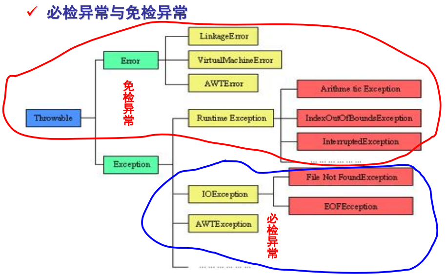


## 抛出异常和捕获异常的区别

**抛出异常**：如果程序中出现了异常，**没有办法将具体的异常打印出来，不做任何处理**

**捕获异常**：如果程序出现了异常，就**能够详细的打印是什么原因导致了异常并且能够做出相应的处理**，能够显示详细的Log

如果异常出现的话,会立刻终止程序,所以我们得处理异常:

1. 该方法不处理,而是声明抛出,由该方法的调用者来处理(throws)。
2. 在方法中使用try-catch的语句块来处理异常。


注意抛出异常 throw 是 **抛出**，  throws 是 **声明**

**throws 关键字和 throw 关键字在使用上的几点区别如下**：

- **throws** 用来声明一个方法可**能抛出的所有异常信息**，throw 则是指拋出的一个**具体的异常类型**。
- 通常在一个方法（类）的声明处通过 throws 声明方法（类）可能拋出的异常信息，而在方法（类）内部通过 throw 声明一个具体的异常信息。
- **throws** **通常不用显示地捕获异常**，可由**系统自动将所有捕获的异常信息抛给上级方法**； **throw** 则**需要用户自己捕获相关的异常**，而后再对其进行相关包装，最后将包装后的异常信息抛出。


throw

```java
public void checkNumber(int num) {
  if (num < 0) {
    throw new IllegalArgumentException("Number must be positive");
  }
}
```

throws

```java
public void readFile(String filePath) throws IOException {
  BufferedReader reader = new BufferedReader(new FileReader(filePath));
  String line = reader.readLine();
  while (line != null) {
    System.out.println(line);
    line = reader.readLine();
  }
  reader.close();
}
```


# Chapter8 常见实用类


## 正则表达式

[Java正则表达式(一看就懂)_陶然同学的博客-CSDN博客](https://blog.csdn.net/weixin_45481821/article/details/123912011?ops_request_misc=%7B%22request%5Fid%22%3A%22168646907716800186590376%22%2C%22scm%22%3A%2220140713.130102334..%22%7D&request_id=168646907716800186590376&biz_id=0&utm_medium=distribute.pc_search_result.none-task-blog-2~all~top_positive~default-1-123912011-null-null.142^v88^koosearch_v1,239^v2^insert_chatgpt&utm_term=java正则表达式&spm=1018.2226.3001.4187)


# Chapter9 GUI

本章主要介绍Java Swing


## 图形界面对象及其框架

> GUI类的三种类型

* 容器类：用来盛装其他GUI组件，如 JFrame、JPanel 、JApplet等
* 辅助类：用来描述GUI组件的属性，如Graphics、 Color、Font、FontMetrics和Dimension等

* 组件类：JButton、JDialog、JComboBox、JList、 JRadioButton和JMenu类

层次结构图：

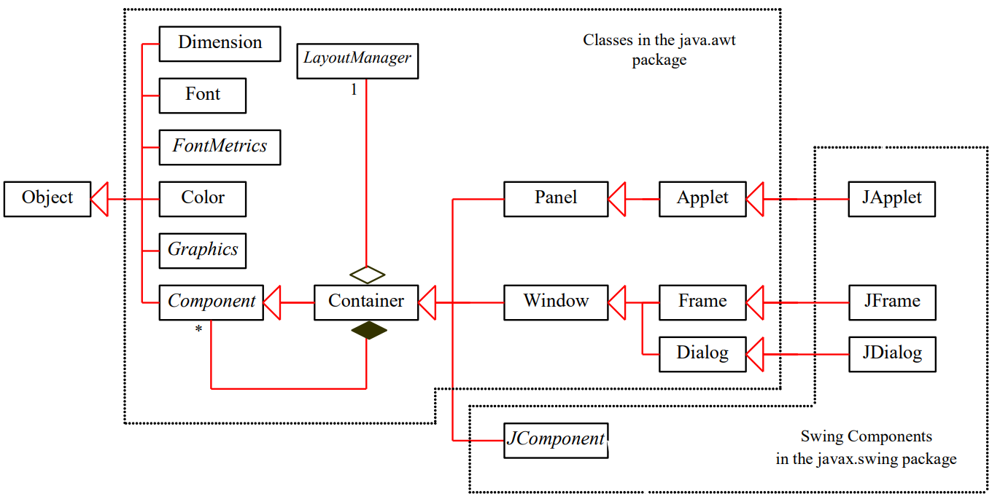


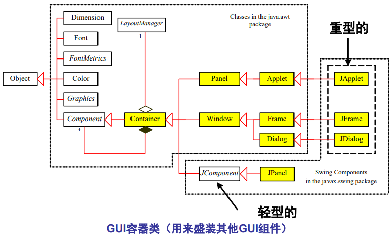


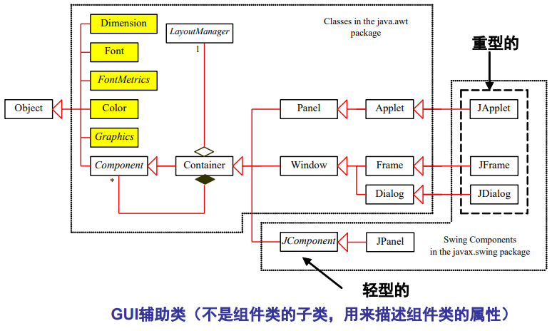


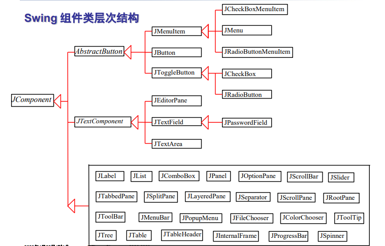


### 框架JFrame

框架JFrame是Java GUI应用程序中用来盛装其它GUI 组件**最顶层容器**（不能置放在其它组件或容器之中），在 GUI程序设计中，常**用JFrame来创建窗体。**


> JFram的构造方法和成员方法

* JFrame的构造方法
  * JFrame()
  * JFrame(Srting title)     //带标题的


> 常用成员方法

* public void setVisible(Boolean b) 

//设置框架是否可见，框架**默认情况下为不可见** 

* public void setSize(int width,int height)  

//设置框架的大小  

* public void setLocation(x,y)  

//设置框架在屏幕左上角的放置位置为（x,y）处，框架默认位置是（0,0）  

* public void setBounds(int x,int y,int width,int height)  

//设置框架在屏幕上出现的初始位置（x,y）、宽和高为（width，height）  

* public void setResizable(boolean b)  

//设置框架是否可调整大小，默认为可调整大小

* public void setDefaultCloseOperation (int Operation）

//设置单击框架右上角关闭图标后，根据其中参数进行相应处理。 

其中Operation的有效值如下：

 (1) DO_NOTHING_ON_CLOSE //什么也不做 

(2) HIDE_ON_CLOSE //隐藏当前框架

(3) DISPOSE_ON_CLOSE //隐藏当前框架，并释放框架所占的其他资源 

(4) EXIT_ON_CLOSE //结束框架所在的应用程序


* public setLocationRelativeTo(c:Componet)

//设置框架相对于特定组件的位置，如果组件为null，框架在屏幕中居中 显示，在JDK1.4（含）以上版本才有此特性


> 创建并显示框架

```java
import javax.swing.*;
public class MyFrame{
	public static void main(String[] args{
		JFrame frame=new JFrame(“MyFrame");
        //创建以MyFrame为标题的窗体
        frame.setSize(400,300);
        // 设置窗体的大小，窗口默认位置是（0,0）
        frame.setLocationRelativeTo(null); 
        //让窗体居中
        frame.setVisible(true);
        // 设置窗体可见，如果不设置，窗体不可见
        frame.setDefaultCloseOperation(frame. EXIT_ON_CLOSE);
        //当框架关闭时结束程序。
        //如果选择其他参数，框架关闭后，程序不会结束
   }
}
```


> 添加组件

在JDK1.5（含 ）版本以上，可直接将组件添加到框架对象中

```
frame.add(new JButton("OK"));
```


### 菜单

> 菜单

Swing菜单广泛应用于各种窗体应用程序，以简单明了的指示说明。

* Java 提供了三种类型的菜单类
  * 菜单栏类： JMenuBar（顶层菜单容器，用于组织菜单对 象）
  * 菜单：JMenu（菜单项容器，用于组织菜单项及其子菜单， 然后置于菜单栏对象中）
  * 菜单项：JMenuItem（置于菜单对象之中）

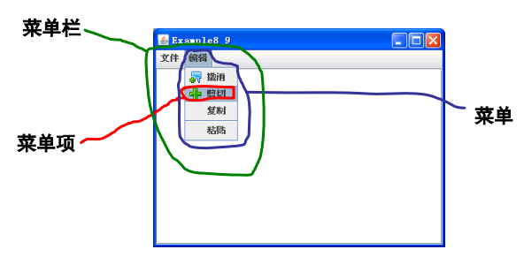


```java
import javax.swing.*;
import java.awt.*;
public class Test extends JFrame{
    //定义组件
    JMenuBar menuBar = new JMenuBar(); //创建菜单栏
    JMenu m1,m2,m3,m4;
    JMenuItem i1,i2,i3,i4;
    JMenu mm1,mm2,mm3,mm4;
    public Test(){
        m1 = new JMenu("文件1");
        m2 = new JMenu("文件2");
        m3 = new JMenu("文件3");
        m4 = new JMenu("文件4");
        i1 = new JMenuItem("文档1");
        i2 = new JMenuItem("文档2");
        i3 = new JMenuItem("文档3");
        i4 = new JMenuItem("文档4");
        m1.add(i1);
        m1.add(i2);
        m1.add(i3);
        m1.add(i4);
        menuBar.add(m1);
        menuBar.add(m2);
        menuBar.add(m3);
        menuBar.add(m4);
        this.add(menuBar,BorderLayout.NORTH);

        this.setBounds(200,200,300,250);
        this.setDefaultCloseOperation(JFrame.EXIT_ON_CLOSE);
        this.setVisible(true);
    }

    public static void main(String[] args) {
        Test t = new Test();
    }
}
```


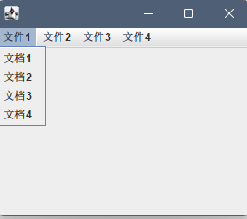


> JMenuItem常用构造方法

1. public JMenuItem() 使用空构造一个菜单项对象
2.  public JMenuItem(Action a) 创建一个支持Action的菜单项对象 
3. public JMenuItem(String text)  使用指定的文本作为菜单项名称创建一个菜单项对象  
4. public JMenuItem(Icon icon) 创建一个指定图标的菜单项对象 
5. public JMenuItem(String text，Icon icon)  创建一个指定文本和图标的菜单项对象 
6. public JMenuItem(String text，int mnemonic)  创建一个指定文本和键盘设置快捷的菜单项对


## 图形界面常用组件


### JTextField

> JTextField
>
> JTextField被称为文本框、文本域，用来输入或接收显示单行文本 信息（字符串）。

当输入文本并按下回车键时，会发生触发**ActionEvent**事件，可以 通过**ActionListener**中的**actionPerformed()方法**对事件进行相应 处理。


> 常用构造方法

* public JTextField(int n)  创建一个显示列数为n的空文本框 
* public JTextField(String text)  创建一个初始值为text的文本框
* public JTextField(String text, int n)  创建一个初始值为text、显示列数为n的文本框


>  常用成员方法

1. int getColumns( ) 获取文本框的显示列数 
2. public void setColumns(int Columns) 设置文本框的显示列数 
3. public void **setFont**(Font font) 设置字体 
4. public void **setHorizontalAlignment**(int align)  设置文本的水平对齐方式，align的有效值为 JTextField.LEFT、JTextField.CENTER、JTextField.RIGHT
5. public String **getText**() 获取文本框中的文本 
6. public void setEditable(Boolean b) 指定文本框是否可编辑，文本框**默认是可编辑**的 
7. public void **setText**(String s)  设置文本框中的文本参数为s，文本框中原来的文本被清除


### JPasswordField

> JPasswordField用来创建口令框对象。用户可以在此文本框中输 入字符，默认显示字符（回显字符）是“ * ”，而不是本身的字符， 用户也可以自己设置显示字符格式。


> 常用构造方法

1. JPasswordField（）创建一个空初始值JPasswordField对象 
2. JPasswordField（int col） 创建一个显示列数为col的JPasswordField对象 
3. JPasswordField（String text） 创建一个初始值为text的JPasswordField对象
4. JPasswordField（String text, int col） 创建一个初始值为text、显示列数为col的JPasswordField对象


> 常用成员方法

1. String getPassword() 获取JPasswordField的文本内容。
2. char getEchoChar() 获取密码的回显字符。 默认是”*“
3. void setEchoChar(char c) 设置密码的回显字符。


### JTextArea

> JTextArea被称为文本区。它与文本框的主要区别是：文本框只能 输入/输出一行文本，而文本区可以输入/输出多行文本。


JTextArea常与**JScrollPane**（滚动窗格）一起配合使用来实现文本 区水平或垂直的滚动（JTextArea本身并不处理滚动），具体实现 方法如下：

```java
JTextArea textArea=new JTextArea( );
JScrollPane scrollPane=new JScrollPane(textArea);
```


在文本区中输入完文本后，**并不直接触发ActionEvent事件**，可以 在JTextArea旁边**设置一个按钮**，通过按钮点击产生的**ActionEvent** 对输入的文本进行处理。


> 常用构造方法

1. public JTextArea（） 用默认构造方法创建一个空文本区。 
2. public JTextArea（int rows,int cols） 用构造方法创建一个rows行、cols列的空文本区。 
3. public JTextArea（String text） 用构造方法创建一个初始值为text的文本区。 
4. public JTextArea（String text，int cols） 用构造方法创建一个初始值为text、显示列数为cols的文本区。 
5. JTextArea(String text,int rows,int cols)  用构造方法创建一个初始值为text、显示行数为rows、列数为cols的 文本区。


> 常用成员方法

1. public void insert(String str,int pos)  在指定的位置pos插入指定的文本str。 
2. public void append(String str)  将文本str添加到末尾。
3. public void replaceRange(String str,int start,int end)  用字符串str替换文本区中从start开始到end的文字。
4. **setLineWrap**(Boolean b)  设置文本在文本区内的是否可以自动换行，**默认为false。**
5. **setWrapStyleWord**(Boolean b)  设置以单词为界或以字符为界换行。
6. **getCaretPosition**() 获取文本区域中输入光标的位置。 
7. **setCaretPosition**(int position) 设置文本区域中输入光标的位置。


### JButton and Label


### 选择性组件

> JCheckBox


> JRadioButton


> JList


> JCombox


> JTabbedPane


> JScrollbar


## 图形界面常用容器

> JPanel 面板

构造：

```java
JPanel p = new JPanel();

JPanel p = new JPanel(LayoutManager layout);  //可指定布局管理器
```

常用方法：

```java
public void add();
```

应用步骤：使用JPanel创建面板，再向这个面板添加组 件，然后把这个面板添加到其它容器中。JPanel面板的 **默认布局是FlowLayout布局**


## 图形界面对象上的布局

当把组件添加到容器中时，希望控制组件在容器中 的位置，这就需要用到布局。

容器可以使用方法： 容器对象引用变量.setLayout(布局对象);

> FlowLayout （(流式布局管理器）

**JPanel、JApplet 的缺省布局管理器**

FlowLayout是最简单的布局管理器，其管理方式为：**按照组件添加的先后顺序，按指定对齐方式由左到右将组件排列在容器中，放满 一行再开始新的一行**，它自动调用组件的getPreferredSize()方法， 使用组件的最佳尺寸来显示组件。

容器的大小改变后，容器中各组件的布局也会随之发生改变：各组件的大小不变，但相对位置会发生变化。


构造方法：

* public FlowLayout() 
  * //使用**缺省居中对齐方式**，组件间的水平和竖直间距为缺省值5个像素。 
* public FlowLayout(int alignment) 
  * //使用指定的对齐方式：FlowLayout.LEFT，FlowLayout.RIGHT， FlowLayout.Center等，水平和竖直间距为缺省值5象素。 
* public FlowLayout(int alignment, int horizontalGap, int verticalGap) 
  * //使用指定的对齐方式，水平和竖直间距为指定值。


重新设置对齐方式

```java
public void setAlignment(int alignment)
```


> BorderLayout (边框布局管理器)

**JFrame 的缺省布局管理器**

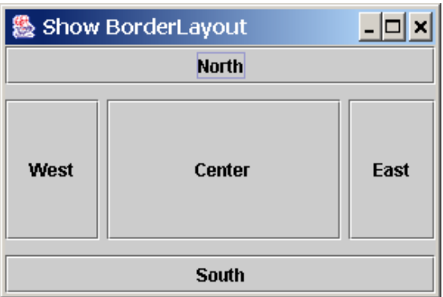


二种构造方法:

* public BorderLayout()
  * //各组件间的水平和竖直间距为缺省值0个象素。 
* public BorderLayout(int horizontalGap, int verticalGap)  
  * //各组件间的水平和竖直间距为指定值。


如果容器使用了BorderLayout布局方式，则容器**用add()方法往其中 添加组件时必须指明该组件在容中的方位**，否则组件将无法正确显示，

如：

```java
add(new Button(“West”),BorderLayout.WEST); 
add(new Button(“North”), BorderLayout.NORTH);
```

若没有指明放置位置，则表明为**默认的“CENTER”**方位。

**如果想 在一个区域添加多个组件，则必须先在该区域放一个JPanel容器， 再将多个组件放在该JPanel容器中。**


> CardLayout


> GridLayout


> GridLayout


>  BoxLayout


## 图像界面对象上的事件响应

在Java中所有非GUI程序一般是按过程的先后顺序执行的，Java GUI程序设计则是事件驱动的。在事件驱 动程序设计中，用户点击按钮、移动鼠标等行为都可以 引起一些反应（引发某些事件）。引发一个事件便执行相应的代码。


> 事件（event） 是指对事件源对象发生的行为的一种描述，比如点击鼠标按钮，按下键盘等
>
> 事件源对象：能引发某些事件的GUI组件被称为事件源对象，简称源对象

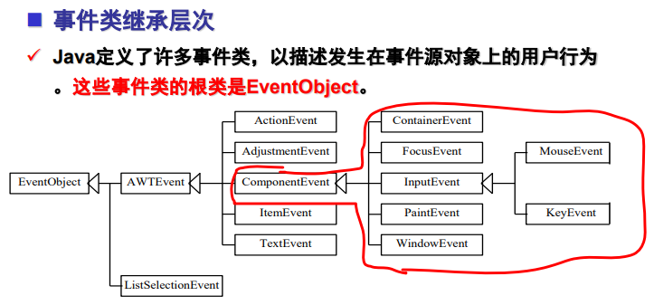


> EventObject及其子类

事件类均是EventObject的子类，通过事件类的成员方法我们可以 获取用户行为、源对象的一些信息


> 用户行为、源对象和事件类型

| 用户行为                      | 事件源对象   | 触发的事件类型         |
| ----------------------------- | ------------ | ---------------------- |
| Click a button                | JButton      | ActionEvent            |
| Click a check box             | JCheckBox    | ItemEvent, ActionEvent |
| Click a radio button          | JRadioButton | ItemEvent, ActionEvent |
| Press return on a text field  | JTextField   | ActionEvent            |
| Select a new item             | JComboBox    | ItemEvent, ActionEvent |
| Window opened, closed, etc.   | Window       | WindowEvent            |
| Mouse pressed, released, etc. | Component    | MouseEvent             |
| Key released, pressed, etc.   | Component    | KeyEvent               |


### 编程实现

事件源对象本身并不处理事件，而是委托给另一对象——**事件监听器对象**（用来接收由事件源对 象触发产生的事件对象，并做出相应处理）来处理。

* 监听器对象的类必须**实现**相应的**事件监听器接口**
* 监听器对象必须在事件源对象上进行**注册**

注意：事件源对象和监听器对象可以是同一个对象，一个事件源对象可以注册多个监听器


> 编程步骤

* 根据事件源对象的事件**选用相应的监听器接口来定义监听器类**，并实现接口
* 在源对象上**注册相应事件监听器对象**


具体代码案例可以参考这几篇博客：

[(63条消息) GUI中常见事件和事件监听器_ruan_luqingnian的博客-CSDN博客](https://blog.csdn.net/ruan_luqingnian/article/details/113555872)

[(63条消息) Java GUI事件监听器_lzm1340458776的博客-CSDN博客](https://blog.csdn.net/lzm1340458776/article/details/37701615)

下面这篇博客提到了**内部类或窗口做监听器**

[(63条消息) Java图形界面事件监听处理之四种方法_陈伟chenwei的博客-CSDN博客](https://blog.csdn.net/sdgihshdv/article/details/68948959)


> 编程示例

```java
public class EventDemo1 {
    Frame  frame = new Frame("这里测试事件处理");

    //事件源
    Button button = new Button("确定");

    TextField tf = new TextField(30);
    public void init(){
        //注册监听
        button.addActionListener(new MyActionListener());

        //添加组件到frame中
        frame.add(tf);
        frame.add(button,BorderLayout.SOUTH);

        //设置frame最佳大小并可见
        frame.pack();
        frame.setVisible(true);
    }

    //自定义事件监听器类
    private  class MyActionListener implements ActionListener{

        @Override
        public void actionPerformed(ActionEvent e) {

            System.out.println("用户点击了确定按钮");
            tf.setText("hello world");
        }
    }
    
    public static void main(String[] args) {
        new EventDemo1().init();
    }
}
```


# Chapte10 Java I/O流

[(65条消息) Java IO流（超详细！）_一个快乐的野指针~的博客-CSDN博客](https://blog.csdn.net/qq_44715943/article/details/116501936)


## java.io.File类

Java语言有专门的File类用来**管理磁盘文件和目录。**

每个File类的对象表示一个磁盘文件或目录

对象属 性中包含了文件或目录的相关信息，如名称、长度、 所含文件个数等，调用它的方法则可以完成对文件或 目录的常用管理操作，如创建、删除等

**但是File类没有包含读写文件 内容的方法，因而用来无法来读取一个文件中存储的数据**


## I/O流概述

> 分类:

二进制I/O流（字节I/O流）：文件或程序内存中的数据不需转化， 直接读入或写出，I/O效率高。用户用记事本读经二进制流输出 得到的文件通常为乱码。 

文本 I/O流（字符I/O流）：文件或程序内存中的数据需经转化， 经**解码读入或经编码写出**。经文本流输出得到的文件通常可用记事本打开，用户能读懂。


## 问题笔记汇总

### FileInputStream和FileReader区别

`FileInputStream`和`FileReader`是Java中用于读取文件数据的两个类，它们的主要区别如下：

1. 数据类型：`FileInputStream`以**字节**为单位读取文件数据，而`FileReader`以**字符**为单位读取文件数据。
2. 字符编码：`FileInputStream`是字节流，它以原始的字节形式读取文件内容。而`FileReader`是字符流，它会根据指定的字符编码（或使用平台默认编码）将字节转换为字符。因此，`FileReader`适用于读取文本文件，可以直接读取和处理字符数据。
3. 使用场景：由于`FileInputStream`是字节流，它通常用于**读取任意类型**的文件数据，包括二进制文件（例如图像、音频等）或非文本文件。而`FileReader`是字符流，它更适合**读取文本文件**（例如.txt、.csv等），因为它能够将字节正确地转换为字符，以便进行字符处理和文本操作。
4. 读取方式：`FileInputStream`提供了以字节为单位的读取方法，例如`read()`方法可以读取一个字节或一组字节。而`FileReader`提供了以字符为单位的读取方法，例如`read()`方法可以读取一个字符或一组字符。


### 字节流？字符流？

字节流（Byte Stream）和字符流（Character Stream）是Java I/O操作中的两种基本流类型，它们主要区别如下：

1. 字节流（Byte Stream）：
   - 字节流以字节为单位进行读写操作，数据以字节的形式进行传输。
   - `InputStream`和`OutputStream`是字节流的基本抽象类。
   - 字节流适用于处理**二进制数据或非文本数据**，如图像、音频、视频等文件。
2. 字符流（Character Stream）：
   - 字符流以字符为单位进行读写操作，数据以字符的形式进行传输。
   - `Reader`和`Writer`是字符流的基本抽象类。
   - 字符流适用于处理**文本数据**，如文本文件、配置文件等。
   - 字符流提供了字符编码解码的功能，可以将字节转换为字符或字符转换为字节，以处理不同的字符集和编码方式。


字符流和字节流之间的转换是通过字符编码（Character Encoding）和字节编码（Byte Encoding）来实现的。字符编码将字符映射为字节序列，而字节编码将字节序列解码为字符。


# Chapter11 JDBC与MySQL

Java提供了专门用于操作数据库的API，即JDBC （**Java  DataBase Connection**）。

Java程序通过不同的JDBC连接和操作操作不同的数据库，基本步骤是一样的：

1) 加载驱动。 
2) 与一个数据库建立连接。 
3)  向数据库发送SQL语句。 
4) 处理数据库返回的结果


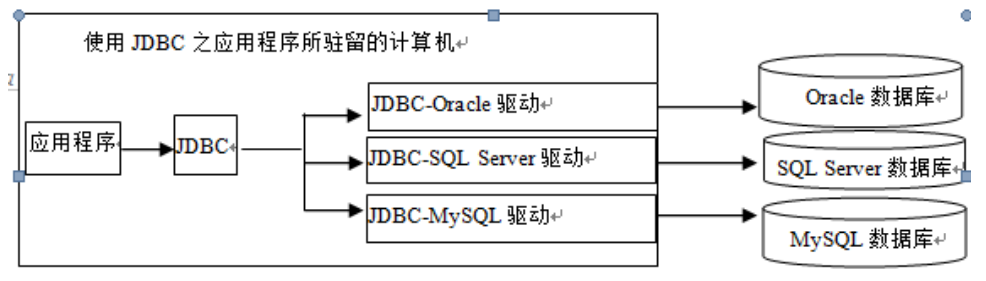


> Java加载JDBC驱动

```java
try{ 
Class.forName("com.mysql.jdbc.Driver");  //MySQL8以上版本的驱动是 com.mysql.cj.jdbc.Driver
}
catch(Exception e){}
```

> 连接MySQL中创建的数据库

 java.sql.**DriverManager**类提供了两个静态方法，用 于建立数据库连接： 

方法1： Connection getConnection(String uri) 

方法2：Connection getConnection(String uri,  String user, String password)

> 字符问题

如果数据库的表中的记录有汉字，那么在建立连接时需要额外多传递一个参数characterEncoding，并取 值gbk或gb2312或utf-8等，字符集最好和定义数据 库时所用的字符集一致。

比如

```java
String uri ="jdbc:mysql://localhost/students?useSSL=true&characterEncoding=utf-8"
```

**MySQL8** 默认编码使用utf8mb4, utf8mb4编码是utf8编码的超集，兼容utf8，所以**可以不用指定字符集参数**


## 编程实例

```java
import java.sql.Connection;
import java.sql.DriverManager;
import java.sql.ResultSet;
import java.sql.Statement;

public class DbUtil {

    public static final String URL = "jdbc:mysql://localhost:3306/MyDB";
    public static final String USER = "kenney";
    public static final String PASSWORD = "123456";

    public static void main(String[] args) throws Exception {
        //1.加载驱动程序
        Class.forName("com.mysql.cj.jdbc.Driver");
        //2. 获得数据库连接
        Connection conn = DriverManager.getConnection(URL, USER, PASSWORD);
        //3.操作数据库，实现增删改查
        Statement stmt = conn.createStatement();
        ResultSet rs = stmt.executeQuery("SELECT user_name, age FROM imooc_goddess");
        /*
        增删改都是executeUpdate
        */
        
        //如果有数据，rs.next()返回true
        while(rs.next()){
            System.out.println(rs.getString("user_name")+" 年龄："+rs.getInt("age"));
        }
        
        //4.关闭连接
        con.close()
    }
}
```


SQL查询语句对数据库的查询操作将返回一个 **ResultSet**对象，ResultSet对象是由一行行记录组 成的集合。

ResultSet对象一次只能看到一个数据行， 需使用**next()**方法移到下一个数据行。ResultSet对象可以使用**getXxx**方法获得字段值（列值）

getString()用的比较多，获取一条记录中指定列（字段）的值


> 关闭连接

con.close();   很重要！！


## 预处理语句

查询或更新SQL语句在执行时需要事先由数据库中的**SQL解释器**解释成底层的内部命令才能运行， 增大了数据库的负担，降低了执行的效率。

解决办法：采用“**预处理语句+通配符**”

步骤

* 定义通配符SQL语句，用?代替SQL语句中字段的具体值
  * `String str = "select * from mess where height < ? and  name= ? "`

* 定义预处理语句
  * `PreparedStatement sql = con.prepareStatement(str);`
* 使用时，设置SQL语句中通配符的具体值
  * `sql.setFloat(1,1.76f);`
  * `sql.setString(2,”张三”);`


## 事务

事务处理是指：应用程序保证事务中的SQL语句要么全部都执行，要么一个都不执行。（原子性）

**事务四大特性(简称ACID)** 
1、**原子性**(Atomicity)：事务中的全部操作在数据库中是不可分割的，要么全部完成，要么均不执行。

2、**一致性**(Consistency)：几个并行执行的事务，其执行结果必须与按某一顺序串行执行的结果相一致。

3、**隔离性**(Isolation)：事务的执行**不受其他事务的干扰**，事务执行的中间结果对其他事务必须是透明的。

4、**持久性**(Durability)：对于任意已提交事务，系统必须保证该事务对数据库的改变不被丢失，即使数据库出现故障。


> JDBC事务处理步骤：

* 关闭自动提交

  * ```java
    con.setAutoCommit(false)
    ```

* 提交事务

  * ```java
    con.commit();
    ```

* 事务执行失败时，回滚

  * ```java
    con.rollback();
    ```


> 编程实例

```java
private Connection conn = null;  
private PreparedStatement ps = null;  
try {  
    conn.setAutoCommit(false);  //将自动提交设置为false  
    ps.executeUpdate("修改SQL"); //执行修改操作  
    ps.executeQuery("查询SQL");  //执行查询操作                 
    conn.commit();      //当两个操作成功后手动提交  
} catch (Exception e) {  
    conn.rollback();    //一旦其中一个操作出错都将回滚，使两个操作都不成功  
    e.printStackTrace();  
}
```


# Chapter12 多线程


## 创建线程的两种方法

1. **继承Thread类**：可以创建一个继承自Thread类的子类，并重写其`run()`方法来定义线程的执行逻辑。然后可以通过创建该子类的实例，调用`start()`方法来启动线程。

```java
class MyThread extends Thread {
    public void run() {
        // 线程的执行逻辑
    }
}

// 创建并启动线程
MyThread myThread = new MyThread();
myThread.start();
```


2. **实现Runnable接口**：可以创建一个实现Runnable接口的类，并实现其中的`run()`方法来定义线程的执行逻辑。然后可以将该实现类的实例作为参数传递给Thread类的构造方法，创建Thread对象，并调用该Thread对象的`start()`方法来启动线程。

```java
class MyRunnable implements Runnable {
    public void run() {
        // 线程的执行逻辑
    }
}

// 创建并启动线程
MyRunnable myRunnable = new MyRunnable();
Thread thread = new Thread(myRunnable);
thread.start();
```


注意：这两种方法都可以用来创建线程，但**推荐使用实现Runnable接口的方式**，因为Java中的**类只能单继承**，如果已经继承了其他类，则无法再继承Thread类。而实现**Runnable接口的方式可以更灵活地组织代码**，实现接口的类还可以继续继承其他类。此外，使用**Runnable接口还能更好地支持线程池和多线程共享资源**的需求。


## 线程同步

### 什么是共享资源？

共享资源是指在多线程编程中，多个线程可以**同时访问和修改的数据、对象或资源**。这些共享资源可以是程序中的全局变量、静态变量、共享数据结构、文件、网络连接、数据库连接等。


在多线程编程中，引入同步机制是为了**解决多线程访问共享资源时可能出现的数据竞争和不一致性问题**。当多个线程并发地访问和修改共享资源时，如果没有适当的同步机制，就会导致以下问题：

1. 数据竞争（Data Race）：当多个线程同时读写共享资源时，由于线程执行的交叉和并发性，可能**导致数据的不一致性和错误**的结果。例如，一个线程在读取共享变量时，另一个线程正在修改它，这样就可能读到脏数据或不一致的状态。
2. 内存可见性问题：多个线程访问共享变量时，每个线程都有自己的本地缓存，这样就可能导致一个线程对共享变量的修改对其他线程不可见。这是由于现代计算机体系结构的缓存一致性机制导致的。
3. 线程间的协调和通信问题：在多线程环境下，有时需要线程之间进行协作和通信，以确保它们**按照预期的顺序执行和共享信息**。如果没有适当的同步机制，可能会导致线程之间的互相等待、死锁等问题。


为了解决这些问题，Java提供了一些同步机制，其中最常用的是使用关键字`synchronized`和使用`Lock`接口及其实现类（如`ReentrantLock`）来实现互斥访问。这些同步机制可以确保在任意时刻只有一个线程可以访问共享资源，从而避免了数据竞争和不一致性问题。此外，还有一些其他的同步工具和技术，如使用`wait()`和`notify()`方法进行线程间的等待和通知、使用`volatile`关键字保证变量的可见性等。


### 如何实现线程同步？

> synchronized

[(65条消息) 多线程：synchronized 关键字用法（修饰类，方法，静态方法，代码块）_synchronized修饰类_萨达哈鲁君的博客-CSDN博客](https://blog.csdn.net/import_sadaharu/article/details/78846675#:~:text=synchronized用法 1 修饰一个类：其作用的范围是synchronized后面括号括起来的部分， 作用的对象是这个类的所有对象 ； 2 修饰一个方法：被修饰的方法称为同步方法，其作用的范围是整个方法， 作用的对象是调用这个方法的对象,修饰一个静态的方法：其作用的范围是整个方法， 作用的对象是这个类的所有对象 ； 4 修饰一个代码块：被修饰的代码块称为同步语句块，其作用范围是大括号 {}括起来的代码块， 作用的对象是调用这个代码块的对象 ；)

在含有临界区语句块的方法头中加上 synchronized 

```java
pubilc synchronized void test() {  }
```

被`synchronized`修饰的代码块及方法，在同一时间，只能被单个线程访问。


对临界区语句块附加synchronized

```java
synchronized {}
```


> Lock

采用 ReentrantLock 类中 **lock()** 和  **unlock()** 

```java
 //创建一把锁对象
    private final Lock lock = new ReentrantLock();
```


```java
//线程
public void run() {
    lock.lock();//上锁
    try {
        
    }catch (Exception e){
        e.printStackTrace();
    }finally {
        lock.unlock();//解锁
    }
}
```


## 线程协作

当一个程序中的多个线程存在依赖关系时， 必须协调线程间的执行次序来让线程彼此协作来访问共 享的资源，才能让程序得到正确的结果。

经典例子：生产者-消费者


> 方法一：锁条件对象

先通过锁对象建立一个锁条件对象，然后调用锁 条件提供的await( )、signal( )和signalAll( )方法对线 程进行协调

```java
Condition 条件名 = 锁对象名.newCondition( );
```

从Lock对象中创建条件，为了**使用条件，必须首先加锁**，

await( )方法让当前线程等待从而进入阻塞态 并且**自动释放条件上的锁**，一旦条件正确，当前线程将唤醒被阻塞的线程让其**重新加锁**

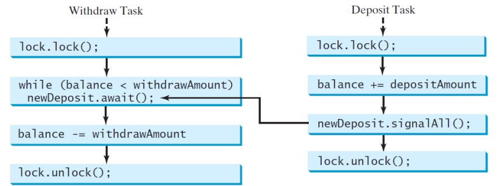


> 方法二

* **wait()**  可以**阻塞当前线程**执行某同步方法，使其等待，暂时让出CPU的使用权，并允许其它线程使用 这个同步方法。 
* **notifyAll()**   **通知所有**的由于使用这个同步方法而处于阻塞的线程结束等待。曾阻塞的线程就会从刚才的阻塞处继续执行这个同步方法，并遵循“**先阻塞先继 续**”的原则。 
* **notify()**   只是通知处于阻塞中的线程的某一个结束等 待。


## Timer

[一文带你学会Java中 Timer定时器的使用！ - 知乎 (zhihu.com)](https://zhuanlan.zhihu.com/p/148142107)


# Chapter13 网络编程

[Java 网络编程 | 菜鸟教程 (runoob.com)](https://www.runoob.com/java/java-networking.html)


# Chapter14 图形绘制


在Java中进行自定义图形绘制的一般步骤如下：

1. 创建绘图区域：通常使用继承自`javax.swing.JComponent`或`java.awt.Canvas`的自定义组件作为绘图区域。

2. 重写绘图方法：在自定义组件中，重写`paint`或`paintComponent`方法来实现具体的绘图逻辑。

   ```java
   @Override
   public void paint(Graphics g) {
       super.paint(g);
       // 绘图逻辑
   }
   ```

3. 获取绘图上下文：通过`getGraphics()`方法获取绘图上下文，绘图上下文是用于执行绘图操作的对象。

   ```java
   Graphics g = getGraphics();
   ```

4. 设置绘图属性：使用绘图上下文的方法来设置绘图的属性，例如线条颜色、字体等。

   ```java
   g.setColor(Color.RED); // 设置线条颜色为红色
   g.setFont(new Font("Arial", Font.BOLD, 12)); // 设置字体为Arial粗体，大小为12
   ```

5. 执行绘图操作：使用绘图上下文的方法来执行具体的绘图操作，例如绘制线条、矩形、椭圆等。

   ```java
   g.drawLine(x1, y1, x2, y2); // 绘制一条线段
   g.drawRect(x, y, width, height); // 绘制一个矩形
   g.drawOval(x, y, width, height); // 绘制一个椭圆
   ```

6. 清除绘图区域（可选）：如果需要在每次绘图前清除绘图区域，可以使用绘图上下文的方法来清除区域。

   ```java
   g.clearRect(x, y, width, height); // 清除指定区域
   ```

7. 更新绘图区域（可选）：如果需要实时更新绘图区域，可以使用`repaint()`方法来触发绘图区域的更新。

   ```java
   repaint(); // 触发绘图区域更新
   ```

这些是一般情况下进行自定义图形绘制的基本步骤。根据具体需求，还可以添加其他操作，例如事件处理、图形变换等。


或者：

1. 创建一个继承自`javax.swing.JPanel`的自定义面板类。该类将作为图形绘制的画布。
2. 在自定义面板类中，重写`paintComponent(Graphics g)`方法。这个方法将被自动调用，用于绘制图形。
3. 在`paintComponent(Graphics g)`方法中，使用`Graphics`对象进行绘图操作。你可以使用`drawXXX`方法来绘制基本图形（如线条、矩形、圆形等），也可以使用`fillXXX`方法来填充基本图形。
4. 在需要进行图形绘制的时候，创建一个实例化的自定义面板类对象，并将其添加到适当的容器组件（如`JFrame`）中。
5. 在需要更新图形时，调用`repaint()`方法，它会自动触发`paintComponent(Graphics g)`方法的调用，从而实现图形的刷新。
6. 可选的步骤：你可以通过监听鼠标事件或键盘事件，实现交互式的图形绘制。例如，你可以通过监听鼠标点击事件来获取鼠标的位置，然后在图形中绘制相应的图形或进行其他操作。


>  代码示例

```java
import java.awt.*;
import javax.swing.*;

public class DrawLine extends JPanel {
   public void paintComponent(Graphics g) {
      super.paintComponent(g);
      g.drawLine(10, 10, 100, 100);
   }

   public static void main(String[] args) {
      JFrame frame = new JFrame("Draw Line");
      frame.setDefaultCloseOperation(JFrame.EXIT_ON_CLOSE);
      frame.setSize(200, 200);
      DrawLine panel = new DrawLine();
      frame.add(panel);
      frame.setVisible(true);
   }
}
```


# Chapter15 泛型和集合框架

## 泛型

注意一下：泛型表示任意的**复合数据类型**（即类和接口），但不 表示基本数据类型，使用一个合理的标识符都可以。


略


## 集合框架

了解一下

Collection类的sort方法：

[(65条消息) 在java中对LIst集合的两种排序方法(即sort的使用方法)_list集合排序sort_李斯特List的博客-CSDN博客](https://blog.csdn.net/qq_36239350/article/details/81782755)


