# SpringBoot请求

由于浏览器只能发送Get请求，本文所有测试由PostMan测试


## 简单参数

可以通过 **HttpServletRequest** 对象接收参数

有原始方式和简便方式

```java
@RestController
public class RequestController {
    //原始方式
    //@RequestMapping("/simpleParam")
    //public String simpleParam(HttpServletRequest request){
    //    //获取请求参数
    //    String name = request.getParameter("name");
    //    String agestr = request.getParameter("age");
    //    int age = Integer.parseInt(agestr);
    //    System.out.println(name+":"+age);
    //    return "ok";
    //}

    //SpringBoot 简化方式
    @RequestMapping("/simpleParam")
    public String simpleParam2(String name, int age){
        //只要设置的形参名与get请求传递的参数名相同，就可以自动类型转换
        System.out.println(name+":"+age);
        return "ok";
    }
}
```

测试结果：

* Get

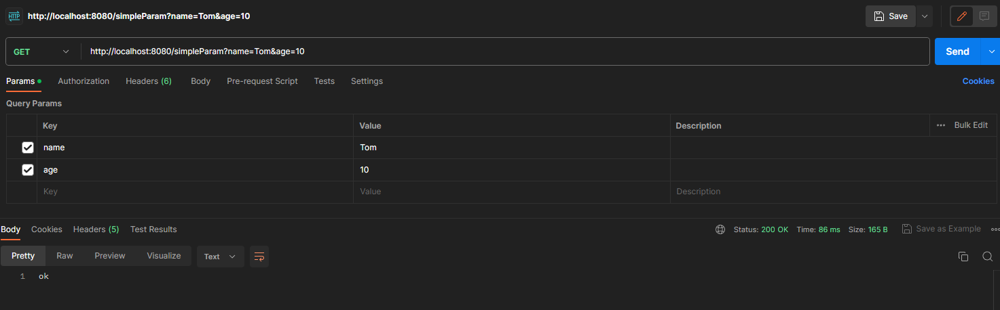

* Post

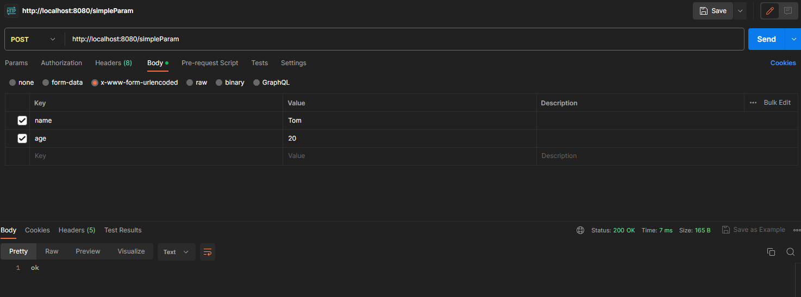


## RequestParam注解

如果形参名称与参数名不能对应，则形参接收不到参数，但是程序不会报错。

如果要使它能够接收不同名称的参数，需要使用 `@RequestParam` 注解

```java
@RequestMapping("/simpleParam")
public String simpleParam2(@RequestParam(value = "name") String username, int age){
    System.out.println(username+":"+age);
    return "ok";
}
```

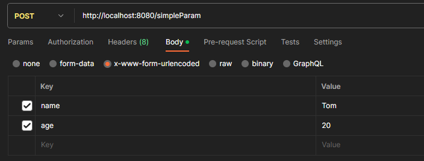

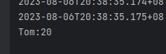


**注意：**

`@RequestParam`中的required属性默认为true,代表该请求参数必须传递，如果不传递将报错。如果该参数是可选的，可以将required属性设置为false。


## 实体参数

如果前端传递的参数过多，使用简单参数传递方式（用 `?a&b&c&d ）不太好

可以将所有参数封装到**实体类**当中，请求参数与形参对象属性名相同，定义Pojo接收即可。


* 比如上方示例中，将 name 和 age两个属性都封装到 user对象中

“请求参数与形参对象属性名相同” ：上面URL请求参数与实体类User中属性保持一致

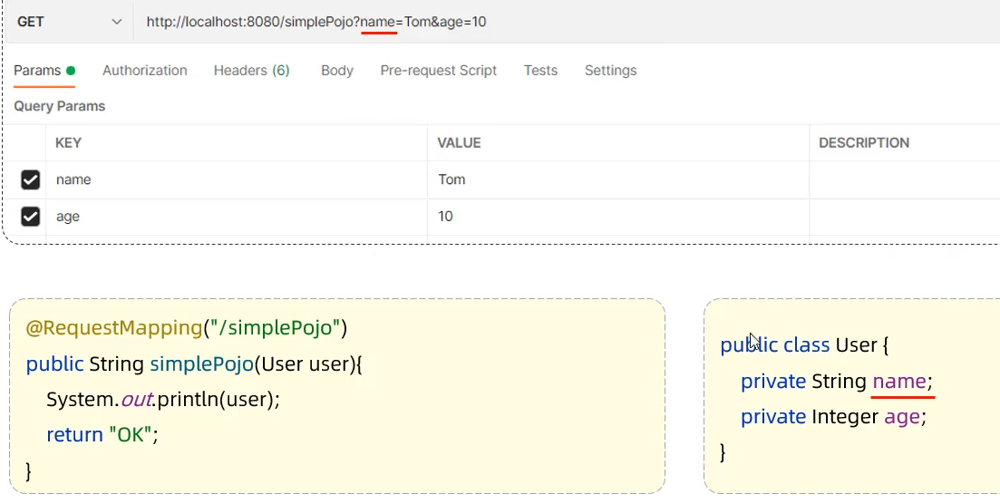


* 封装更复杂的实体对象

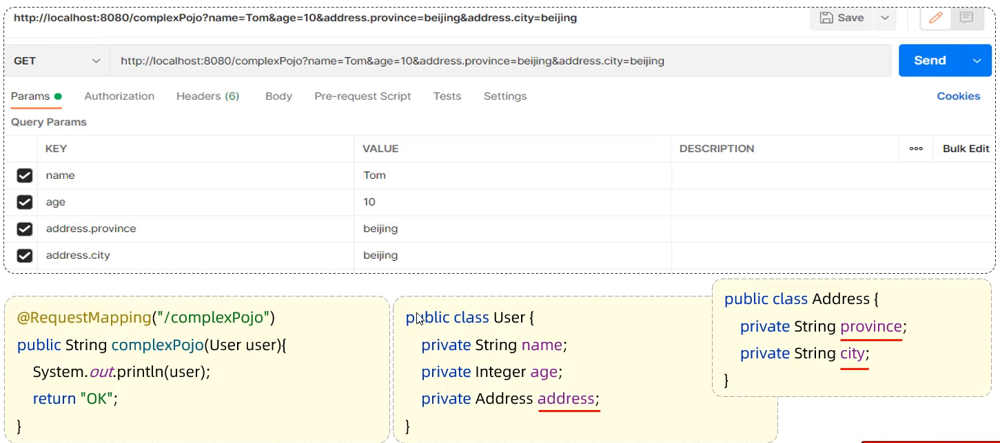

一般属性与之前的传递方式没有区别，主要关注`Address`对象，传递时用 `对象.属性` 的方式传递即可


## 数组集合参数

* 数组参数：请求参数名与形参数组名称相同且请求参数为多个，定义数组类型形参即可接收参数

应用场景举例：在使用复选框 `checkbox` 时，同一组checkbox可能会传递多个选项值

* 传递

比如：你有一个name为hobby的复选框，有两个选项game和java，那么传递的时候写 `hobby=name&hobby=java` 即可


* 接收（两种方式）
  * 数组接收
  * 集合接收


### 数组接收

* 用数组作为形参接收，需要数组名与请求参数名保持一致（比如举例中的hobby），就可以自动将请求参数封装到数组中

```java
@RequestMapping("/arrayParam")
public String arrayParam(String[] hobby){
    System.out.println(Arrays.toString(hobby));
    return "ok";
}
```

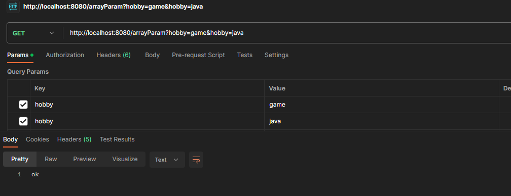


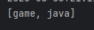


### 集合接收

* 集合参数：请求参数名与形参集合名称相同且请求参数为多个，用`@RequestParam` 绑定参数关系

```java
@RequestMapping("/listParam")
public String arrayParam(@RequestParam List<String> hobby){
    System.out.println(hobby);
    return "ok";
}
```

测试结果与数组接收相同。


## 日期时间参数

* 可以封装到 `Date` 或 Java8 之后提供的 `LocalDateTime` 中
  * 由于前端传来的格式可能多种多样 （比如y-m-d / y年m月d日 / y/m/d等等），所以后端需要指定参数格式。

* 通过注解 `DateTimeFormat` 完成日期参数格式转换
* 同样，形参名需要与请求参数保持一致

```java
@RequestMapping("/dateParam")
public String dateParam(@DateTimeFormat(pattern="yyyy-MM-dd HH:mm:ss")LocalDateTime time){
    System.out.println(time);
    return "ok";
}
```

测试：` http://localhost:8080/dateParam?time=2023-08-06 12:30:01`

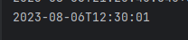


## Json参数

### 如何传递Json参数

要想传递 Json 参数，需要将请求设置为Post，因为 Json 格式数据是需要放在请求体中携带的。

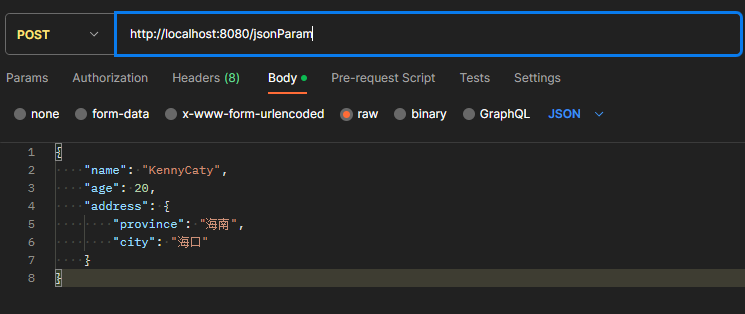

```json
{
    "name": "KennyCaty",
    "age": 20,
    "address": {
        "province": "海南",
        "city": "海口"
    }
}
```


### 如何接收Json参数

Json格式的数据一般通过实体对象来接收

定义Pojo类型形参即可接收参数，需要使用 `@RequestBody` 注解

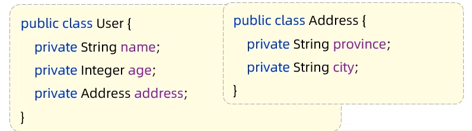

* Json参数规范：需要让 Json 数据**键名（key）与形参对象属性名相同**

```java
@RequestMapping("/jsonParam")
public String jsonParam(@RequestBody User user){
    System.out.println(user);
    return "ok";
}
```


## 路径参数

* 路径参数：通过请求URL直接传递参数，使用{...}来标识该路径参数，需要使用 `@PathVariable` 获取路径参数，路径参数名和形参名需要保持一致

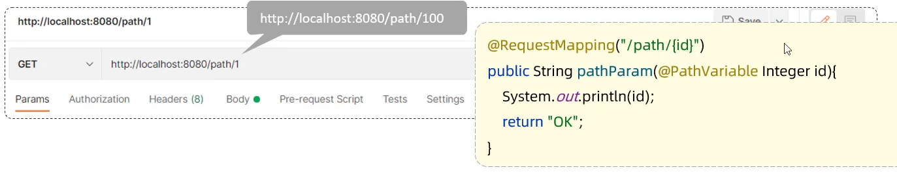

* 多个可变路径

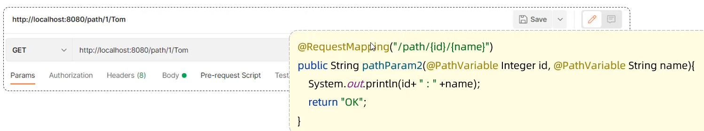

* restful风格


# SpringBoot响应

就是controller函数中return的东西

## @ResponseBody

* 类型：方法注解、类注解
* 位置：Controller方法上/类上
* 作用：将方法**返回值直接响应**，如果返回值类型是实体对象/集合，将会转换为SON格式响应
* 说明：@RestController=@Controller+@ResponseBody;


点开`@ResponseBody`的源码：

```java
@Target({ElementType.TYPE})                    //元注解： 修饰注解的注解（Java基础）
@Retention(RetentionPolicy.RUNTIME)            //元注解
@Documented									   //元注解
@Controller
@ResponseBody
public @interface RestController {
    @AliasFor(
        annotation = Controller.class
    )
    String value() default "";
}
```


## 统一响应结果

在项目开发中，给前端暴露的接口通常数量特别多，每个接口都可以有不同的响应内容（字符串/Json对象/Json数组），为了规范，我们一般设置统一响应结果

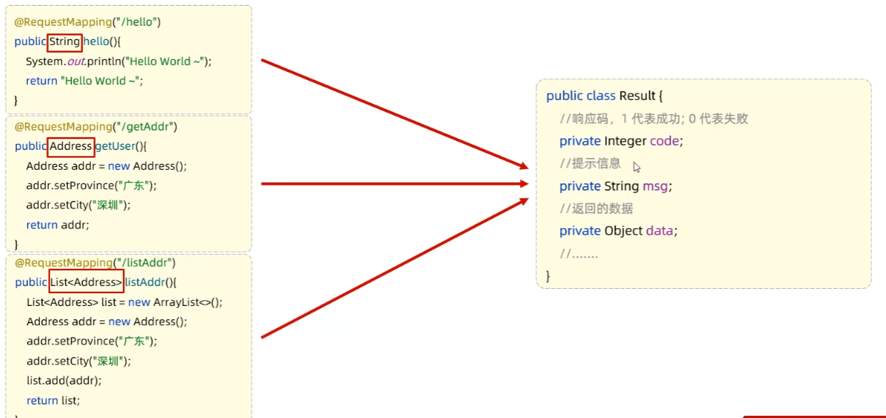


* Result对象

```java
public class Result{
    //响应码：可以跟前端约定，1代表成功；0代表失败
    private Integer code;
    //提示信息
    private String msg;
    //返回的数据
    private Object data;
    //....
}
```

* 示例：

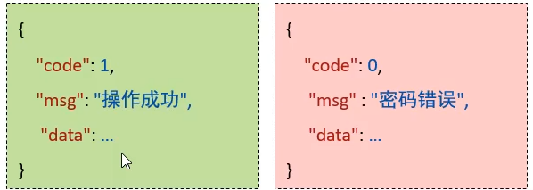

