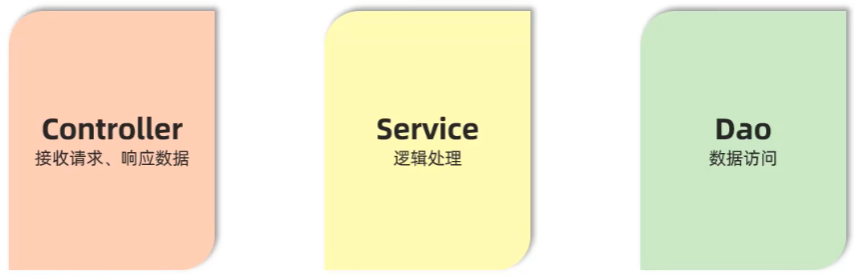

# 分层解耦（三层架构）

在之前的SpringBoot的请求响应中，所有的数据访问，数据处理（逻辑处理），接收请求并响应数据的代码都写在了一段代码里面，而实际开发中，应该让每一个方法的职责更加单一，只管一件事情（单一职责原则），**降低代码复杂度，可读性更强，扩展性更好**

所以才有了Web开发的三层架构

* controller: 控制层，接收前端发送的请求，**对请求进行处理，并响应数据。**
* service: 业务逻辑层，处理具体的**业务逻辑**。
* dao: 数据访问层(Data Access Object)(**持久层**)，负责**数据访问**操作，包括数据的增、删、改、查。

