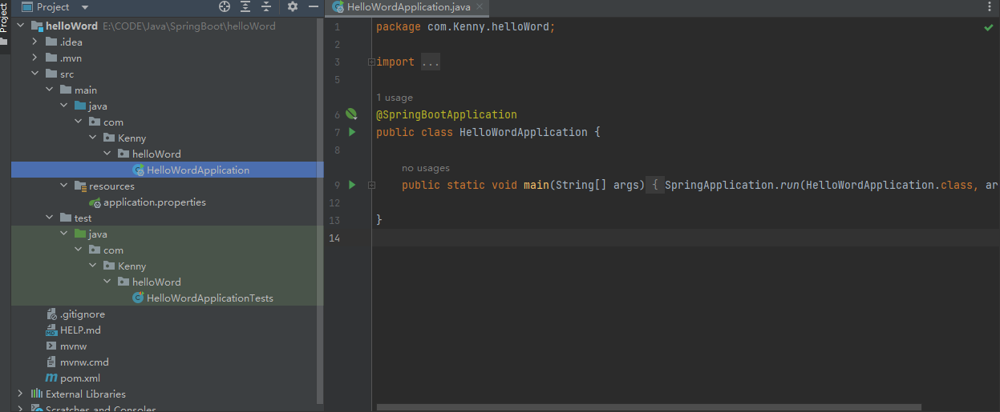
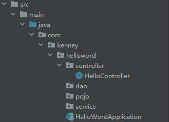
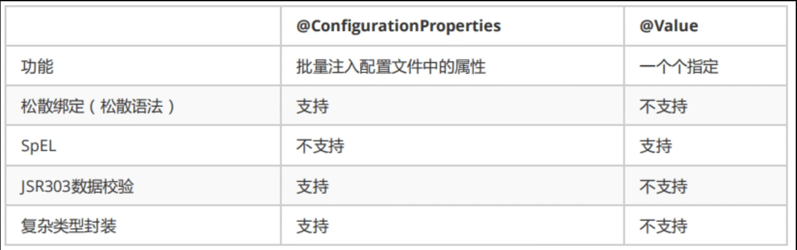
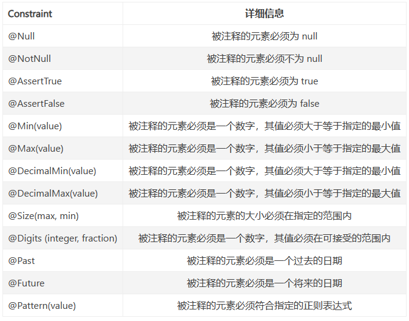
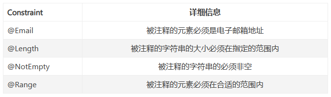

# SpringBoot与微服务

## SpringBoot

官网：[Spring Boot](https://spring.io/projects/spring-boot)

**概念：**

约定优于配置，简单来说就是你所期待的配置与约定的配置一致，那么就可以不做任何配置，约定不符合期待时才需要对约定进行替换配置。

> ## 特征（官网版）
>
> - 创建独立的 Spring 应用程序
> - 直接嵌入Tomcat，Jetty或Undertow（无需部署WAR文件）
> - 提供固执己见的“入门”依赖项以简化构建配置
> - 尽可能自动配置 Spring 和第三方库
> - 提供生产就绪功能，如指标、运行状况检查和外部化配置
> - 绝对无需生成代码，也无需 XML 配置

<!--more-->

**特征：**

1. SpringBoot Starter：他将常用的依赖分组进行了整合，将其合并到一个依赖中，这样就可以一次性添加到项目的Maven或Gradle构建中。
2. 使编码变得简单，SpringBoot采用 JavaConfig的方式对Spring进行配置，并且提供了大量的注解，极大的提高了工作效率，比如**@Configuration**和**@bean**注解结合，基于**@Configuration**完成类扫描，基于**@bean**注解把返回值注入**IOC**容器。
3. 自动配置：SpringBoot的自动配置特性利用了Spring对条件化配置的支持，合理地推测应用所需的bean并自动化配置他们。
4. 使部署变得简单，SpringBoot内置了三种Servlet容器，Tomcat，Jetty, Undertow.（无需部署war包）我们只需要**一个Java的运行环境**就可以跑SpringBoot的项目了，SpringBoot的项目可以打成一个jar包。
5. **场景启动器（starter）**
6. 提供**生产级特性**：如监控指标，健康检查，外部化配置等
   1. 监控指标，健康检查（k8s） 

7. 无代码生成，无xml

## 微服务

[(55条消息) 微服务架构——马丁弗勒（中文版论文完整版）_微服务架构论文_火火笔记的博客-CSDN博客](https://blog.csdn.net/weixin_42428778/article/details/118768742)


# 第一个SpringBoot程序



* HelloWordApplication
  * 程序主入口
* application.properties
  * 配置文件

```xml
<dependency>
    <groupId>org.springframework.boot</groupId>
    <artifactId>spring-boot-starter-web</artifactId>
</dependency>
```

这个依赖 spring-boot-starter-web（Web 启动器） 来为 Web 开发予以支持。spring-boot-starter-web 为我们提供了嵌入的 Servlet 容器以及 SpringMVC 的依赖，并为 Spring MVC 提供了大量自动配置，可以适用于大多数 Web 开发场景。

* 说人话：有这个，就可以通过端口打开网页


## helloworld

入口文件同级文件夹下，新建controller包，写一个控制器



```java
@RestController
public class HelloController {
    @RequestMapping("/hello")
    public String hello(){
        return "hello,world";
    }
}
```

运行入口程序，浏览器输入端口号以及对应页面


## 小技巧

> 如何改端口号

在application.properties中，添加`server.port=xxxx`


> 更改banner （启动时的命令行那一行字）

在网上找banner字体生成（直接网上搜索springboot banner，有很多）

在resources下新建banner.txt，把banner放进去


# 原理


## 自动装配

[狂神说SpringBoot02：运行原理初探 - 遇见狂神说 - 博客园 (cnblogs.com)](https://www.cnblogs.com/hellokuangshen/p/12450327.html)

pom.xml

* spring-boot-dependencies ：核心配置在父工程中

* 我们写或引入SpringBoot依赖的时候，不需要指定版本，就是因为有版本仓库


启动器：

```xml
<dependency>
    <groupId>org.springframework.boot</groupId>
    <artifactId>spring-boot-starter</artifactId>
</dependency>
```

* SpingBoot的启动场景
* 比如spring-boot-starter-web，会帮我们导入Web环境的所有依赖
* SpringBoot会将所有场景都变成一个个的启动器
* 需要什么功能，就只需要找到对应的启动器就可以了 `starter`


主程序

```java
//@SpringBootApplication ： 标注这个类是一个springboot应用；启动类下的所有资源被导入
@SpringBootApplication
public class HelloWordApplication {

    public static void main(String[] args) {
        //启动springboot
        SpringApplication.run(HelloWordApplication.class, args);
    }

}
```


注解

@SpringBootApplication

```
@SpringBootConfiguration ：springboot的配置
	@Configuration ： sping配置类
		@Component ： 说明这也是一个spring组件
		
@EnableAutoConfiguration ：自动配置
	@AutoConfigurationPackage ：自动配置包
		@Import({AutoConfigurationPackages.Registrar.class}) ：自动配置包注册
    @Import({AutoConfigurationImportSelector.class}) ：自动导入选择
....
```


**结论：springboot所有自动配置都是在启动的时候扫描并加载：spring.factories.所有的自动配置类都在这里面，但是不一定生效，要判断条件是否成立，只要导入了对应的stt，就有对应的启动器了，有了启动器，我们自动装配就会生效，然后就配置成功！**

1.springboot在启动的时候，从类路径下/META-lNF/spring.factories获取指定的值；

2.将这些自动配置的类导入容器，自动配置就会生效，帮我进行自动配置！

3.以前我们需要自动配置的东西，现在springboot帮我们做了！

4.整合javaEE,解决方案和自动配置的东西都在spring-.boot-autoconfigure-2.2.0.RELEASE.jar这个包下

5.它会把所有需要导入的组件，以类名的方式返回，这些组件就会被添加到容器；

6.容器中也会存在非常多的xxxAutoConfiguration的文件(@Bean),就是这些类给容器中导入了这个场景需要的所有组件；并自动配置，@Configuration,JavaConfig!

7.有了自动配置类，免去了我们手动编写配置文件的工作！


## 启动

> SpringApplication类和run方法

**这个类主要做了以下四件事情：**

1、推断应用的类型是普通的项目还是Web项目

2、查找并加载所有可用初始化器 ， 设置到initializers属性中

3、找出所有的应用程序监听器，设置到listeners属性中

4、推断并设置main方法的定义类，找到运行的主类


**Run方法**


# SpringBoot配置

## yaml与properties

Spring Boot使用一个全局的配置文件，配置文件名称是固定的

* application.properties
  * 语法结构：key=value
* application.yaml
  * 语法结构：key:空格value


## 给属性赋值的方式


@Component //注册bean

@ConfigurationProperties作用：

`ConfigurationProperties(prefix = "person")`

将配置文件中配置的每一个属性的值，映射到这个组件中：**告诉SpringBoot将本类中的所有属性和配置文件中相关的配置进行绑定参数prefix="person"**:将配置文件中的person下面的所有属性一对应只有这个组件是容器中的组件，才能使用容器提供@ConfigurationProperties功能


对比@Values




cp只需要写一次即可，vaue则需要每个字段都添加

松散绑定：这个什么意思呢？比如我的yml中写的last-name,这个和lastName是一样的，-后面跟着的字母默认是大写的。这就是松散绑定

JSR303数据校验，这个就是我们可以在字段是增加一层过滤器验证，可以保证数据的合法性

复杂类型封装，yml中可以封装对象，使用@vaue就不支持


结论：

* 配置yml和配置propertiesi都可以获取到值，强烈推荐yml
* 如果我们在某个业务中，只需要获取配置文件中的某个值，可以使用一下@value
* 如果说，我们专门编写了一个JavaBean:来和配置文件进行映射，就直接使用@configurationProperties,不要犹豫！


### JSR303校验

JSR-303是 Java EE 6 中的一项子规范，叫做 Bean Validation，官方参考实现是hibernate Validator。用于对Java Bean中的值进行验证

**1.Bean Validation 中内置的 constraint**




**2.Hibernate Validator 附加的 constraint**




示例

```java
@Component
@ConfigurationProperties(prefix = "person")
@Validated //数据校验需要加这个
public class MyEmail {
    @Email(message = "请输入正确的邮箱信息")    //如果校验错误会输出message
    private String email;

    public MyEmail(String name) {
        this.email = name;
    }

    public MyEmail(){}

    public String getName() {
        return email;
    }

    public void setName(String name) {
        this.email = name;
    }

    @Override
    public String toString() {
        return "MyEmail{" +
                "email='" + email + '\'' +
                '}';
    }
}
```


```java
@SpringBootTest
class HelloWordApplicationTests {

    @Autowired
    MyEmail email;
    @Test
    void contextLoads() {
        System.out.println(email);
    }

}
```


# SpringBoot Web开发


SpringBoot帮我们做了什么？

* xxxxAutoConfiguration - 向容器中自动配置组件

* xxxxProperties：自动配置类，装配配置文件中自定义的一些内容！

  


## 静态资源

在SpringBoot中，可以通过以下方式处理静态资源

* webjars      映射到域名:端口/webjars/
* public， static， /**， resources    映射域名:端口/

优先级：resource > static (默认) > public


## 首页如何定制

首页包括页签图标直接放在static里面即可


## 模板引擎

* 如果需要使用thymeleaf，只需要导入对应依赖`spring-boot-starter-thymeleaf`就可以了

导入之后，将html放在templates即可

* 在HTML的头部添加thymeleaf的约束

```html
<html lang="en" xmlns:th="http://www.thymeleaf.org">
```

* 使用th标签

```html
<div th:text="${msg}"></div>
<div th:utext="${msg}"></div>

<h3 th:each="user:${users}" th:text="${user}"></h3>
------------------------------
<h4 th:each="user:${users}">[[${user}]]</h4>

```


所有的htmL元素都可以被thymeLeaf替换接管：th：元素名


### thymleaf语法

中文文档https://fanlychie.github.io/post/thymeleaf.html

官方文档https://www.thymeleaf.org/doc/tutorials/3.0/usingthymeleaf.html


### 提取公共页面

```
th:fragment='sidebar'
```

插入

```
th:insert="~{path::sidebar}"

th::replace="~{path::sidebar}"
```


## 页面国际化

1. 需要配置i18n文件
2. 如果需要在项目中进行按钮自动切换，我们需要自定义一个组件LocaleResolver
3. 记得将自己的组件配置到spring容器 `@Bean`


```html
<a class="btn btn-sm" th:href="@{/index(l='zh_CN')}">中文</a>
<a class="btn btn-sm" th:href="@{/index(l='en_US')}">English</a>
```


```java
public class MyLocaleResolver implements LocaleResolver {
    //解析请求
    @Override
    public Locale resolveLocale(HttpServletRequest request) {
        //获取请求中的语言参数 'zh_CN'
        String language = request.getParameter("l");
        Locale locale = Locale.getDefault();//如果没有就使用默认的
        //如果请求的链接携带了参数
        if (!StringUtils.isEmpty(language)){
            String[] split = language.split("_");
            //国家，地区
            locale = new Locale(split[0], split[1]);
        }
        return locale;
    }

}
```


```java
@Configuration
public class MyMVCConfig implements WebMvcConfigurer {
//    public void addViewControllers(ViewControllerRegistry registry){
//        registry.addViewController("/").setViewName("index");
//    }

    @Bean
    public LocaleResolver localeResolver(){
        return new MyLocaleResolver();
    }
}
```


## 处理404

在templates下建立error文件夹，把404.html页面放进去


## 前端ui

* elementUI
* anti-admin-vue


# 数据库


## 整合JDBC

```properties
#数据库配置
spring.datasource.username=root
spring.datasource.password=123456
spring.datasource.url=jdbc:mysql://localhost:3306/mybatis?useUnicode=true&characterEncoding=utf-8
spring.datasource.driver-class-name=com.mysql.cj.jdbc.Driver
```

连接数据库

```java
@SpringBootTest
class Web01ApplicationTests {
    //配置数据库后，会自动产生DataSource对象，可以自动注入数据源（配置）
    @Autowired
    DataSource dataSource;
    @Test
    void contextLoads() throws SQLException {
        System.out.println(dataSource.getClass());
        Connection con = dataSource.getConnection();
        System.out.println(con);
        con.close();
    }
}

```


使用**JdbcTemplate**，可以执行sql语句

JdbcTemplate封装了很多对数据库的操作，拿来即用

```java
@Autowired
JdbcTemplate jdbcTemplate;

@GetMapping("/authors")
    public List<Map<String,Object>> Authorlist(){
        String sql = "select * from author";
        List<Map<String, Object>> maps = jdbcTemplate.queryForList(sql);
        return maps;
    }
```


## DRUID

Druid是阿里巴巴开源平台上一个数据库连接池实现，结合了C3PO、DBCP、PROXOOL等DB池的优
点，同时加入了日志监控。

Dud可以很好的监控DB池连接和SQL的执行情况，天生就是针对监控而生的DB连接池。

Spring Boot2.0以上默认使用Hikari数据源，可以说Hikari与Driud都是兰前Java Web上最优秀的
数据源，我们来重点介绍Spring Boot如何集成Druid数据源，如何实现数据库监控。


```yaml
spring:
  thymeleaf:
    cache: false
  #//配置文件的真实位置
  messages:
    basename: i18n.login

  mvc:
    format:
      date: yyyy-MM-dd
  
  #数据库配置
  datasource:
    username: root
    password: 123456
    url: jdbc:mysql://localhost:3306/booksystem?useUnicode=true&characterEncoding=utf-8
    driver-class-name: com.mysql.cj.jdbc.Driver
    type: com.alibaba.druid.pool.DruidDataSource  #指定druid数据源
    filters: stat, wall, log4j  #监控统计，防止sql注入，日志
```

```java
@Configuration
public class DruidConfig {
    @ConfigurationProperties(prefix = "spring.datasource")
    @Bean
    public DataSource druidDataSource(){
        return new DruidDataSource();
    };

    //后台监控
    @Bean
    public ServletRegistrationBean StatViewServlet(){
        ServletRegistrationBean<StatViewServlet> bean = new ServletRegistrationBean<>(new StatViewServlet(), "/druid/*");
        //后台需要有人登录，账号密码
        HashMap<String,String > initParameters = new HashMap<>();
        //增加配置
        initParameters.put("loginUsername","admin");
        initParameters.put("loginPassword","123456");   ///登陆的key是固定的
        //允许谁可以访问
        initParameters.put("allow","");  //为空表示所有人可以访问
        //禁止谁能访问 initParameters.put("name","192.168.xx.xx")

        bean.setInitParameters(initParameters); //设置初始化参数
        return bean;
    }

    //filter
    @Bean
    public FilterRegistrationBean webStatFilter(){
        FilterRegistrationBean bean = new FilterRegistrationBean();
        bean.setFilter(new WebStatFilter());

        //可以过滤哪些请求
        Map<String,String> initParameters = new HashMap<>();
        initParameters.put("exclusions","*.js,*.css,/druid/*");//这些不进行统计
        return bean;
    }
}
```


## 整合mybatis

整合包： mybatis-spring-boot-starter
