Pytorch学习


<!--more-->


# 加载数据

> Dataset 和 DataLoader

* Dataset：获取数据，label，数量
* DataLoader：加载数据，同时可以进行数据预处理


## Dataset

Dataset 是一个抽象类，所有子类都应该**重写 `__getitem__` 方法**； 可以选择性**重写 `__len__`  方法**

* `__getitem__` : 返回数据及其label
* `__len__` : 返回数据数量

### 简单示例

下面是一个简单获取**图像数据集**的示例（label为文件夹的名字，如果label是在txt中，那么获取到名字之后找到相应的 txt 文件拿到 label 即可）

关键代码：

```python
class MyData(Dataset):
    def __init__(self, root_dir, label_dir):    # train  ants    dir_path = "train/ants"  or "train/bees"
        self.root_dir = root_dir
        self.label_dir = label_dir
        self.path = os.path.join(self.root_dir, self.label_dir)  #需要获取文件夹的路径
        self.img_name_list = os.listdir(self.path)  #构造文件名列表    
        
    def __getitem__(self,idx):   #目的：通过index（idx）获取文件，那么就需要创建文件名列表（在__init__中创建）
        img_name = self.img_name_list[idx]   #拿到文件名称
        img_item_path = os.path.join(self.root_dir, self.label_dir, img_name)  #拿到文件路径
        img = Image.open(img_item_path)
        label = self.label_dir
        return img, label
    
    def __len__(self): 
        return len(self.img_path)
```

Jupyter演示：

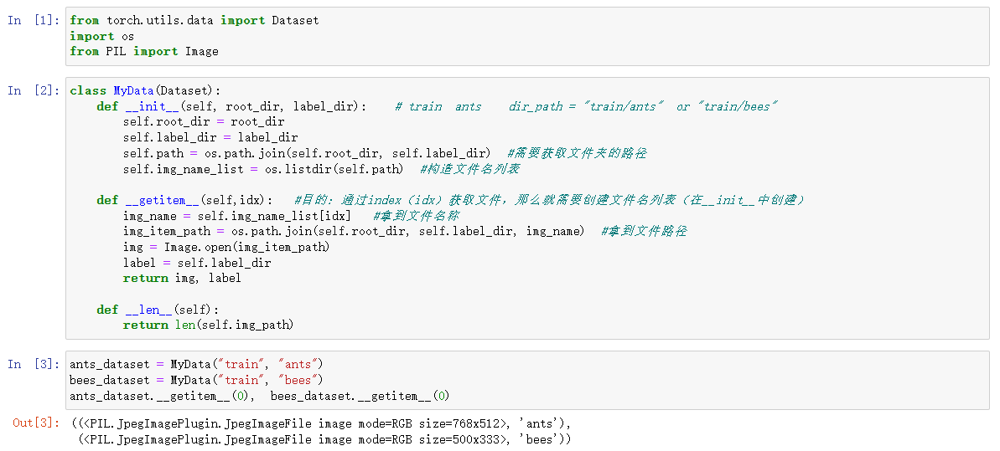


## DataLoader

后面单独讲


# 训练可视化

有时候需要根据模型的loss来挑选合适的模型，或者查看模型训练结果，使用下面几个方式可以直观的做出可视化

## Tensorboard

Pytorch1.1之后加入了Tensorboard

安装：

```bash
pip install tensorboard
```

pytorch导入包

```python
from torch.utils.tensorboard import SummaryWriter
```


### 读取标量

```python
add_scalar(tag, scalar_value, global_step=None, walltime=None, new_style=False, double_precision=False)
```


```python
writer = SummaryWriter("logs")     #指定文件夹路径

# writer.add_image()  这个方法可以添加图片，下方例子为添加标量数据
# y = x
for i in range(100): 
    writer.add_scalar("y=x",i, i)      #标识名称，竖轴（数据，这里是标量）， 横轴（训练步数）
    
writer.close()
```

然后会在指定位置生成目录（这里是logs）及文件，可以在命令行输入：`tensorboard --logdir=logs`

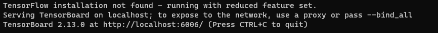

也可以指定端口：`tensorboard --logdir=logs --port=6007`

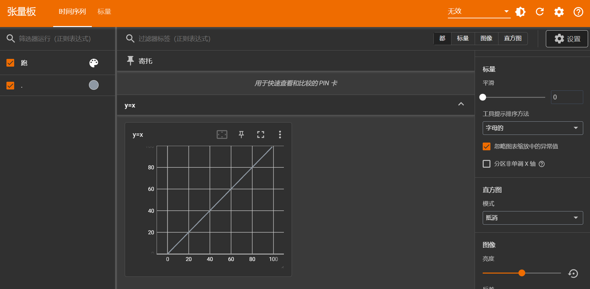


### 读取图像

```python
add_image(tag, img_tensor, global_step=None, walltime=None, dataformats='CHW')
```

能读入的图像只能是以下几种类型：`img_tensor (torch.Tensor, numpy.ndarray, or string/blobname): Image data`


如何读取numpy型图像，可以利用opencv读取


也直接用numpy读取

导入numpy 

```python
import numpy as np
from PIL import Image
```

```python
img_path = "train/ants_image/0013035.jpg"
img = Image.open(img_path)     #此时是PIL类型的图像数据
img_array = np.array(img)      #转为numpy型数据
```

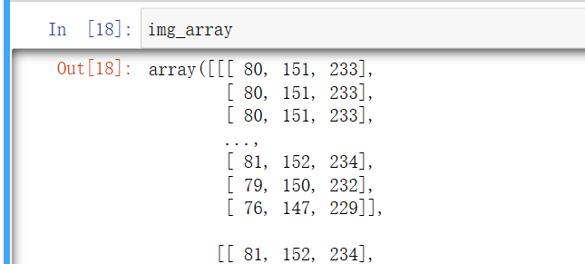


使用Tensorboard

```python
writer = SummaryWriter("logs")     #指定文件夹路径

writer.add_image("test_image",img_array,1)
    
writer.close()
```


有时候图片shape不匹配（默认是CHW格式，chanel，height，width）会报错，在使用Tensorboard之前记得看一看图片shape，避免报错，比如我这张图片是HWC格式（通道Chanel在最后）

```python
print(img_array.shape)    #(512, 768, 3)   H W C
```

那么就要指定格式

```python
writer = SummaryWriter("logs")     #指定文件夹路径

writer.add_image("test_image", img_array, 1, dataformats="HWC")
    
writer.close()
```

然后可以在命令行输入`tensorboard --logdir=logs` 然后点击链接查看


# transforms

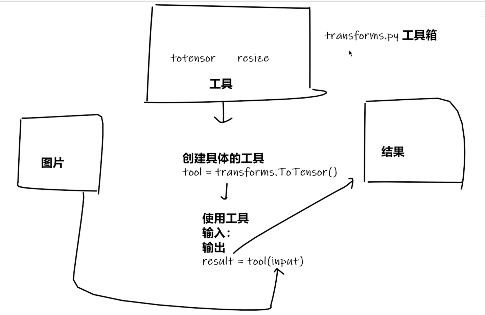


简单使用示例：

## ToTensor

```python
from torchvision import transforms
from PIL import Image

# 随便找一张图片试一试
img_path = "./练手数据集/train/ants_image/0013035.jpg"

img = Image.open(img_path)
img #jupyter查看

# 查看图片类型
print(img)
#<PIL.JpegImagePlugin.JpegImageFile image mode=RGB size=768x512 at 0x21F2516EAF0>

#获取转化器ToTensor类
tensor_trans = transforms.ToTensor()
tensor_img = tensor_trans(img)
tensor_img
```


结合Tensorboard

```python
from torch.utils.tensorboard import SummaryWriter

writer = SummaryWriter("logs")
img = Image.open(img_path)

trans_totensor = transforms.ToTensor()
img_tensor = trans_totensor(img)

writer.add_image("ToTensor", img_tensor)
writer.close
```


## Normalize

```python
trans_norm = transforms.Normalize([0.5,0.5,0.5], [0.5,0.5,0.5]) # 输入均值，标准差
img_norm = trans_norm(img_tensor)
img_norm
```


## Resize

```python
print(img.size)
trans_resize = transforms.Resize((512,512))
img_resize = trans_resize(img)
print(img_resize)


```

Resize输入两个参数时，输出的图片按照给定参数变化，如果只输入一个数字，比如Resize(512), 代表指定最短边的像素数量


## Compose

参数是一个transform实例列表

```python
trans_compose = transforms.Compose([trans_resize, trans_totensor])
img_tensor = trans_compose(img)
```

前一个的输出是后一个的输入


# 数据集

torchvision里的数据集的使用


以CIFAR10为例

```python
# 数据集使用

import torchvision

train_set = torchvision.datasets.CIFAR10(root="./dataset", 
                                         train=True, 
                                         download=True)
test_set = torchvision.datasets.CIFAR10(root="./dataset", 
                                         train=False, 
                                         download=True)
```

```python
from PIL import Image
print(test_set[0])
img, label = test_set[0]
print(img)
print(label)
print(test_set.classes[label])
img #jupyter查看，也可以img.show
```


数据集默认为PIL图片，可以结合transforms转化为Tensor

```python
import torchvision
dataset_transform = torchvision.transforms.Compose([
    torchvision.transforms.ToTensor(),
    
])

# 利用transform将PIL类型的图片转化为Tensor
train_set = torchvision.datasets.CIFAR10(root="./dataset", 
                                         train=True, 
                                         transform=dataset_transform,
                                         download=True)
test_set = torchvision.datasets.CIFAR10(root="./dataset", 
                                         train=False, 
                                         transform=dataset_transform,
                                         download=True)
```


结合tensorboard可视化前十张图片

```python
from torch.utils.tensorboard import SummaryWriter

writer = SummaryWriter("p10")
for i in range(10):
    img, label = test_set[i]
    writer.add_image("test_set", img, i)

writer.close()
```


# DataLoader

[torch.utils.data — PyTorch 2.1 documentation](https://pytorch.org/docs/stable/data.html#torch.utils.data.DataLoader)

```python
import torchvision

# 用测试集目的，数据少一点，方便一点
test_data = torchvision.datasets.CIFAR10(
    root="./dataset",
    train=False,
    transform=torchvision.transforms.ToTensor()
)


from torch.utils.data import DataLoader
test_loader = DataLoader(dataset=test_data, batch_size=4,
                         shuffle=True, num_workers=0, drop_last=False)
# num_workers:是否采用多进程，0就是只采用主进程
# drop_list, 最后不够batch_size的直接舍去与否

img, target = test_data[0]
print(img.shape)
print(target)
print(test_data.classes)
```


```python
# 从DataLoader里面取数据, 发现每一个data融合了四张图片的数据
for data in test_loader:
    img, target = data
    print(img.shape)
    print(target)
```


# 搭建神经网络


## torch.nn.Module

所有torch定义的网络都必须继承这个类

一个示例：

```python
import torch.nn as nn
import torch.nn.function as F

class Model(nn.Module):
	def __init__(self):
        super(Model, self).__init__()
        self.conv1 = nn.Conv2d(1,20,5)
        self.conv2 = nn.Conv2d(20,20,5)
        
    def forward(self, x):
        x = F.relu(self.conv1(x))
        return F.relu(self.conv2(x))
```


## 卷积

[torch.nn.functional.conv2d — PyTorch 2.1 documentation](https://pytorch.org/docs/stable/generated/torch.nn.functional.conv2d.html#torch.nn.functional.conv2d)

以function.conv2d为例，注意这里的输入和kernel都是四维的，第一个表示batch数

```python
import torch
import torch.nn.functional as F
```

```PYTHON
input = torch.tensor([[1,2,0,3,1],
                     [0,1,2,3,1],
                     [1,2,1,0,0],
                     [5,2,3,1,1],
                     [2,1,0,1,1]])

kernel = torch.tensor([[1,2,1],
                       [0,1,0],
                       [2,1,0]])

input = torch.reshape(input, (1,1,5,5)) # 1batch， 1chanel， 5x5
kernel = torch.reshape(kernel, (1,1,3,3))

print(input.shape)
print(kernel.shape)
```

```PYTHON
output = F.conv2d(input, kernel, stride=1, padding=0)
print(output)
```


## 卷积层

卷积层在nn.Conv2d里面

[Conv2d — PyTorch 2.1 documentation](https://pytorch.org/docs/stable/generated/torch.nn.Conv2d.html#torch.nn.Conv2d)

```python
torch.nn.Conv2d(in_channels,  out_channels,  kernel_size,  stride=1,  padding=0,  dilation=1,  groups=1,  bias=True,  padding_mode='zeros')
```

这个kernel只需要设置大小，不需要设置具体值（由训练得到）


```python
import torchvision

from torch.utils.data import DataLoader

import torch.nn as nn
from torch.nn import Conv2d
```

```python
dataset = torchvision.datasets.CIFAR10("./dataset", train=False, transform=torchvision.transforms.ToTensor(),
                                       download=True)

dataLoader = DataLoader(dataset, batch_size=64, shuffle=True)

class Model(nn.Module):
    def __init__(self):
        super(Model, self).__init__()
        self.conv1 = Conv2d(in_channels=3, out_channels=6, kernel_size=3)
        
    def forward(self, x):
        x = self.conv1(x)
        return x
    
model = Model()
print(model)

for data in dataLoader:
    imgs, targets = data
    output = model(imgs)
    print(output.shape)
```


# 优化器

在torch.optim里面


注意每一次反向传播之前，先清零梯度

略一下，可以看李沐的课程或者官网


# 使用torch的预训练模型

以VGG16为例

```python
import torchvision
import torch.nn as nn
```

```python
train_data = torchvision.datasets.CIFAR10("./dataset",
                                           train=True,
                                           download=True,
                                           transform=torchvision.transforms.ToTensor)
```

```python
# 未预训练
vgg16_false = torchvision.models.vgg16(pretrained=False)
print("done")
# 已经预训练（官方说是在ImageNet预训练的，那个数据集有点大，一百多G）
vgg16_true = torchvision.models.vgg16(pretrained=True)
print("done")
```


将VGG16更改为可以应用CIFAR10数据集模型

```python
vgg16_true.add_module("add_linear", nn.Linear(1000, 10))
print(vgg16_true)
```

当然也可以更改未预训练的模型

```python
vgg16_false.add_module("add_linear", nn.Linear(1000, 10))
print(vgg16_false)
```


# 模型的加载和保存

```python
import torchvision
import torch

vgg16 = torchvision.models.vgg16(pretrained=False)
```


## 保存方式1      

既保存网络模型结构，也保存网络模型参数      

```python
torch.save(vgg16, "./models/vgg16_1.pth")
```


### 加载

```python
model = torch.load("./models/vgg16_1.pth")
print(model)
```


## 保存方式二（官方推荐）
只保存模型参数（状态），保存为字典

```python
# 只保存模型参数（状态）
torch.save(vgg16.state_dict(), "./models/vgg16_2.pth")
```


### 加载

```python
model = torch.load("./models/vgg16_2.pth")
print(model) #是一个参数字典

vgg16_new = torchvision.models.vgg16(pretrained=False)
vgg16_new.load_state_dict(model)
print(vgg16_new)
```


## 注意的问题

在自己定义模型时（使用继承nn.Module）

方式一虽然会保存模型结构，但是仍然**需要代码中有这个模型class类**（相当于任然需要访问模型定义的代码）


# Transformer

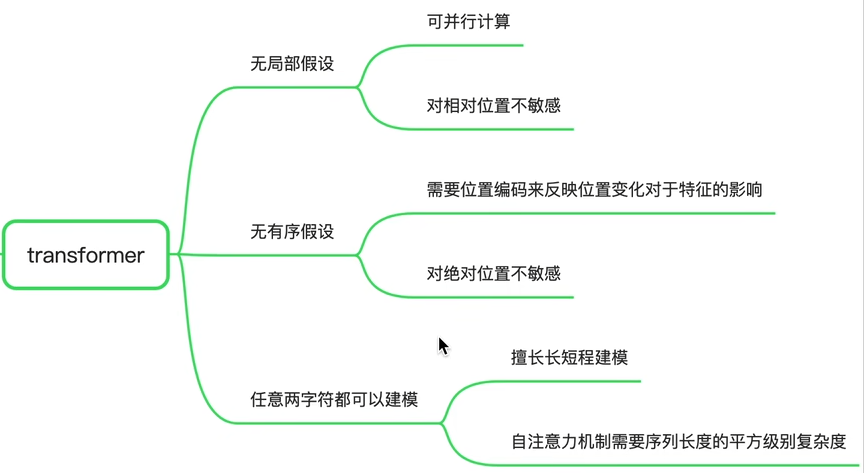


【18、深入剖析PyTorch中的Transformer API源码】https://www.bilibili.com/video/BV1o44y1Y7cp?vd_source=c2c8a4fe07a11ba495278ab92632a245

论文：[Attention is all you need]([[1706.03762\] Attention Is All You Need (arxiv.org)](https://arxiv.org/abs/1706.03762))


## Self-attention

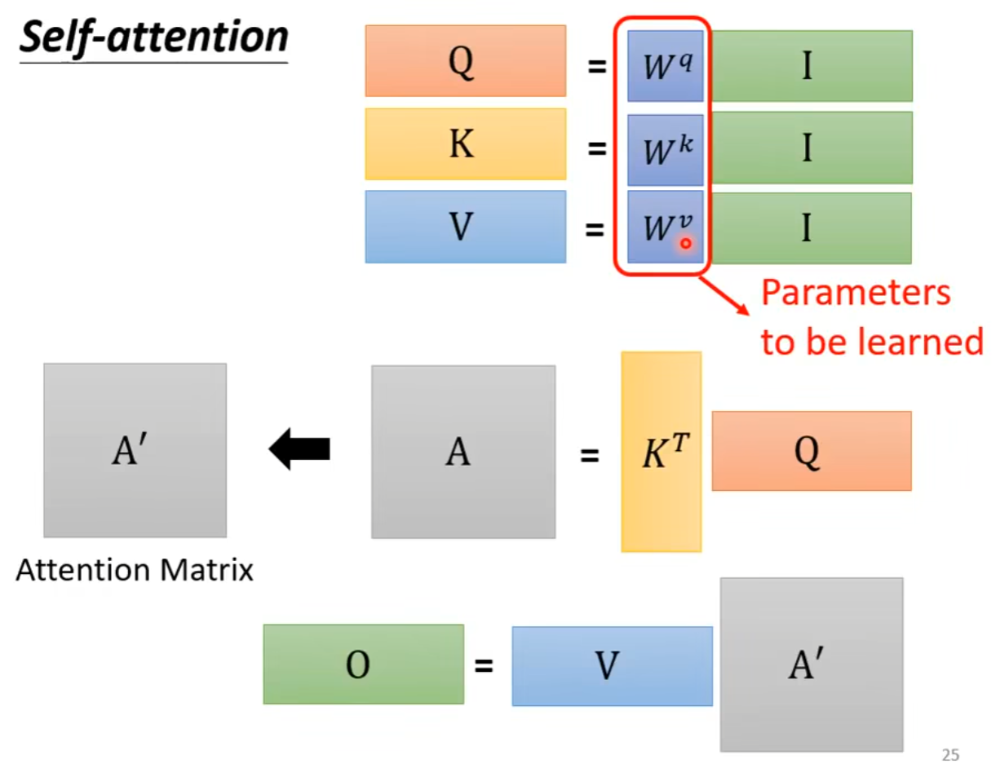


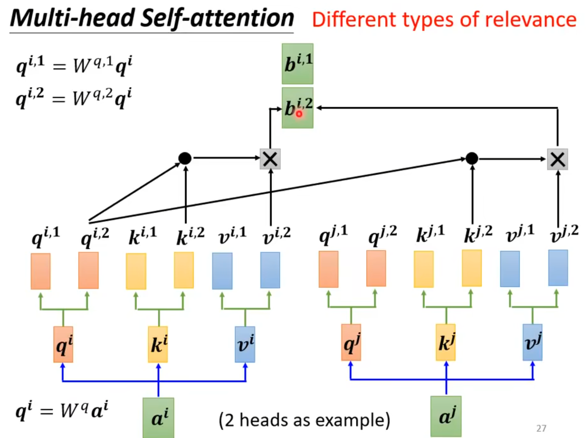

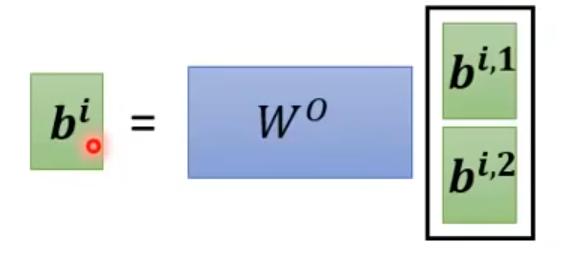


自注意力机制vsCNN

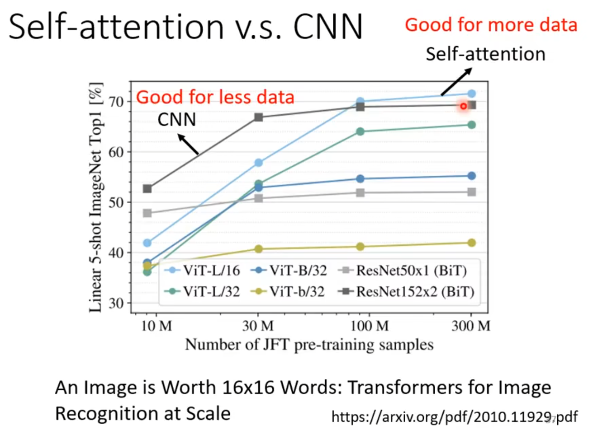

[论文](https://arxiv.org/pdf/2010.11929pdf)


vsRNN

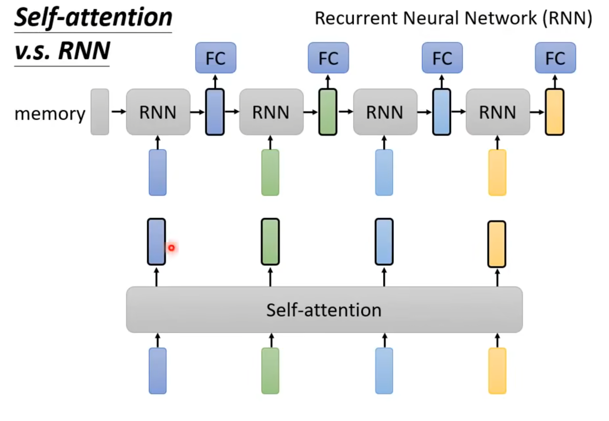


## Transformer

本质就是一个Seq2Seq模型


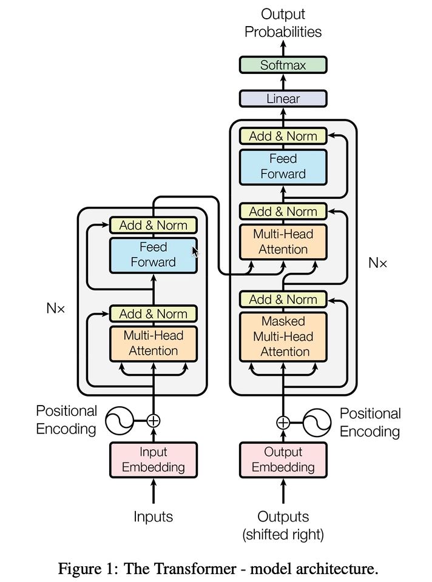


